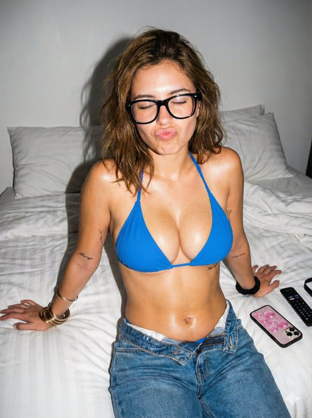
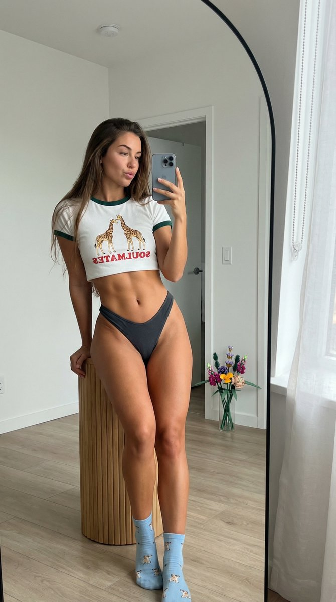

<div align="center">

# ✨ AI Image Prompt Vault ✨

A hand-picked collection of AI image generation prompts and their visual outputs.  
Built for **inspiration**, **learning**, and **prompt engineering reference**.

</div>

---

## 🌌 Gallery

> Click an image to view it in full resolution.

---

### 🖼️ Prompt 01

<p align="center">
  
</p>

**Source:** [𝕏](https://x.com/lexx_aura/status/2002324374431617191)

```json
{
  "subject": {
    "description": "Young woman with a slim, toned physique",
    "hair": "Shoulder-length brown hair, messy/tousled texture, center part",
    "skin": "Light skin tone, glistening/shiny texture (oil or sweat sheen)"
  },
  "apparel": {
    "top": "Bright blue triangle bikini top with string ties",
    "bottom": "Blue denim jeans, unbuttoned and unzipped at the waist, low-rise fit"
  },
  "accessories": {
    "eyewear": "Black thick-rimmed rectangular glasses",
    "jewelry": [
      "Stacked gold and silver bangles/bracelets on left wrist",
      "Belly button piercing with a small gem"
    ],
    "other": "Black hair tie on right wrist",
    "tattoos": [
      "Small minimalist line art/script tattoos on inner arms",
      "Script tattoo on left ribcage reading 'Always'"
    ]
  },
  "pose_and_expression": {
    "pose": "Seated on a bed leaning slightly back, both hands grasping the top of head, elbows flared outward",
    "expression": "Playful pout (duck face), eyes closed"
  },
  "environment": {
    "location": "Indoor bedroom",
    "surface": "Bed with white striped sheets, slightly wrinkled",
    "objects": [
      "Smartphone with a pink bubble-textured case lying on the bed",
      "Black remote control lying on the bed",
      "White pillows in the background"
    ]
  },
  "photography_style": {
    "lighting": "Direct on-camera flash, hard lighting, strong shadows behind the subject",
    "aesthetic": "Candid snapshot, 2000s digital camera aesthetic, raw/amateur style, high contrast"
  }
}
```
---

### 🖼️ Prompt 02

<p align="center">
  
</p>

**Source:** [𝕏](https://x.com/_MehdiSharifi_/status/2002154028214480910)

```json
{
  "image_request": {
    "goal": "Create an ultra-authentic hyperrealistic mirror selfie/fitness influencer aesthetic/cozy minimalist interior / casual fit check / soft daylight beauty",
    "meta": {
      "image_type": "Hyperrealistic Mirror Selfie / Influencer Lifestyle / Minimalist Indoor Portrait",
      "quality": "8K, Ultra-HD, Masterpiece, Best Quality, Ultra-Detailed, Hyperrealistic",
      "color_mode": "Full Color (natural, soft warm tones)",
      "style_mode": "raw_photoreal / high-fashion luxury lifestyle / authentic social media content",
      "aspect_ratio": "4:5",
      "resolution": "1080x1350px"
    },
    "creative_style": "Contemporary influencer lifestyle with soft natural lighting, minimalist interior design aesthetics, focus on fitness physique and casual fashion details, authentic mirror selfie composition",
    "overall_theme": "casual fitness confidence / minimalist home aesthetic/cozy morning vibe/body positivity",
    "mood_vibe": "serene confidence / relaxed / playful / aesthetic / alluring / cozy",
    "style_keywords": [
      "mirror selfie",
      "fitness aesthetic",
      "abs",
      "minimalist interior",
      "natural light",
      "iPhone photography",
      "high fidelity",
      "social media style",
      "clean girl aesthetic"
    ],
    "subject": {
      "count": "1",
      "type": "female",
      "identity": "stunning young woman, early 20s, fit hourglass physique, defined abdominal muscles, long straight brunette hair falling over shoulders",
      "identity_preservation": {
        "description": "Preserve fit body type, hair texture, and casual facial expression",
        "notes": "Focus on the juxtaposition of cute top/socks with alluring physique."
      },
      "age_appearance": "early 20s",
      "skin": "smooth, tanned, healthy glow, realistic texture with defined muscle shading on abdomen",
      "makeup": {
        "lips": "soft rosy pink, natural gloss",
        "eyes": "subtle definition, winged liner",
        "general": "soft glam / natural 'no-makeup' makeup look"
      },
      "facial_features": {
        "expression": "soft pout / confident gaze at phone screen / relaxed",
        "eyes": {
          "gaze": "directed at phone screen in reflection",
          "intensity": "focused but relaxed."
        },
        "lips": {
          "gesture": "relaxed/slight pout"
        }
      },
      "hair": {
        "length": "long, reaching mid-back",
        "texture": "straight to slight wave, silky, dark brown",
        "style": "loose and flowing over one shoulder",
        "lighting_interaction": {
          "light": "soft natural highlights from window",
          "shadow_play": "gentle shadows giving volume"
        }
      },
      "clothing": {
        "top": "white cropped ringer t-shirt with dark green trim on neck and sleeves",
        "bottom": "dark charcoal grey high-cut bikini bottoms/thong style",
        "full_description": "white crop top featuring a graphic of two giraffes and red text 'SOULMATES', paired with high-waisted dark grey bikini bottoms",
        "accessories": "light blue/grey ankle socks with small cute paw print or animal pattern"
      },
      "props": {
        "bouquet": "N/A",
        "wine_glass": "N/A",
        "other": "iPhone Pro in grey case held in hand, wooden cylindrical stool, vase with colorful Lego-style botanical flowers on floor"
      }
    },
    "pose_action": {
      "description": "Standing full-body mirror selfie leaning slightly back",
      "overall_pose": "leaning back against a tall wooden cylindrical table/stool, legs crossed at ankles, hips tilted",
      "head_turn": "slight tilt to the left",
      "gaze": "looking at phone screen in a mirror",
      "body_position": "weight resting on support, elongating torso to highlight abs",
      "hands": "one hand holding phone up covering part of face, other arm resting or hidden behind body",
      "movement": "static pose"
    },
    "environment": {
      "setting": "clean minimalist bedroom or living area / bright apartment",
      "location": "indoor, in front of a large full-length mirror",
      "weather": "N/A (indoor)",
      "time_of_day": "daytime / soft morning light",
      "atmosphere": "calm, clean, airy, private"
    },
    "background": {
      "color": "white walls, light wood tones",
      "effect": "reflection showing room depth, door in background, light wood flooring"
    },
    "lighting": {
      "type": "soft natural diffuse light",
      "position": "side/window source (off-screen)",
      "direction": "soft wash from right side",
      "intensity": "moderate, flattering",
      "focus": "highlighting torso definition and face",
      "falloff": "gradual, soft shadows",
      "light_quality": "diffuse daylight 5500K",
      "source": "large window reflection implied",
      "tone": "natural neutrals",
      "mood": "effortless chic",
      "subject_lighting": "soft uneven wash accentuating muscle definition",
      "environment_lighting": "ambient daylight filling the room",
      "color_temperature": "neutral daylight",
      "contrast_shadow": "soft contrast, definition in mid-tones",
      "shadow_quality": "soft, natural",
      "imperfections": ["mirror surface dust", "slight phone reflection artifacts"]
    },
    "camera": {
      "sensor_format": "smartphone sensor simulation / digital",
      "lens": "wide angle smartphone lens (approx 24-26mm equivalent)",
      "position_angle": "eye-level reflection",
      "distance": "arm's length/selfie distance",
      "framing": "vertical full body shot capturing reflection in large arched mirror",
      "depth_of_field": "deep depth of field (everything relatively sharp)",
      "composition": {
        "framing": "mirror frame visible on left, subject centered/right-weighted",
        "depth": "room reflection provides depth behind the subject",
        "emphasis": "physique and outfit details",
        "angle": "straight on into the mirror"
      }
    },
    "color_grading": {
      "palette": "neutrals, white, skin tones, light wood, pops of green (shirt trim) and red (text)",
      "lut": "Natural / Social Media 'Clean' Preset / Low Contrast",
      "mood": "clean/modern/bright"
    },
    "post_processing": {
      "sharpening": "standard digital sharpening",
      "final_touch": "subtle brightness adjustment, natural color balance."
    },
    "negative": {
      "style": "painting, drawing, sketch, cartoon, anime, 3d render, blurry, low res, noisy, oversaturated",
      "content": "cluttered room, dark room, messy background, distorted body, unrealistic anatomy, extra limbs, watermark, text overlay",
      "artifacts": "warped phone, distorted fingers, mirror anomalies"
    },
    "additional_controls": {
      "focus_emphasis": "subject's physique and outfit",
      "grounding": "standing firmly on the floor in socks",
      "special_notes": "Ensure the text 'SOULMATES' and giraffe graphic on the shirt are legible and detailed. Capture the specific texture of the 'Lego' flowers in the background vase."
      "vibe": "authentic influencer update",
      "final_output_goal": "A photorealistic, high-quality mirror selfie that looks like a genuine social media post from a fitness/lifestyle influencer."
    }
  }
}
```

---

## 📌 Why This Exists

- Visual reference for prompt crafting
- Compare outputs across styles & models
- A personal archive of inspiring AI generations

---

## ⚠️ Ownership & Credits

- All prompts and images in this repository are NOT owned by me.
- They have been collected from various sources on the internet.
- All rights, ownership, and credits belong to their respective original creators.
- This repository is shared strictly for educational and inspiration purposes only.
- If you are a rights holder and wish to have content removed or credited, please open an issue.

---

<div align="center">

✨ If this repository inspired you, consider leaving a star ✨<br>Craft better prompts. Generate better images.

</div>
