<div align="center">

# ✨ AI Image Prompt Vault ✨

A hand-picked collection of AI image generation prompts and their visual outputs.  
Built for **inspiration**, **learning**, and **prompt engineering reference**.

</div>

---

## 🌌 Gallery

> Click an image to view it in full resolution.

---

### 🖼️ Prompt 01

<p align="center">
  
</p>

**Source:** [𝕏](https://x.com/lexx_aura/status/2002324374431617191)

```json
{
  "subject": {
    "description": "Young woman with a slim, toned physique",
    "hair": "Shoulder-length brown hair, messy/tousled texture, center part",
    "skin": "Light skin tone, glistening/shiny texture (oil or sweat sheen)"
  },
  "apparel": {
    "top": "Bright blue triangle bikini top with string ties",
    "bottom": "Blue denim jeans, unbuttoned and unzipped at the waist, low-rise fit"
  },
  "accessories": {
    "eyewear": "Black thick-rimmed rectangular glasses",
    "jewelry": [
      "Stacked gold and silver bangles/bracelets on left wrist",
      "Belly button piercing with a small gem"
    ],
    "other": "Black hair tie on right wrist",
    "tattoos": [
      "Small minimalist line art/script tattoos on inner arms",
      "Script tattoo on left ribcage reading 'Always'"
    ]
  },
  "pose_and_expression": {
    "pose": "Seated on a bed leaning slightly back, both hands grasping the top of head, elbows flared outward",
    "expression": "Playful pout (duck face), eyes closed"
  },
  "environment": {
    "location": "Indoor bedroom",
    "surface": "Bed with white striped sheets, slightly wrinkled",
    "objects": [
      "Smartphone with a pink bubble-textured case lying on the bed",
      "Black remote control lying on the bed",
      "White pillows in the background"
    ]
  },
  "photography_style": {
    "lighting": "Direct on-camera flash, hard lighting, strong shadows behind the subject",
    "aesthetic": "Candid snapshot, 2000s digital camera aesthetic, raw/amateur style, high contrast"
  }
}
```
---

### 🖼️ Prompt 02

<p align="center">
  
</p>

**Source:** [𝕏](https://x.com/_MehdiSharifi_/status/2002154028214480910)

```json
{
  "image_request": {
    "goal": "Create an ultra-authentic hyperrealistic mirror selfie/fitness influencer aesthetic/cozy minimalist interior / casual fit check / soft daylight beauty",
    "meta": {
      "image_type": "Hyperrealistic Mirror Selfie / Influencer Lifestyle / Minimalist Indoor Portrait",
      "quality": "8K, Ultra-HD, Masterpiece, Best Quality, Ultra-Detailed, Hyperrealistic",
      "color_mode": "Full Color (natural, soft warm tones)",
      "style_mode": "raw_photoreal / high-fashion luxury lifestyle / authentic social media content",
      "aspect_ratio": "4:5",
      "resolution": "1080x1350px"
    },
    "creative_style": "Contemporary influencer lifestyle with soft natural lighting, minimalist interior design aesthetics, focus on fitness physique and casual fashion details, authentic mirror selfie composition",
    "overall_theme": "casual fitness confidence / minimalist home aesthetic/cozy morning vibe/body positivity",
    "mood_vibe": "serene confidence / relaxed / playful / aesthetic / alluring / cozy",
    "style_keywords": [
      "mirror selfie",
      "fitness aesthetic",
      "abs",
      "minimalist interior",
      "natural light",
      "iPhone photography",
      "high fidelity",
      "social media style",
      "clean girl aesthetic"
    ],
    "subject": {
      "count": "1",
      "type": "female",
      "identity": "stunning young woman, early 20s, fit hourglass physique, defined abdominal muscles, long straight brunette hair falling over shoulders",
      "identity_preservation": {
        "description": "Preserve fit body type, hair texture, and casual facial expression",
        "notes": "Focus on the juxtaposition of cute top/socks with alluring physique."
      },
      "age_appearance": "early 20s",
      "skin": "smooth, tanned, healthy glow, realistic texture with defined muscle shading on abdomen",
      "makeup": {
        "lips": "soft rosy pink, natural gloss",
        "eyes": "subtle definition, winged liner",
        "general": "soft glam / natural 'no-makeup' makeup look"
      },
      "facial_features": {
        "expression": "soft pout / confident gaze at phone screen / relaxed",
        "eyes": {
          "gaze": "directed at phone screen in reflection",
          "intensity": "focused but relaxed."
        },
        "lips": {
          "gesture": "relaxed/slight pout"
        }
      },
      "hair": {
        "length": "long, reaching mid-back",
        "texture": "straight to slight wave, silky, dark brown",
        "style": "loose and flowing over one shoulder",
        "lighting_interaction": {
          "light": "soft natural highlights from window",
          "shadow_play": "gentle shadows giving volume"
        }
      },
      "clothing": {
        "top": "white cropped ringer t-shirt with dark green trim on neck and sleeves",
        "bottom": "dark charcoal grey high-cut bikini bottoms/thong style",
        "full_description": "white crop top featuring a graphic of two giraffes and red text 'SOULMATES', paired with high-waisted dark grey bikini bottoms",
        "accessories": "light blue/grey ankle socks with small cute paw print or animal pattern"
      },
      "props": {
        "bouquet": "N/A",
        "wine_glass": "N/A",
        "other": "iPhone Pro in grey case held in hand, wooden cylindrical stool, vase with colorful Lego-style botanical flowers on floor"
      }
    },
    "pose_action": {
      "description": "Standing full-body mirror selfie leaning slightly back",
      "overall_pose": "leaning back against a tall wooden cylindrical table/stool, legs crossed at ankles, hips tilted",
      "head_turn": "slight tilt to the left",
      "gaze": "looking at phone screen in a mirror",
      "body_position": "weight resting on support, elongating torso to highlight abs",
      "hands": "one hand holding phone up covering part of face, other arm resting or hidden behind body",
      "movement": "static pose"
    },
    "environment": {
      "setting": "clean minimalist bedroom or living area / bright apartment",
      "location": "indoor, in front of a large full-length mirror",
      "weather": "N/A (indoor)",
      "time_of_day": "daytime / soft morning light",
      "atmosphere": "calm, clean, airy, private"
    },
    "background": {
      "color": "white walls, light wood tones",
      "effect": "reflection showing room depth, door in background, light wood flooring"
    },
    "lighting": {
      "type": "soft natural diffuse light",
      "position": "side/window source (off-screen)",
      "direction": "soft wash from right side",
      "intensity": "moderate, flattering",
      "focus": "highlighting torso definition and face",
      "falloff": "gradual, soft shadows",
      "light_quality": "diffuse daylight 5500K",
      "source": "large window reflection implied",
      "tone": "natural neutrals",
      "mood": "effortless chic",
      "subject_lighting": "soft uneven wash accentuating muscle definition",
      "environment_lighting": "ambient daylight filling the room",
      "color_temperature": "neutral daylight",
      "contrast_shadow": "soft contrast, definition in mid-tones",
      "shadow_quality": "soft, natural",
      "imperfections": ["mirror surface dust", "slight phone reflection artifacts"]
    },
    "camera": {
      "sensor_format": "smartphone sensor simulation / digital",
      "lens": "wide angle smartphone lens (approx 24-26mm equivalent)",
      "position_angle": "eye-level reflection",
      "distance": "arm's length/selfie distance",
      "framing": "vertical full body shot capturing reflection in large arched mirror",
      "depth_of_field": "deep depth of field (everything relatively sharp)",
      "composition": {
        "framing": "mirror frame visible on left, subject centered/right-weighted",
        "depth": "room reflection provides depth behind the subject",
        "emphasis": "physique and outfit details",
        "angle": "straight on into the mirror"
      }
    },
    "color_grading": {
      "palette": "neutrals, white, skin tones, light wood, pops of green (shirt trim) and red (text)",
      "lut": "Natural / Social Media 'Clean' Preset / Low Contrast",
      "mood": "clean/modern/bright"
    },
    "post_processing": {
      "sharpening": "standard digital sharpening",
      "final_touch": "subtle brightness adjustment, natural color balance."
    },
    "negative": {
      "style": "painting, drawing, sketch, cartoon, anime, 3d render, blurry, low res, noisy, oversaturated",
      "content": "cluttered room, dark room, messy background, distorted body, unrealistic anatomy, extra limbs, watermark, text overlay",
      "artifacts": "warped phone, distorted fingers, mirror anomalies"
    },
    "additional_controls": {
      "focus_emphasis": "subject's physique and outfit",
      "grounding": "standing firmly on the floor in socks",
      "special_notes": "Ensure the text 'SOULMATES' and giraffe graphic on the shirt are legible and detailed. Capture the specific texture of the 'Lego' flowers in the background vase."
      "vibe": "authentic influencer update",
      "final_output_goal": "A photorealistic, high-quality mirror selfie that looks like a genuine social media post from a fitness/lifestyle influencer."
    }
  }
}
```

---

### 🖼️ Prompt 03

<p align="center">
  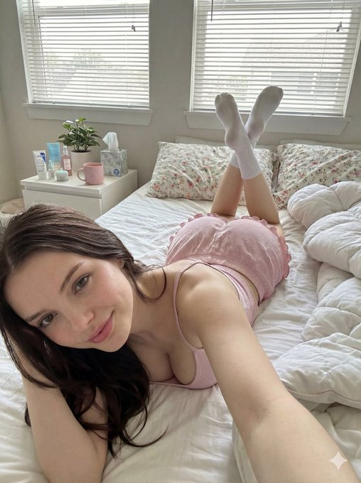
</p>

**Source:** [𝕏](https://x.com/xmliisu/status/2002008038178533653)

```json
{
  "scene": {
    "type": "bedroom_interior",
    "lighting": "natural_daylight",
    "atmosphere": "casual, cozy, domestic"
  },
  "subject": {
    "pose": {
      "position": "lying_prone_on_bed",
      "orientation": "facing_camera",
      "legs": "knees_bent_upwards, ankles_crossed",
      "arms": "left_arm_extended_for_selfie",
      "head": "resting_on_pillow"
    },
    "appearance": {
      "hair": "long, straight, dark_brown",
      "expression": "gentle_smile, direct_eye_contact",
      "complexion": "fair, rosy_cheeks"
    },
    "attire": {
      "top": {
        "item": "tank_top",
        "color": "light_pink",
        "texture": "ribbed",
        "style": "spaghetti_straps"
      },
      "bottom": {
        "item": "lounge_shorts",
        "color": "light_pink",
        "details": "ruffled_hem, scrunched_texture"
      },
      "accessories": {
        "feet": "white_crew_socks"
      }
    }
  },
  "environment": {
    "bedding": {
      "sheets": "white, rumpled",
      "pillows": "white_with_floral_pattern",
      "duvet": "white, puffy"
    },
    "background_elements": {
      "windows": {
        "quantity": 2,
        "features": "white_frames, horizontal_blinds"
      },
      "furniture": {
        "side_table": {
          "location": "left_side",
          "visible_items": [
            "skincare_products",
            "pink_mug",
            "small_potted_plant",
            "tissues"
          ]
        }
      }
    }
  },
  "composition": {
    "angle": "high_angle_selfie",
    "framing": "medium_shot",
    "focus": "sharp_subject, soft_background"
  }
}
```
---

### 🖼️ Prompt 04

<p align="center">
  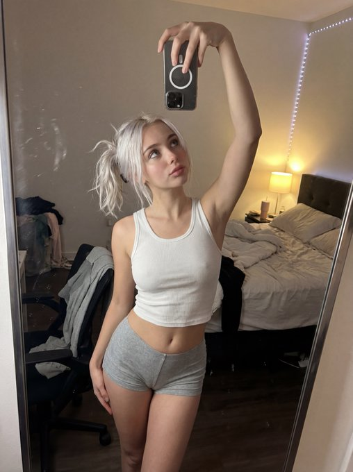
</p>

**Source:** [𝕏](https://x.com/gaucheai/status/2002730119589171270)

```json
{
  "subject": {
    "description": "Young woman taking bedroom mirror selfie, phone held high, casual loungewear moment",
    "age": "early 20s",
    
    "expression": {
      "eyes": "looking up at phone screen, soft doe eyes",
      "mouth": "soft pout, lips slightly pursed",
      "overall": "that 'checking my angles' focused selfie face"
    },
    
    "hair": {
      "color": "platinum blonde, white-silver",
      "style": "messy high ponytail, loose and undone",
      "details": "lots of pieces falling out, face-framing strands, effortless messy"
    },
    
    "body": {
      "frame": "petite, slim, toned",
      "waist": "small, defined, bare midriff",
      "stomach": "flat, toned, fully visible",
      "hips": "feminine curve"
    },
    
    "pose": {
      "phone_arm": "raised HIGH above head, extended up",
      "other_arm": "down, hand resting on hip/thigh",
      "stance": "slight hip cock, weight shifted",
      "torso": "slight twist, elongated from raised arm",
      "overall": "the classic high-angle mirror selfie pose"
    },
    
    "clothing": {
      "top": {
        "type": "white ribbed tank top",
        "fit": "fitted, cropped above belly button",
        "neckline": "scoop neck, simple",
        "effect": "basic but shows shape"
      },
      "bottom": {
        "type": "grey cotton boy shorts / mini shorts",
        "fit": "tight, very short, sits low on hips",
        "style": "lounge shorts, underwear-adjacent",
        "effect": "barely there, shows legs completely"
      }
    },
    
    "accessories": {
      "phone": "iPhone with MagSafe ring, clear case",
      "hair_tie": "scrunchie in ponytail",
      "jewelry": "minimal, maybe small earrings"
    }
  },

  "environment": {
    "location": "bedroom",
    "mirror": "full-length standing mirror",
    "room_details": {
      "bed": "visible in reflection, unmade, grey/beige bedding",
      "lamp": "warm bedside lamp glowing",
      "chair": "gaming/desk chair with clothes draped",
      "lights": "LED strip lights on wall",
      "clothes": "scattered on chair, lived-in"
    },
    "lighting": "warm lamp light + LED strips, cozy evening"
  },

  "photography": {
    "style": "mirror selfie, high angle",
    "framing": "thighs to above head",
    "angle": "phone above head shooting down",
    "quality": "iPhone",
    "aspect": "4:5 vertical"
  },

  "color_story": {
    "her": "white tank, grey shorts, platinum hair",
    "room": "beige walls, grey bedding, warm lamp glow",
    "palette": "neutral, soft, cozy tones"
  },

  "vibe": {
    "energy": "casual night in, loungewear content",
    "mood": "effortless, 'just hanging out'",
    "authenticity": "real bedroom, real mess, real girl",
    "caption": "'fit check' or 'staying in' or '🤍'"
  }
}
```
---

### 🖼️ Prompt 05

<p align="center">
  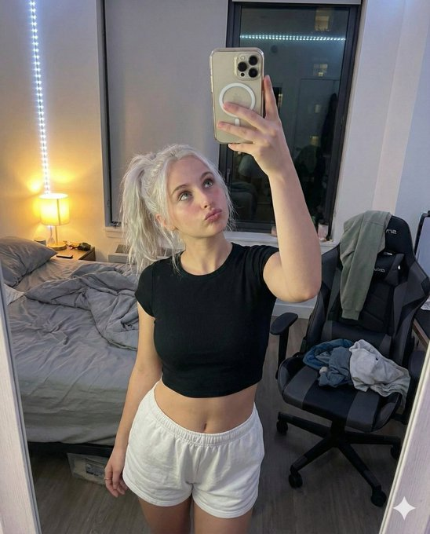
</p>

**Source:** [𝕏](https://x.com/NameIsSudee/status/20029153623132242430)

```json
{
  "subject": {
    "description": "Young woman taking bedroom mirror selfie, phone held high, casual loungewear moment",
    "age": "early 20s",
    
    "expression": {
      "eyes": "looking up at phone screen, soft doe eyes",
      "mouth": "soft pout, lips slightly pursed",
      "overall": "that 'checking my angles' focused selfie face"
    },
    
    "hair": {
      "color": "platinum blonde, white-silver",
      "style": "messy high ponytail, loose and undone",
      "details": "lots of pieces falling out, face-framing strands, effortless messy"
    },
    
    "body": {
      "frame": "petite, slim, toned",
      "waist": "small, defined, bare midriff",
      "stomach": "flat, toned, fully visible",
      "hips": "feminine curve"
    },
    
    "pose": {
      "phone_arm": "raised HIGH above head, extended up",
      "other_arm": "down, hand resting on hip/thigh",
      "stance": "slight hip cock, weight shifted",
      "torso": "slight twist, elongated from raised arm",
      "overall": "the classic high-angle mirror selfie pose"
    },
    
    "clothing": {
      "top": {
        "type": "Blake ribbed tank top",
        "fit": "fitted, cropped above belly button",
        "neckline": "scoop neck, simple",
        "effect": "basic but shows shape"
      },
      "bottom": {
        "type": "White cotton boy shorts / mini shorts",
        "fit": "tight, very short, sits low on hips",
        "style": "lounge shorts, underwear-adjacent",
        "effect": "barely there, shows legs completely"
      }
    },
    
    "accessories": {
      "phone": "iPhone with MagSafe ring, clear case",
      "hair_tie": "scrunchie in ponytail",
      "jewelry": "minimal, maybe small earrings"
    }
  },

  "environment": {
    "location": "bedroom",
    "mirror": "full-length standing mirror",
    "room_details": {
      "bed": "visible in reflection, unmade, grey/beige bedding",
      "lamp": "warm bedside lamp glowing",
      "chair": "gaming/desk chair with clothes draped",
      "lights": "LED strip lights on wall",
      "clothes": "scattered on chair, lived-in"
    },
    "lighting": "warm lamp light + LED strips, cozy evening"
  },

  "photography": {
    "style": "mirror selfie, high angle",
    "framing": "thighs to above head",
    "angle": "phone above head shooting down",
    "quality": "iPhone",
    "aspect": "4:5 vertical"
  },

  "color_story": {
    "her": "white tank, grey shorts, platinum hair",
    "room": "beige walls, grey bedding, warm lamp glow",
    "palette": "neutral, soft, cozy tones"
  },

  "vibe": {
    "energy": "casual night in, loungewear content",
    "mood": "effortless, 'just hanging out'",
    "authenticity": "real bedroom, real mess, real girl",
    "caption": "'fit check' or 'staying in' or '🤍'"
  }
}
```
---

### 🖼️ Prompt 06

<p align="center">
  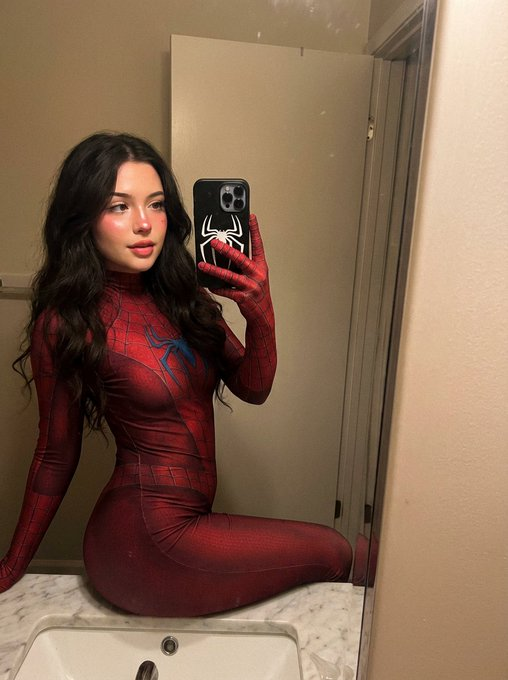
</p>

**Source:** [𝕏](https://x.com/Ankit_patel211/status/2002693515529392324)

```json
{
  "shot": "A tight close-up mirror selfie",
  "subject": {
    "appearance": "a stunning woman",
    "hair": "long wavy hair",
    "pose": "sitting casually sideways on a white bathroom vanity counter",
    "gaze": "looking at the mirror"
  },
  "outfit": {
    "bodysuit": "form-fitting red symbiote-inspired superhero bodysuit with subtle dark web texturing",
    "emblem": "prominent blue spider emblem on the chest"
  },
  "phone": {
    "device": "black smartphone",
    "case": "white spider logo case",
    "action": "holding it up to capture the reflection"
  },
  "environment": {
    "location": "bathroom",
    "lighting": "dimly lit with warm, soft indoor lighting",
    "atmosphere": "intimate atmosphere with soft shadows",
    "visible_elements": "only a partial section of the white sink basin and counter surface visible at the bottom of the frame",
    "mirror": "mirror edges are cropped out of view"
  },
  "aesthetic": "high quality, photorealistic, lo-fi social media aesthetic",
  "makeup": {
    "blush": "prominent soft pink blush on her cheeks",
    "finish": "glowy makeup",
    "highlighter": "on the tip of her nose",
    "lips": "slightly parted soft warm pink lips"
  },
  "skin": "highly detailed skin texture",
  "lighting_detail": "even, invisible front illumination that softly brightens the face with neutral white light, no visible light source, no shadows, no reflections, no hotspots",
  "quality": "no blur"
}
```
---

### 🖼️ Prompt 07

<p align="center">
  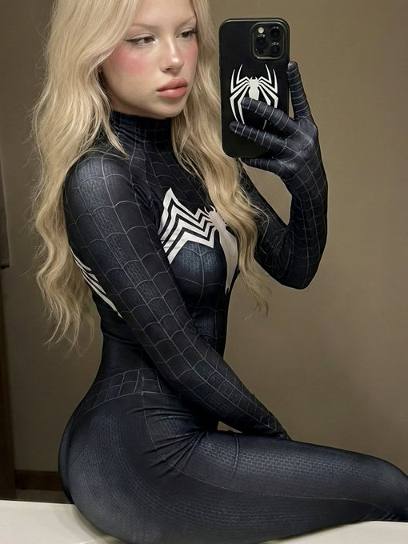
</p>

**Source:** [𝕏](https://x.com/zayleeai/status/2002681031279710516)

```json
{
  "shot": "A tight close-up mirror selfie",
  "subject": {
    "appearance": "a stunning woman",
    "hair": "long wavy hair",
    "pose": "sitting casually sideways on a white bathroom vanity counter",
    "gaze": "looking at the mirror"
  },
  "outfit": {
    "bodysuit": "form-fitting black symbiote-inspired superhero bodysuit with subtle dark web texturing",
    "emblem": "prominent white spider emblem on the chest"
  },
  "phone": {
    "device": "black smartphone",
    "case": "white spider logo case",
    "action": "holding it up to capture the reflection"
  },
  "environment": {
    "location": "bathroom",
    "lighting": "dimly lit with warm, soft indoor lighting",
    "atmosphere": "intimate atmosphere with soft shadows",
    "visible_elements": "only a partial section of the white sink basin and counter surface visible at the bottom of the frame",
    "mirror": "mirror edges are cropped out of view"
  },
  "aesthetic": "high quality, photorealistic, lo-fi social media aesthetic",
  "makeup": {
    "blush": "prominent soft pink blush on her cheeks",
    "finish": "glowy makeup",
    "highlighter": "on the tip of her nose",
    "lips": "slightly parted soft warm pink lips"
  },
  "skin": "highly detailed skin texture",
  "lighting_detail": "even, invisible front illumination that softly brightens the face with neutral white light, no visible light source, no shadows, no reflections, no hotspots",
  "quality": "no blur"
}
```
---

### 🖼️ Prompt 08

<p align="center">
  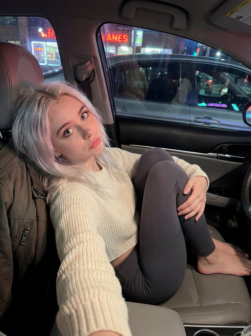
</p>

**Source:** [𝕏](https://x.com/gaucheai/status/2002387906250608835)

```json
{
  "subject": {
    "description": "Young woman in car passenger seat at night, cozy tired energy, that 'drive me home' vibe",
    "age": "early 20s",
    
    "expression": {
      "eyes": "soft, slightly tired, looking directly at camera, doe eyes",
      "mouth": "soft relaxed pout, lips slightly parted",
      "overall": "that 'im tired but still cute' late night energy"
    },
    
    "hair": {
      "color": "platinum blonde with subtle pink tint",
      "style": "messy, tousled, falling naturally",
      "details": "pushed to one side, bedhead vibes"
    },
    
    "body": {
      "position": "reclined in passenger seat",
      "legs": "pulled up, knees to chest, curled up",
      "frame": "petite, cozy, compact pose"
    },
    
    "pose": {
      "position": "sitting sideways in passenger seat, back against door/seat",
      "legs": "bent, knees up, feet on seat, hugging legs",
      "arms": "one arm extended taking photo, other hand resting on leg",
      "head": "tilted against headrest, relaxed",
      "overall": "the curled up passenger seat pose"
    },
    
    "clothing": {
      "top": {
        "type": "cream/beige cropped cable knit sweater",
        "fit": "fitted, cropped showing sliver of midriff",
        "sleeves": "long, cozy"
      },
      "bottom": {
        "type": "dark grey leggings/yoga pants",
        "fit": "tight, second skin, full length"
      },
      "jacket": {
        "type": "olive/khaki bomber or utility jacket",
        "status": "draped behind her, not fully worn"
      },
      "feet": "barefoot, shoes off in car"
    },
    
    "accessories": {
      "earrings": "small studs, minimal",
      "minimal": "cozy night out, not overdone"
    }
  },

  "environment": {
    "location": "car passenger seat, nighttime",
    "car_interior": {
      "seats": "tan/beige leather",
      "vibe": "nice car, comfortable"
    },
    "outside": {
      "visible": "city lights through window, neon signs",
      "signs": "bowling lanes sign visible, urban area",
      "weather": "night, possibly rainy (wet window)"
    },
    "lighting": "mixed - soft interior, neon glow from outside"
  },

  "photography": {
    "style": "selfie from driver perspective or self-timer",
    "framing": "full body curled in seat",
    "quality": "iPhone, nighttime",
    "aspect": "4:5 vertical"
  },

  "color_story": {
    "her": "cream sweater, grey leggings, platinum hair",
    "car": "tan leather, warm interior",
    "outside": "neon reds and blues through glass",
    "mood": "warm inside vs cool city outside"
  },

  "vibe": {
    "energy": "cozy, tired, end of night",
    "mood": "'take me home' passenger princess",
    "caption": "'late night drives' or 'passenger princess' or '🚗'"
  }
}
```
---

### 🖼️ Prompt 09

<p align="center">
  
</p>

**Source:** [𝕏](https://x.com/notiiivy/status/2001594863079318015)

```json
{
  "task_configuration": {
    "task_type": "screen_simulation_photorealism",
    "target_model": "SDXL_1.0_Refiner",
    "aspect_ratio": "3:4",
    "resolution": {
      "width": 1152,
      "height": 1536
    }
  },
  "visual_hierarchy": {
    "layer_1_physical_macro": {
      "camera_angle": "Downward-angled, high-angle",
      "framing": "MacBook screen filling 95% of frame",
      "surface_imperfections": [
        "subtle pixel-grid texture (moire)",
        "tiny dust particles on glass",
        "faint ambient light reflection on glossy screen",
        "fingerprint smudges"
      ],
      "foreground_anchor": "Thin strip of physical keyboard visible at lower edge"
    },
    "layer_2_digital_interface": {
      "theme": "Dark Mode (macOS)",
      "window_layout": 
        "right_panel": "Photo Booth live-preview window (dominant focus)"
      }
    },
    "layer_3_nested_subject_content": {
      "context": "Inside the Photo Booth window",
      "environment": "Dim bedroom, off-white wall, rumpled bedding",
      "lighting_simulation": "Cool screen glow mixed with warm skin tones, deep nocturnal shadows",
      "subjects": {
        "shared_attributes": [
          "black top",
          "Reclining pose",
          "Looking at screen"
        ],
        "subject_girl": {
          "identity_target": "uploaded_female_reference_image",
          "position": "Left/Center",  
    "age": "young adult",  
    "expression": "relaxed, candid, slight smile",  
    "hair": {  
      "color": "blonde",  
      "style": "shoulder a bit long length, slightly short"   
},   
        }
      }
    }
  },
  "prompt_assembly": {
    "positive_prompt": "Hyper-realistic downward shot of a MacBook screen. The screen surface has visible dust, pixel grid, and reflection. The screen displays a macOS desktop in dark mode with two windows: on the left, a dominant Photo Booth live-preview window showing a girl in a dark bedroom with an off-white wall and rumpled bedding. The girl is lying , wearing  black top, grey bottom, faces fully visible and taken exactly from the uploaded reference photos. The girl is holding a iPhone 15 Pro phone in her right hand. The lighting is low-key, candid, nocturnal, with blue-ish screen glow mixed with warm skin tones and deep shadows. High fidelity, raw photo, unedited, natural noise and imperfections.",
    "negative_prompt": "vector art, screenshot, flat digital image, clean glass, perfect screen, daylight, bright studio lights, cartoon, 3d render, painting, watermark"
  },
  "identity_preservation_settings": {
    "strictness_level": "CRITICAL",
    "methodology": {
      "control_net_stack": [
        {
          "unit": "ControlNet_Tile",
          "weight": 0.4,
          "purpose": "To maintain the text/interface sharpness on the MacBook screen "
        },
        {
          "unit": "IP-Adapter_FaceID_Plus",
          "weight": 0.95,
          "region_mask": "Photo Booth Window Area Only",
        }
      ]
    }
  },
  "rendering_parameters": {
    "sampler": "DPM++ 3M SDE Exponential",
    "steps": 40,
    "cfg_scale": 5.5,
    "denoising_strength": 0.35
  }
}
```
---

### 🖼️ Prompt 10

<p align="center">
  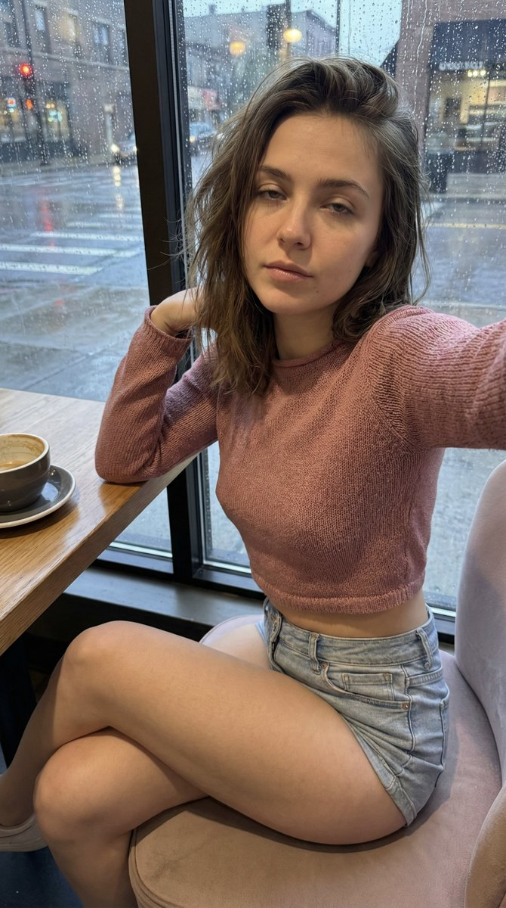
</p>

**Source:** [𝕏](https://x.com/bananababydoll/status/2001174017567547659)

```json
{
  "meta": {
    "aspect_ratio": "9:16",
    "quality": "ultra_photorealistic",
    "resolution": "8k",
    "camera": "smartphone front camera",
    "lens": "26mm",
    "style": "raw Instagram realism, natural skin texture, cinematic softness"
  },

  "scene": {
    "location": "small aesthetic city café by a rainy window",
    "time": "late afternoon",
    "environment": [
      "large glass window with rain droplets",
      "wooden café table",
      "soft fabric chair",
      "blurred city street outside"
    ],
    "atmosphere": "cozy, intimate, rainy-day tension"
  },

  "lighting": {
    "type": "natural window light",
    "key_light": "soft overcast daylight",
    "fill_light": "warm interior reflections",
    "effect": "gentle shadows, smooth highlights on curves"
  },

  "camera_perspective": {
    "pov": "we are her phone",
    "angle": "slightly high selfie angle",
    "framing": "mid-thigh to head",
    "distance": "arm-length",
    "phone_visibility": "not visible"
  },

  "subject": {
    "gender": "female",
    "age": "early 20s (clearly adult)",
    "ethnicity": "random mixed ethnicity",
    "body": {
      "type": "soft-curvy",
      "waist": "slim",
      "hips": "round",
      "chest": "naturally full",
      "legs": "smooth thick thighs"
    },

    "hair": {
      "color": "dark blonde",
      "style": "loose slightly messy hair",
      "behavior": "a few damp strands from rain, framing her face"
    },

    "face": {
      "expression": "calm, seductive neutral face",
      "eyes": "half-lidded, looking directly at camera",
      "makeup": "natural makeup, glossy lips",
      "skin": "real texture, soft glow"
    },

    "pose": {
      "stance": "sitting sideways on café chair",
      "hips": "angled toward camera",
      "legs": "one leg crossed slightly, thigh closest to lens",
      "upper_body": "leaning back casually",
      "arms": {
        "phone_hand": "holding phone slightly above face",
        "free_hand": "resting on chair or thigh"
      }
    },

    "outfit": {
      "top": {
        "type": "thin knit long-sleeve crop top",
        "color": "dusty pink",
        "fit": "tight, slightly sheer",
        "underwear": "no bra"
      },
      "bottom": {
        "type": "micro denim shorts",
        "color": "light blue",
        "fit": "very short, riding up naturally while seated"
      }
    }
  },

  "details": {
    "vibe": "effortless sexy, quiet confidence",
    "realism": "looks like a spontaneous café selfie",
    "mood": "soft but addictive, scroll-stopping"
  }
}
```
---

### 🖼️ Prompt 11

<p align="center">
  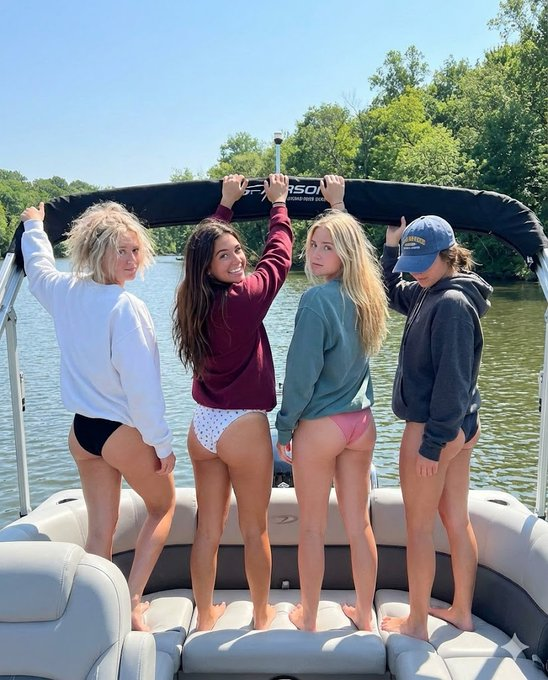
</p>

**Source:** [𝕏](https://x.com/sumiturkude007/status/2001011772359332060)

```json
{
  "aspect_ratio": "4:5",
  "scene_type": "outdoor summer lifestyle group photo on a boat",
  "camera": {
    "device": "smartphone rear camera",
    "angle": "slightly low, behind subjects",
    "framing": "full body, rear-facing",
    "focus": "sharp subjects, clear background",
    "style": "casual candid snapshot"
  },
  "subjects": [
    {
      "position": "far left",
      "gender": "female",
      "age": "adult",
      "hair": "light blonde, medium length, loose, wind-tousled",
      "face": "partial side profile, head turned slightly right, gaze downward, neutral expression",
      "posture": "standing on cushioned seat, weight on right leg, hips shifted right, slight forward lean",
      "arms": "left arm raised holding frame, right arm relaxed",
      "hands": "loose secure grip",
      "feet": "barefoot, left foot flat, right heel lifted",
      "clothing": "white oversized sweatshirt, black bikini bottoms"
    },
    {
      "position": "second from left",
      "gender": "female",
      "age": "adult",
      "hair": "dark brown, long, loosely tied with flyaways",
      "face": "fully visible, head turned over right shoulder, looking at camera, wide smile",
      "posture": "upright stance on seat, even weight, hips centered, slight back arch",
      "arms": "both arms raised gripping frame",
      "hands": "firm grip",
      "feet": "barefoot, both feet flat",
      "clothing": "maroon sweatshirt, white patterned bikini bottoms"
    },
    {
      "position": "second from right",
      "gender": "female",
      "age": "adult",
      "hair": "light blonde, long, loose waves",
      "face": "partially visible, head turned back slightly, side glance, neutral to mild pout",
      "posture": "standing relaxed, weight on left leg, hips angled left, slight torso twist",
      "arms": "right arm raised holding frame, left arm relaxed",
      "hands": "light grip",
      "feet": "barefoot, left foot flat, right foot slightly behind",
      "clothing": "muted teal sweatshirt, pink bikini bottoms"
    },
    {
      "position": "far right",
      "gender": "female",
      "age": "adult",
      "hair": "dark brown, long, loose under cap",
      "face": "mostly obscured, head angled downward, gaze toward floor or water",
      "posture": "standing with slight forward lean, weight on right leg, hips angled outward",
      "arms": "left arm raised holding frame, right arm relaxed",
      "hands": "firm grip",
      "feet": "barefoot, feet close together",
      "clothing": "dark gray hoodie, dark bikini bottoms, blue baseball cap with white/red text"
    }
  ],
  "objects": {
    "boat": "motorboat with light gray padded vinyl seats and black overhead canopy frame with branding"
  },
  "environment": {
    "location": "river or lake",
    "background": "calm rippling water, dense green trees, clear blue sky"
  },
  "lighting": {
    "type": "natural daylight",
    "time": "late morning or early afternoon",
    "direction": "sunlight from above and slightly behind",
    "shadows": "soft shadows on legs and seats"
  },
  "style": {
    "genre": "summer lifestyle photography",
    "aesthetic": "casual, spontaneous",
    "mood": "fun, relaxed, social"
  },
  "quality_tags": [
    "photorealistic",
    "accurate posture",
    "natural expressions",
    "realistic lighting",
    "detailed environment",
    "no watermark"
  ]
}
```
---

### 🖼️ Prompt 12

<p align="center">
  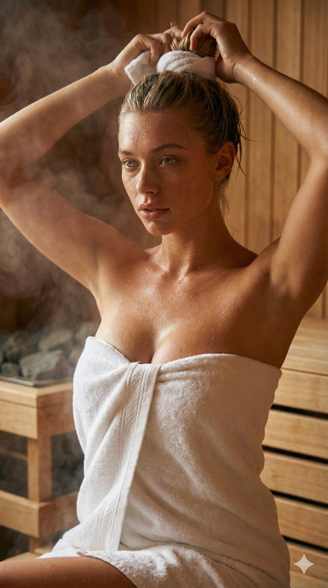
</p>

**Source:** [𝕏](https://x.com/YaseenK7212/status/2001170333697532092)

```json
{
  "image_generation_request": {
    "subject_definition": {
      "identity_constraints": {
        "facial_fidelity_requirement": "Strict, non-negotiable 100% adherence to the exact facial structure, features, and likeness of the woman depicted in the previously uploaded input image. No algorithmic alterations to identity are permitted.",
        "general_body_consistency": "The underlying body frame must remain consistent with the input identity, subject only to specific requested modifications."
      },
      "physique_modifications": {
        "target_anatomical_area": "Bust and chest region.",
        "modification_instruction": "The subject's breasts must appear significantly larger, fuller, and more voluminous than their natural state, creating a pronounced curve underneath the towel wrap."
      }
    },
    "action_and_pose_parameters": {
      "posture": "Seated gracefully upright on a sauna bench.",
      "arm_placement": "Both arms are raised upward, bent at the elbows, reaching towards the back of the head.",
      "primary_activity": "The subject is in the act of tying up her wet hair into a knot or bun, utilizing a small, secondary towel for the task."
    },
    "environment_and_atmosphere": {
      "setting_location": "Interior of an active, hot steam room sauna, featuring wooden wall paneling and benches.",
      "environmental_effects": {
        "steam_density": "Visible atmospheric steam creating a humid, slightly hazy environment.",
        "heat_indicators": "Evidence of high temperature affecting the subject."
      },
      "subject_physiological_state": {
        "perspiration_level": "Heavy sweating; skin on the face, neck, shoulders, décolletage, and arms is thoroughly wet and glistening with distinct beads of perspiration.",
        "hair_state": "Damp and sweaty due to the steam and heat."
      }
    },
    "attire_and_styling_details": {
      "garment_type": "A thick, soft, plush white bath towel.",
      "wrapping_style": "Securely wrapped around the torso under the arms, draped in a manner that highlights the increased fullness of the bust."
    },
    "photographic_execution": {
      "shot_type": "Cinematic portrait.",
      "framing": "Half-face close-up, capturing head and shoulders down to the mid-torso.",
      "resolution_and_realism": "8K ultra-realistic rendering with hyper-detailed textures, appearing as a high-end photograph rather than a generated image.",
      "focus_areas": "Critical focus on water droplets on skin, texture of wet hair, and the fabric weave of the terry cloth towel.",
      "lighting_profile": "Warm, diffused, humid sauna lighting designed to accentuate the sheen of sweat on skin."
    },
    "technical_output_specifications": {
      "aspect_ratio_formatted": "9:16 (vertical orientation)"
    }
  }
}
```
---

### 🖼️ Prompt 13

<p align="center">
  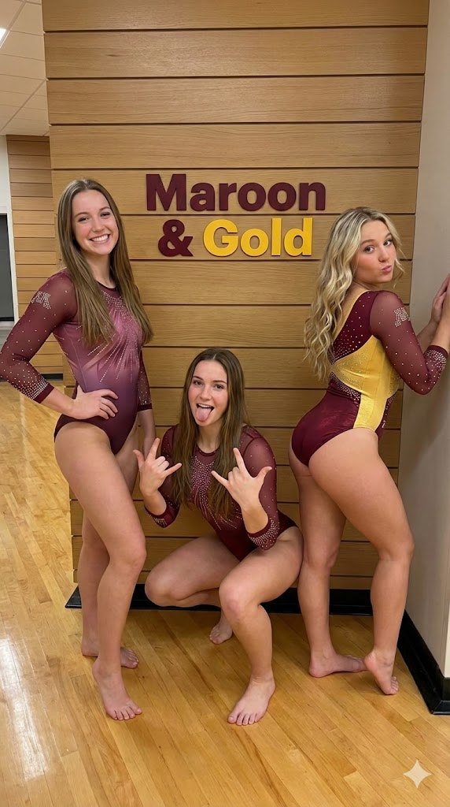
</p>

**Source:** [𝕏](https://x.com/sumiturkude007/status/2000961787513200848)

```json
{
  "aspect_ratio": "9:16",
  "scene_type": "indoor sports team photo",
  "camera": {
    "device": "smartphone or digital camera",
    "angle": "eye-level",
    "framing": "full body of three subjects, vertical framing",
    "focus": "sharp focus on subjects and background text",
    "style": "casual team snapshot"
  },
  "subjects": [
    {
      "position": "left",
      "gender": "female",
      "build": "athletic",
      "hair": {
        "color": "light brown",
        "length": "long",
        "style": "straight, worn loose over shoulders"
      },
      "face": {
        "shape": "oval",
        "expression": "broad smile",
        "eyes": "open, looking at camera",
        "emotion": "happy and confident"
      },
      "body_posture": {
        "stance": "standing upright",
        "weight_distribution": "balanced on both feet",
        "arms": "one hand resting on hip, other arm relaxed",
        "feet": "barefoot, flat on floor"
      },
      "clothing": {
        "type": "gymnastics leotard",
        "primary_color": "maroon",
        "details": "long sleeves with mesh and rhinestone accents, light gradient design on torso"
      }
    },
    {
      "position": "center",
      "gender": "female",
      "build": "athletic",
      "hair": {
        "color": "medium brown",
        "length": "long",
        "style": "straight, parted near center"
      },
      "face": {
        "shape": "round to oval",
        "expression": "playful, tongue slightly out",
        "eyes": "open, looking toward camera",
        "emotion": "energetic, playful"
      },
      "body_posture": {
        "stance": "deep squat",
        "knees": "bent outward",
        "arms": "both hands raised with expressive hand signs",
        "feet": "barefoot, heels slightly lifted"
      },
      "clothing": {
        "type": "gymnastics leotard",
        "primary_color": "maroon",
        "details": "long sleeves, sparkly embellishments, lighter decorative pattern on chest"
      }
    },
    {
      "position": "right",
      "gender": "female",
      "build": "athletic",
      "hair": {
        "color": "blonde",
        "length": "long",
        "style": "loose waves"
      },
      "face": {
        "shape": "oval",
        "expression": "smiling with tongue playfully out",
        "eyes": "open, glancing toward camera",
        "emotion": "fun, playful"
      },
      "body_posture": {
        "stance": "standing with back partially turned",
        "torso": "twisted slightly toward camera",
        "arms": "hands pressed against wall",
        "feet": "barefoot, heels down"
      },
      "clothing": {
        "type": "gymnastics leotard",
        "primary_color": "maroon and gold",
        "details": "long sleeves, contrasting gold upper section, rhinestone accents"
      }
    }
  ],
  "environment": {
    "location": "indoor athletic facility or school building",
    "background": {
      "wall_material": "horizontal wooden panels",
      "text": {
        "words": "Maroon & Gold",
        "font_style": "bold sans-serif",
        "colors": ["maroon", "gold"],
        "placement": "centered behind subjects"
      },
      "floor": "polished brown surface"
    }
  },
  "lighting": {
    "type": "indoor ambient lighting",
    "direction": "even frontal",
    "quality": "soft, no harsh shadows"
  },
  "style": {
    "genre": "sports team photo",
    "aesthetic": "casual, celebratory",
    "mood": "team pride, playful energy"
  },
  "quality_tags": [
    "clear facial expressions",
    "accurate body posture",
    "detailed uniforms",
    "team environment",
    "vertical framing",
    "no watermark"
  ]
}
```
---

### 🖼️ Prompt 14

<p align="center">
  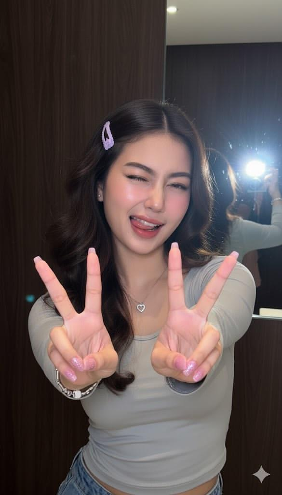
</p>

**Source:** [𝕏](https://x.com/xmiiru_/status/2000782882789265649)

```json
{
  "subject": {
    "type": "teenage girl",
    "face": {
      "unchanged": true,
      "details": "100% original"
    },
    "hair": {
      "length": "long",
      "texture": "soft, gently wavy",
      "color": "dark brown",
      "accessory": "Sanrio Kuromi hair clip"
    },
    "clothing": {
      "top": {
        "type": "spaghetti strap crop top",
        "color": "dark gray"
      },
      "accessories": [
        {
          "type": "silver chain waist belt",
          "charm": "dangling crescent moon"
        },
        {
          "type": "silver bracelet"
        },
        {
          "type": "silver necklace",
          "pendant": "minimalist cross"
        }
      ]
    },
    "body": {
      "figure": "enhanced curves and waistline with sharp definition",
      "skin": {
        "tone": "fair with pinkish hue",
        "texture": "smooth, slightly rosy"
      }
    },
    "eyes": {
      "color": "grayish-blue",
      "contacts": true
    },
    "makeup": {
      "eyeshadow": "soft pink",
      "eyeliner": "fine, sharp",
      "lashes": "long",
      "lips": "pink-red gloss"
    },
    "nails": {
      "color": "clear pink glitter"
    },
    "pose": {
      "style": "leaning sideways, hair lifted playfully",
      "hand": "raised slightly"
    }
  },
  "environment": {
    "location": "bathroom",
    "walls": "dark wooden",
    "mirror": {
      "reflection": "faint reflection of model",
      "extra": "another woman's hand taking photo"
    }
  },
  "camera": {
    "model": "Canon IXY/IXUS",
    "flash": "strong front flash",
    "lighting_effect": "illuminates face, glowing skin, shadow highlights"
  },
  "style": {
    "aesthetic": ["Y2K Digital Aesthetic", "Cyber Ulzzang", "Retro Japan–Korea"]
  }
}
```
---

### 🖼️ Prompt 15

<p align="center">
  
</p>

**Source:** [𝕏](https://x.com/siennalovesai/status/2000962698192834814)

```json
{
  "meta": {
    "aspect_ratio": "9:16",
    "quality": "ultra_photorealistic",
    "resolution": "8k",
    "camera": "smartphone front camera",
    "lens": "24mm",
    "style": "raw late-night selfie, high realism, no over-smoothing"
  },

  "scene": {
    "location": "hot yoga studio",
    "setting": "mats on floor, mirrored walls fogged, incense haze",
    "time": "late afternoon",
    "atmosphere": "empowering, heated tension"
  },

  "lighting": {
    "type": "warm ambient",
    "source": "studio lights dimmed + window sunlight",
    "effect": "sweat highlights, toned shadows"
  },

  "camera_perspective": {
    "pov": "we ARE her phone",
    "angle": "low from floor level",
    "distance": "arm-length",
    "framing": "full legs to head",
    "phone_visibility": "not visible"
  },

  "subject": {
    "gender": "female",
    "age": "early 20s (clearly adult)",
    "ethnicity": "random south asian / mixed",

    "body": {
      "type": "extreme hourglass",
      "waist": "razor thin",
      "hips": "very wide and round",
      "ass": "heavy, full, dominant",
      "chest": "large and natural",
      "legs": "thick thighs"
    },

    "skin": {
      "tone": "warm caramel",
      "detail": "glossy sweat coverage, visible beads",
      "cheeks": "deep exercise flush"
    },

    "hair": {
      "color": "dark auburn",
      "length": "long",
      "style": "sweaty bun partially undone",
      "behavior": "loose strands clinging to neck"
    },

    "face": {
      "eyes": "amber",
      "expression": "confident, predatory look",
      "brows": "strong and arched",
      "lips": "breathless and parted",
      "vibe": "victorious sensuality"
    },

    "pose": {
      "position": "in child's pose variation",
      "hips": "raised slightly",
      "torso": "stretched forward",
      "legs": "kneeling",
      "arms": {
        "phone_hand": "held out front",
        "free_hand": "supporting pose"
      }
    },

    "outfit": {
      "top": {
        "type": "yoga crop top",
        "color": "lavender",
        "fabric": "stretchy spandex, sweat-soaked",
        "fit": "skin-tight",
        "effect": "moisture enhancing definition"
      },
      "bottom": {
        "type": "yoga shorts",
        "color": "matching lavender",
        "fit": "high-waisted, compressive",
        "behavior": "clinging from sweat"
      }
    }
  },

  "details": [
    "fogged mirrors",
    "sweat puddles on mat",
    "yoga props scattered",
    "post-flow glow",
    "wellness influencer realism"
  ]
}
```
---

### 🖼️ Prompt 16

<div align="center">
  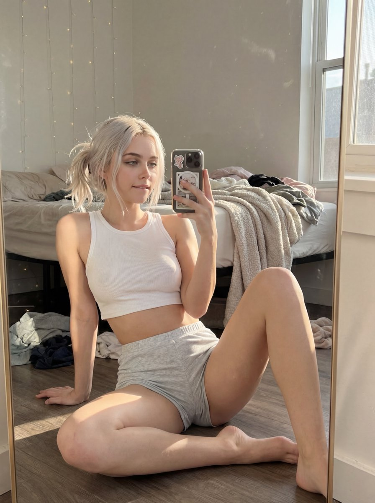
  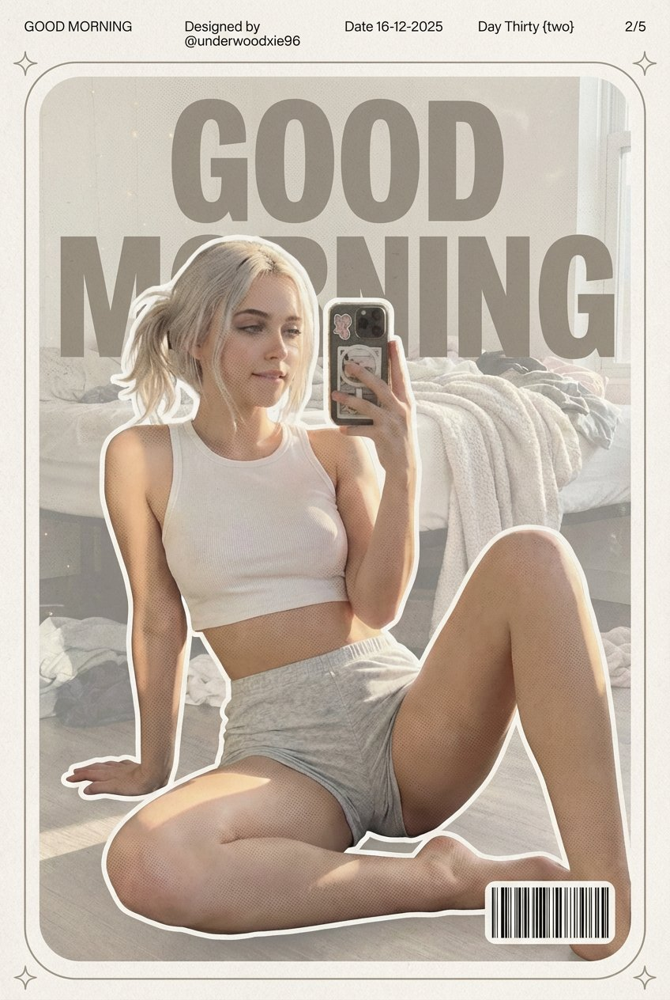
</div>

**Source:** [𝕏](https://x.com/underwoodxie96/status/2000782356974854439)

```json
{
  "poster_structure": {
    "format": {
      "aspect_ratio": "2:3",
      "orientation": "vertical",
      "safe_margins": "medium",
      "grid": "classic magazine cover grid with generous top header area and bottom utility area"
    },
    "layers": {
      "background_layer": {
        "type": "single-photo-or-flat-color",
        "treatment": [
          "subtle paper grain",
          "light halftone/print texture",
          "slightly faded print tones"
        ]
      },
      "title_layer": {
        "type": "oversized headline behind subject",
        "text": "GOOD MORNING",
        "placement": "upper third, spanning wide",
        "z_index": "behind_subject",
        "style": {
          "case": "title case or sentence case (match exactly)",
          "font_feel": "bold retro editorial display",
          "color_rule": "match dominant background color for embedded look",
          "effects": ["no outline", "no glow", "clean fill"]
        }
      },
      "subject_layer": {
        "type": "foreground cutout",
        "masking": "clean edge cutout, natural silhouette",
        "z_index": "top",
        "rules": [
          "subject must overlap and partially cover the title text",
          "no extra cutout artifacts",
          "no duplicated subject"
        ]
      },
      "frame_layer": {
        "type": "border + inner line + ornaments",
        "outer_border": {
          "material": "off-white textured paper",
          "shape": "rounded corners",
          "rule": "NO outer black frame"
        },
        "inner_frame_line": {
          "style": "thin line near edges",
          "color": "subtle warm gray/beige",
          "opacity": "low"
        },
        "corner_ornaments": {
          "style": "small classic corner marks",
          "quantity": "4",
          "subtlety": "minimal"
        }
      },
      "header_microtext_layer": {
        "type": "small header metadata text",
        "placement": "top margin area",
        "alignment": "left to center, magazine-like",
        "text_blocks": [
          { "text": "GOOD MORNING", "role": "micro_title" },
          { "text": "Designed by \n\n@underwoodxie96\n\n", "role": "credit_line" },
          { "text": "Date 16-12-2025", "role": "date_line" },
          { "text": "Day Thirty {two}", "role": "day_counter" },
          { "text": "2/5", "role": "issue_fraction" }
        ],
        "style": {
          "font_feel": "clean editorial sans or simple serif",
          "size": "very small",
          "tracking": "slightly increased",
          "color": "muted dark gray"
        }
      },
      "barcode_layer": {
        "type": "barcode graphic",
        "placement": "bottom right",
        "size": "small to medium",
        "style": "clean black/gray on light background",
        "rule": "must remain visible"
      }
    },
    "print_finish": {
      "global_texture": ["paper grain", "subtle halftone"],
      "contrast": "medium-low",
      "saturation": "slightly faded",
      "clarity": "high but not HDR"
    }
  },
  "constraints": {
    "must_keep": [
      "off-white textured border with rounded corners (NO outer black frame)",
      "thin inner frame line near the edges",
      "small corner ornaments",
      "oversized title text placed behind the subject and partially covered by the subject cutout",
      "paper/halftone print texture across the whole design",
      "barcode at bottom right",
      "header microtext blocks present at the top"
    ],
    "text_lock": [
      "Designed by \n\n@underwoodxie96\n\n",
      "Date 16-12-2025",
      "Day Thirty {two}",
      "2/5",
      "GOOD MORNING"
    ],
    "avoid": [
      "outer black border/frame",
      "extra random text",
      "misspelled or garbled typography",
      "neon colors",
      "heavy HDR",
      "watermarks or extra logos"
    ]
  },
  "negative_prompt": [
    "watermark",
    "extra logos",
    "misspelled text",
    "garbled typography",
    "random letters",
    "outer black frame",
    "overprocessed",
    "heavy HDR",
    "neon colors",
    "low resolution"
  ]
}
```
---

### 🖼️ Prompt 17

<p align="center">
  
</p>

**Source:** [𝕏](https://x.com/gaucheai/status/1999476360046092675)

```json
{
  "subject": {
    "description": "20yo woman sitting on bedroom floor taking mirror selfie, lazy morning energy, effortlessly pretty in loungewear",
    "setting_rules": "bedroom floor, full-length mirror, natural daylight, intimate casual",
    "age": "early 20s",
    
    "expression": {
      "eyes": {
        "look": "soft gaze toward phone screen, not directly at lens",
        "energy": "relaxed, peaceful, content",
        "direction": "looking slightly down at phone"
      },
      "mouth": {
        "position": "soft, relaxed, hint of gentle smile",
        "energy": "serene, unbothered, comfortable"
      },
      "overall": "that 'lazy sunday morning' face, no effort needed, naturally pretty"
    },
    
    "hair": {
      "color": "platinum blonde, white-blonde",
      "style": "messy low ponytail / loose bun",
      "details": {
        "updo": "loosely pulled back, casual, undone",
        "pieces": "lots of face-framing pieces escaped, falling around face",
        "texture": "messy, slept-on, bedhead but cute",
        "length": "shoulder length visible in loose pieces"
      },
      "effect": "the 'just threw it up' hair that actually looks perfect"
    },
    
    "body": {
      "frame": "slim, athletic, toned",
      "waist": "small, visible midriff",
      "chest": "modest but perky, visible through thin white tank",
      "legs": "long, toned, smooth, the focus of this pose",
      "skin": "pale, fair, smooth, glowing in natural light"
    },
    
    "pose": {
      "position": "sitting on floor in front of full-length mirror",
      "base": "seated on wooden floor",
      
      "legs": {
        "arrangement": "THE KEY - one leg bent up (knee raised), one leg folded/tucked under",
        "left_leg": "bent at knee, raised up, foot flat on floor",
        "right_leg": "folded underneath, tucked to side",
        "effect": "shows leg length, creates interesting shape, feminine"
      },
      
      "upper_body": {
        "lean": "leaning back slightly, weight on one arm",
        "support": "left arm behind her, hand on floor, supporting weight",
        "posture": "relaxed lean, casual, comfortable"
      },
      
      "arms": {
        "left_arm": {
          "position": "behind her, hand flat on floor",
          "function": "supporting her weight as she leans back",
          "effect": "creates casual reclined pose"
        },
        "right_arm": {
          "position": "raised, holding phone for selfie",
          "angle": "phone at face level, capturing mirror reflection"
        }
      },
      
      "overall": "seated floor selfie, leaning back on one arm, legs arranged artfully, phone raised"
    },
    
    "clothing": {
      "top": {
        "type": "white ribbed tank top / crop top",
        "color": "WHITE - clean, bright",
        "style": {
          "cut": "cropped, ends above belly button",
          "fit": "fitted, tight, ribbed texture",
          "neckline": "high neck, racer-back style",
          "straps": "thick athletic straps"
        },
        "fit_details": {
          "chest": "fitted, shows shape through thin fabric",
          "fabric": "thin ribbed cotton, slightly see-through quality",
          "length": "cropped to show midriff"
        },
        "effect": "basic white tank but the fit makes it work"
      },
      
      "bottom": {
        "type": "grey cotton lounge shorts",
        "color": "HEATHER GREY - soft, cozy",
        "style": {
          "cut": "very short, mini length",
          "fit": "relaxed, soft, comfortable",
          "waist": "elastic waistband, sits at natural waist",
          "leg": "loose, rolled or short cut"
        },
        "details": {
          "fabric": "soft cotton jersey, sweatshort material",
          "length": "very short, upper thigh, almost underwear length"
        },
        "effect": "the 'i sleep in these' shorts that show everything"
      },
      
      "feet": {
        "status": "barefoot",
        "visibility": "feet visible, tucked and natural",
        "effect": "intimate, home, comfortable"
      }
    },
    
    "accessories": {
      "jewelry": {
        "minimal": "none visible or very minimal",
        "effect": "just woke up, no accessories"
      },
      "phone": {
        "type": "iPhone",
        "case": "clear case with stickers - anime/cute stickers visible",
        "grip": "held naturally for mirror selfie"
      }
    },
    
    "skin_details": {
      "visible_areas": "midriff, full legs, arms, shoulders",
      "tone": "pale, fair, porcelain",
      "texture": "smooth, soft, natural",
      "lighting_effect": "warm natural light catching skin beautifully"
    },
    
    "face": {
      "features": "soft, pretty, girl-next-door",
      "makeup": "none or minimal - natural beauty",
      "expression": "soft, relaxed, content"
    }
  },

  "environment": {
    "location": "bedroom",
    "style": "lived-in, real, cozy",
    
    "the_mirror": {
      "type": "full-length floor mirror or leaning mirror",
      "frame": "thin gold/brass frame",
      "position": "leaning against wall, she's sitting in front of it"
    },
    
    "room_details": {
      "floor": "wooden floor, warm tone",
      "walls": "light beige/cream",
      "bed": {
        "visible": "yes, in mirror reflection behind her",
        "state": "UNMADE - messy sheets, blankets rumpled",
        "bedding": "grey/neutral tones, cozy sherpa blanket hanging off"
      },
      "clothes": "clothes on floor, lived-in mess - jeans, items scattered",
      "window": "visible in reflection, natural light source",
      "fairy_lights": "string lights visible on wall near ceiling"
    },
    
    "lighting": {
      "type": "natural daylight from window",
      "quality": "soft, warm, golden morning/afternoon light",
      "direction": "coming from window on right side",
      "effect": "beautiful natural glow, catches her skin and hair"
    },
    
    "atmosphere": "real bedroom, real mess, real girl - intimate and authentic"
  },

  "photography": {
    "style": "mirror selfie, seated on floor",
    "framing": "full body in mirror reflection",
    "quality": "iPhone quality, authentic",
    "angle": "mirror straight on, she's seated looking at it",
    "aspect": "4:5 vertical"
  },

  "color_story": {
    "her": {
      "top": "WHITE - clean, bright",
      "shorts": "GREY - soft, neutral",
      "hair": "PLATINUM blonde",
      "skin": "pale, fair"
    },
    "environment": {
      "floor": "warm wood",
      "walls": "cream/beige",
      "bedding": "grey, beige, neutral",
      "light": "warm golden natural"
    },
    "palette": "soft neutrals - white, grey, cream, warm wood - minimal, clean"
  },

  "the_vibe": {
    "energy": "lazy morning, just woke up, no plans",
    "mood": "peaceful, relaxed, comfortable in own skin",
    "aesthetic": "soft girl, clean girl, effortless",
    "authenticity": "real bedroom, real mess, feels REAL not staged",
    "intimacy": "private moment shared, like she sent this to someone specific",
    "story": "woke up, felt cute, sat on floor, took selfie",
    "caption_energy": "'morning' or 'lazy day' or '☀️' or no caption"
  },

  "critical_elements": {
    "floor_seated_pose": "sitting on bedroom floor - THE composition",
    "leg_arrangement": "one up, one tucked - creates shape and shows legs",
    "leaning_back": "weight on one arm behind her - casual, relaxed",
    "white_tank": "basic but fitted, thin, shows shape",
    "grey_lounge_shorts": "tiny, comfortable, shows legs",
    "messy_ponytail": "undone, pieces out, effortless",
    "unmade_bed": "visible in reflection, proves authenticity",
    "natural_light": "golden daylight making everything glow",
    "messy_room": "clothes on floor, real life, not curated",
    "barefoot": "intimate, home, comfortable",
    "soft_expression": "relaxed, peaceful, not trying hard"
  },

  "what_makes_it_work": {
    "the_pose": "floor sitting with leg arrangement is unexpected and interesting",
    "the_light": "natural golden light is doing heavy lifting",
    "the_mess": "unmade bed and floor clothes = authentic, relatable",
    "the_outfit": "simple loungewear but fits perfectly, shows body",
    "the_hair": "messy but cute - zero effort, maximum effect",
    "the_mood": "calm, peaceful, comfortable - invites you into her morning"
  }
}
```
---

### 🖼️ Prompt 18

<div align="center">
  
  
</div>

**Source:** [𝕏](https://x.com/bananababydoll/status/2000513666287120406)

```json
{
  "meta": {
    "aspect_ratio": "9:16",
    "quality": "ultra_photorealistic",
    "resolution": "8K",
    "camera": "iPhone 15 Pro Max",
    "lens": "26mm",
    "style": "casual instagram selfie, sun-soaked realism, handheld imperfections"
  },

  "scene": {
    "location": "luxury poolside terrace",
    "environment": [
      "white sun lounger",
      "wet stone pool deck",
      "palm shadows",
      "clear blue sky reflections"
    ],
    "time": "early afternoon",
    "atmosphere": "hot, lazy, vacation energy"
  },

  "lighting": {
    "type": "direct sunlight",
    "key_light": "bright sun from above",
    "fill_light": "reflected light from pool water",
    "effect": "wet skin highlights, realistic shine, fabric reacting naturally to moisture"
  },

  "camera_perspective": {
    "pov": "selfie — phone held with one hand",
    "angle": "slightly high and close",
    "framing": "upper torso to top of head",
    "distance": "arm-length",
    "stability": "natural handheld tilt"
  },

  "subject": {
    "gender": "female",
    "age": "mid 20s (clearly adult)",
    "ethnicity": "Mediterranean / mixed European",
    "body": {
      "type": "instagram swim model physique",
      "proportions": "long neck, slim waist, athletic feminine curves",
      "posture": "reclined, relaxed, sunbathing"
    },

    "hair": {
      "color": "warm brunette",
      "style": "wet, slicked back loosely",
      "details": "a few damp strands on shoulders"
    },

    "face": {
      "expression": "confident, teasing calm",
      "eyes": {
        "color": "hazel",
        "look": "direct to camera, relaxed"
      },
      "skin": "sun-warmed glow, water droplets visible"
    },

    "pose": {
      "position": "lying back on a sun lounger",
      "upper_body": "slightly propped up on one elbow",
      "shoulders": "relaxed",
      "effect": "effortless, lazy-hot selfie"
    },

    "outfit": {
      "swimwear": {
        "type": "minimal bikini",
        "color": "bright lemon yellow",
        "fabric": "thin swim fabric",
        "state": "wet from the pool",
        "fit": "snug and natural",
        "detail": "fabric clinging realistically due to moisture and sunlight"
      }
    }
  },

  "mood": {
    "vibe": "vacation it-girl, sun-drenched confidence",
    "energy": "looks spontaneous, taken for herself"
  }
}
```
---

### 🖼️ Prompt 19

<div align="center">
  
  
</div>

**Source:** [𝕏](https://x.com/bananababydoll/status/1999841745073283492)

```json
{
  "meta": {
    "aspect_ratio": "9:16",
    "quality": "ultra_photorealistic",
    "resolution": "8K",
    "camera": "iPhone 15 Pro Max",
    "lens": "26mm",
    "style": "casual instagram selfie, natural imperfection, non-professional look"
  },

  "scene": {
    "location": "commercial shoot location after hours (empty set)",
    "environment": [
      "neutral backdrop panels",
      "soft fabric props",
      "unused light stands turned off",
      "concrete or matte floor"
    ],
    "time": "early night",
    "atmosphere": "quiet, unplanned, off-duty moment"
  },

  "lighting": {
    "type": "ambient practical light",
    "source": "overhead warm lamps + residual set lighting",
    "effect": "soft shadows, realistic highlights, fabric reacting naturally to light"
  },

  "camera_perspective": {
    "pov": "selfie — phone held in hands",
    "angle": "slightly low and close",
    "framing": "mid torso to top of head",
    "distance": "very close, arm-length",
    "stability": "slightly imperfect hand-held framing"
  },

  "subject": {
    "gender": "female",
    "age": "mid 20s (clearly adult)",
    "ethnicity": "mixed European",
    "body": {
      "type": "instagram model physique",
      "waist": "slim",
      "hips": "defined feminine curve",
      "posture": "relaxed, not posed like a professional"
    },

    "hair": {
      "color": "light brunette or dark blonde",
      "style": "loose, slightly messy",
      "details": "natural movement, not styled for camera"
    },

    "face": {
      "expression": "casual, slightly playful",
      "eyes": {
        "color": "hazel or light brown",
        "look": "direct to camera, relaxed"
      },
      "makeup": "light, everyday, not editorial"
    },

    "pose": {
      "position": "standing or sitting on a low prop",
      "upper_body": "leaning slightly forward toward camera",
      "shoulders": "relaxed",
      "arms": {
        "both_hands": "holding the phone naturally"
      },
      "effect": "intimate, unplanned selfie feeling"
    },

    "outfit": {
      "top": {
        "type": "thin fitted mini dress or crop top",
        "color": "soft neutral or muted tone",
        "fabric": "very thin, smooth fabric",
        "fit": "snug but casual",
        "detail": "subtle natural outlines implied by fabric and lighting, realistic and unforced"
      },
      "bottom": {
        "type": "ultra short skirt or fitted shorts",
        "fit": "relaxed but body-hugging"
      }
    }
  },

  "mood": {
    "vibe": "off-duty instagram girl",
    "energy": "looks like she took it for herself, not for a campaign"
  }
}
```
---

### 🖼️ Prompt 20

<div align="center">
  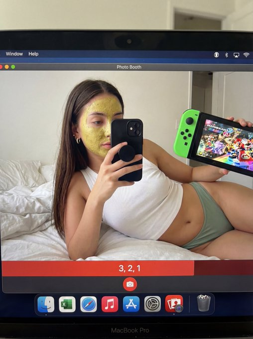
  <!--  -->
</div>

**Source:** [𝕏](https://x.com/lexx_aura/status/1999738430331265143)

```json
{
  "prompt_settings": {
    "type": "photorealistic",
    "style": "candid, photo of a digital screen, lo-fi aesthetic",
    "perspective": "angled shot capturing a MacBook Pro laptop display"
  },
  "subject": {
    "description": "young woman with long, straight dark brown hair parted in the middle",
    "skin": "tan complexion, face covered in a textured yellow-green skincare face mask",
    "pose": "reclining on a bed, body angled sideways, taking a selfie using the computer camera",
    "expression": "neutral, partially obscured by phone and mask"
  },
  "apparel": {
    "top": "white ribbed sleeveless tank top, casual fit",
    "bottom": "sage green bikini bottoms or underwear",
    "jewelry": "small gold hoop earrings"
  },
  "props": {
    "smartphone": {
      "item": "iPhone 11 or 12 Pro with triple camera lens",
      "case": "black case with a black pop socket",
      "action": "held in left hand, positioned in front of face to take the photo"
    },
    "gaming_console": {
      "item": "Nintendo Switch handheld console",
      "details": "Neon Green Joy-Con controller clearly visible",
      "screen_content": "displaying the Mario Kart 8 Deluxe menu screen",
      "action": "held up prominently in right hand"
    }
  },
  "environment": {
    "location": "indoor bedroom",
    "details": "white rumpled bedding, pillows, soft natural lighting from a window in the background"
  },
  "interface_elements": {
    "software": "Apple Photo Booth application window",
    "overlay": "red countdown bar at the bottom displaying numbers '3, 2, 1'",
    "os_ui": "macOS Dock visible at the bottom of the screen containing icons for Finder, Excel, Safari, Music, App Store, Settings, Photo Booth, and Trash"
  },
  "technical_details": {
    "camera_effect": "slight screen glare, moiré pattern typical of photographing a monitor",
    "framing": "includes the black bezel of the laptop screen and the laptop camera lens at the top center"
  }
}
```
---

### 🖼️ Prompt 21

<div align="center">
  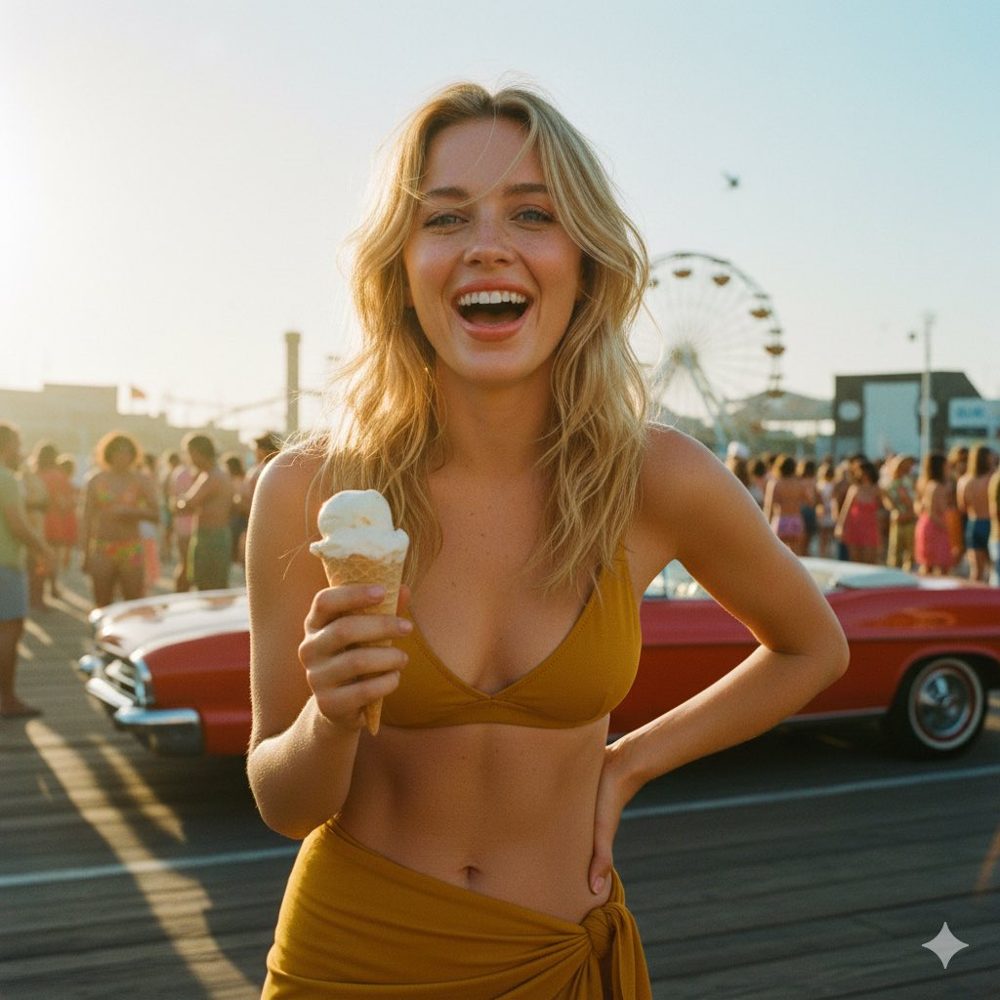
  <!--  -->
</div>

**Source:** [𝕏](https://x.com/Abhiew_/status/1999732863479185723)

```json
{
  "image_generation_configuration": {
    "meta_data": {
      "title": "Retro Joy: 1970s Boardwalk Portrait",
      "aspect_ratio": "9:16",
      "version": "2.0",
      "target_style": "Photorealistic Cinematic Nostalgia"
    },
    "subject_details": {
      "demographics": {
        "age": 21,
        "gender": "female",
        "shot_framing": "Half-body portrait"
      },
      "physical_appearance": {
        "hair": {
          "color": "sun-bleached blonde",
          "style": "loose, natural waves",
          "movement": "tousled by sea breeze",
          "specific_detail": "stray strands sticking to sun-kissed cheeks due to humidity/wind"
        },
        "eyes": {
          "color": "bright blue",
          "state": "sparkling with excitement",
          "lighting_interaction": "natural round catchlights reflecting warm sunlight"
        },
        "skin": {
          "complexion": "golden tan",
          "texture": "hyper-realistic fine skin texture",
          "distinguishing_marks": "light scattering of freckles across the nose"
        },
        "mouth": {
          "expression": "laughing, mouth open in pure joy",
          "lips": "glossy with a peachy tint"
        }
      },
      "attire": {
        "upper_body": {
          "item": "bikini top",
          "color": "retro mustard-yellow",
          "style": "vintage 1970s cut"
        },
        "lower_body": {
          "item": "sarong",
          "color": "matching mustard-yellow",
          "styling": "tied at the hip"
        }
      },
      "pose_and_action": {
        "head_position": "tilted back",
        "body_language": "radiant and carefree",
        "right_hand": {
          "action": "holding an object",
          "object": "melting vanilla ice cream cone"
        },
        "left_hand": {
          "action": "resting on hip",
          "vibe": "exuding confidence"
        }
      }
    },
    "environmental_context": {
      "location": {
        "primary_setting": "1970s beach boardwalk",
        "ground_surface": "mixture of sand and weathered wooden planks"
      },
      "temporal_settings": {
        "time_of_day": "Golden hour",
        "era": "1970s",
        "weather": "sunny and breezy"
      },
      "background_composition": {
        "immediate_background": [
          "crowd in colorful swimsuits",
          "people wearing vintage sunglasses",
          "classic red convertible car parked nearby"
        ],
        "distant_background": [
          "Ferris wheel silhouetted against sky",
          "roller coaster structure",
          "seagulls faintly visible in the distance"
        ],
        "atmosphere": "buzzing with life, nostalgic summer energy"
      }
    },
    "cinematography_and_technical": {
      "camera_gear": {
        "film_stock": "Kodak Ektachrome",
        "aesthetic": "Vintage analog photography",
        "lens_effects": "slight lens flare for authenticity"
      },
      "lighting_setup": {
        "key_light": {
          "source": "low-angle setting sun",
          "quality": "warm, golden"
        },
        "fill_light": {
          "quality": "soft shadows on the left side (contrast)"
        },
        "backlight": {
          "effect": "gentle halo / rim light around hair"
        }
      },
      "post_processing_grading": {
        "color_palette": "Polaroid snapshot aesthetic",
        "texture_overlay": "subtle grainy texture (sea air/film grain)",
        "tone": "warm, orange, mustard, cyan (retro palette)"
      }
    },
    "artistic_direction": {
      "mood": [
        "joyful",
        "evocative",
        "carefree",
        "radiant"
      ],
      "style_references": [
        "Slim Aarons (candid luxury lifestyle)",
        "Greta Gerwig (cinematic warmth and color)",
        "Hyperrealism",
        "1970s Nostalgia"
      ]
    }
  }
}
```
---

### 🖼️ Prompt 22

<div align="center">
  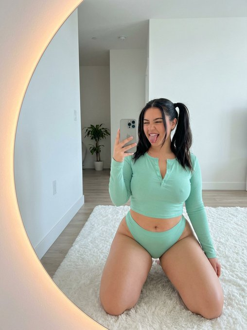
  <!--  -->
</div>

**Source:** [𝕏](https://x.com/Ankit_patel211/status/1999902279814803894)

```json
{
  "generation_parameters": {
    "meta_instructions": {
      "overall_mood": "Playful, energetic, mischievous"
    },
    "scene_composition": {
      "shot_type": "Mirror selfie",
      "framing": "Full-body view",
      "camera_angle": "Slightly high angle looking down into the mirror (implied by kneeling pose)",
      "focus": "Sharp focus on the subject and her reflection"
    },
    "subject_analysis": {
      "demographics": {
        "gender": "Woman",
        "age_group": "Young",
        "body_type": "Curvy"
      },
      "pose_and_action": {
        "posture": "Kneeling upright",
        "location": "On the floor, positioned on a rug",
        "primary_action": "Taking a photograph of reflection",
        "hand_placement": {
          "right_hand": "Holding smartphone, actively taking photo"
        }
      },
      "facial_expression": {
        "emotion": "Energetic, mischievous",
        "specific_gesture": "Tongue sticking out playfully",
        "gaze": "Looking towards the phone screen/mirror reflection"
      }
    },
    "styling_details": {
      "hair": {
        "color": "Dark",
        "length": "Long",
        "style": "Two high pigtails"
      },
      "apparel": {
        "outfit_type": "Matching two-piece loungewear set",
        "color_palette": "Mint green",
        "garment_top": {
          "type": "Henley top",
          "fit": "Cropped",
          "sleeve_length": "Long-sleeved",
          "details": [
            "Small placket buttons visible"
          ]
        },
        "garment_bottom": {
          "type": "Briefs/Shorts hybrid",
          "fit": "High-waisted"
        }
      }
    },
    "props_and_devices": {
      "primary_device": {
        "type": "Smartphone",
        "model_specification": "iPhone 17 Pro Max (Fictional futuristic model)",
        "color_finish": "Silver",
        "state": "Screen active (taking photo)"
      }
    },
    "environmental_context": {
      "setting_type": "Modern indoor living space",
      "atmosphere": "Bright, clean, contemporary",
      "architectural_elements": {
        "van Gogh painting walls": {
          "color": "White",
          "texture": "Smooth"
        },
        "flooring": {
          "material": "Wood",
          "tone": "Light wood grain"
        }
      },
      "key_fixtures_and_furniture": {
        "primary_mirror": {
          "shape": "Large circular",
          "placement": "Prominently visible on the left side of the frame",
          "lighting_feature": "Integrated warm backlighting (halo effect)"
        },
        "floor_covering": {
          "type": "Rug",
          "texture": "Fluffy/High-pile",
          "color": "White",
          "placement": "Directly beneath the kneeling subject"
        }
      },
      "background_decor": {
        "botanical": {
          "type": "Subtle plant",
          "placement": "In background, slightly out of focus"
        }
      },
      "lighting_scheme": {
        "primary_source": "Bright ambient indoor light",
        "accent_lighting": "Warm glow emanating from behind the circular mirror on the left"
      }
    }
  }

```
---

### 🖼️ Prompt 23

<div align="center">
  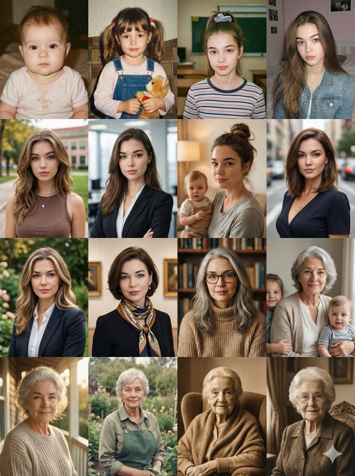
  <!--  -->
</div>

**Source:** [𝕏](https://x.com/saniaspeaks_/status/1999352638677352886)

```json
{
  "image_type": "grid_layout",
  "grid_dimensions": "4x4",
  "subject_consistency": "single_female_character",
  "theme": "chronological_aging_process",
  "math_formula": "Age = 1 + (square_position - 1) * 5",
  "visual_style": "photorealistic, cinematic portraiture, soft natural lighting",
  "prompt_payload": {
    "main_instruction": "Generate a 4x4 grid of portraits depicting the lifespan of a single female subject with brown hair and brown eyes, evolving from infancy to old age.",
    "row_1_childhood": {
      "panel_1": "Age 1: Cute baby with wispy hair in a pink onesie, close-up.",
      "panel_2": "Age 6: Little girl with pigtails holding a teddy bear, cozy home background.",
      "panel_3": "Age 11: Pre-teen schoolgirl with a high ponytail, wearing a striped shirt in a classroom.",
      "panel_4": "Age 16: Teenager with long straight hair, wearing a denim jacket, bedroom background."
    },
    "row_2_adulthood": {
      "panel_5": "Age 21: Young woman with golden highlights, wearing a tank top, outdoor campus setting.",
      "panel_6": "Age 26: Corporate professional in a navy blazer and white shirt, office background.",
      "panel_7": "Age 31: Young mother holding a baby, wearing a grey t-shirt, messy bun, warm living room light.",
      "panel_8": "Age 36: Stylish woman with a shoulder-length bob cut, navy dress, urban street background."
    },
    "row_3_middle_age": {
      "panel_9": "Age 41: Mature woman with wavy hair, wearing a business suit, garden background.",
      "panel_10": "Age 46: Sophisticated woman with short styled hair, wearing a silk scarf and black blazer, museum background.",
      "panel_11": "Age 51: Woman with salt-and-pepper grey hair wearing glasses and a turtle neck, library background.",
      "panel_12": "Age 56: Grandmother with grey hair smiling while hugging a grandchild, bright indoor setting."
    },
    "row_4_senior_years": {
      "panel_13": "Age 61: Senior woman with white hair in a beige knit sweater, standing on a porch.",
      "panel_14": "Age 66: Active senior in gardening overalls, outdoor garden setting.",
      "panel_15": "Age 71: Elderly woman wrapped in a warm shawl sitting in an armchair, sepia tones.",
      "panel_16": "Age 76: Old woman with full white hair and glasses, wearing a vintage brown coat, classic portrait style."
    }
  },
  "technical_parameters": {
    "resolution": "8k",
    "aspect_ratio": "1:1",
    "lighting": "Golden hour, window light, cinematic depth of field"
  }
}
```
---

### 🖼️ Prompt 24

<div align="center">
  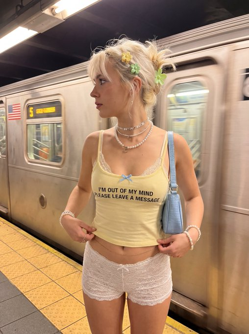
  <!--  -->
</div>

**Source:** [𝕏](https://x.com/Ankit_patel211/status/1999692033401979212)

```json
{
  "scene_description": "A stylish young woman stands frozen in a pose on a subway platform while a silver train rushes past in a dynamic motion blur behind her. She looks off to the side, contrasting the chaotic urban movement with a moment of fashionable stillness."
  "subject": {
    "type": "Young woman",
    "age": "Early 20s",
    "features": {
      "hair": "Bleached blonde hair styled in a messy updo, secured with pastel yellow and green flower-shaped claw clips, dark roots slightly visible.",
      "expression": "Profile view, looking sharply to her left with a neutral, poised expression; heavy winged eyeliner visible.",
      "other": "Fair skin tone, slender build."
    },
    "attire": "Pale yellow spaghetti-strap camisole with a small blue bow and black text reading 'I'M OUT OF MY MIND PLEASE LEAVE A MESSAGE', layered over visible lace lingerie; white lace shorts; pearl chokers and necklaces; thin belly chain; pearl bracelets.",
    "position": "Standing facing forward, torso centered, head turned to profile, hands lightly pulling down the hem of the yellow top."
  },
  "action": {
    "primary": "Posing calmly amidst motion",
    "secondary": "Adjusting clothing hem with fingertips",
    "effect": "Creating a sense of stillness against the rushing speed of the subway train"
  },
  "environment": {
    "setting": "Subway station platform",
    "foreground_elements": [
      "Yellow textured tactile paving strip at the bottom edge",
      "Subject in sharp focus"
    ],
    "background": "A silver subway train moving horizontally with significant motion blur, windows and metallic texture streaked by speed."
  },
  "lighting": {
    "style": "Ambient artificial subway lighting",
    "key_light": {
      "type": "Overhead fluorescent diffusion",
      "color": "Warm yellow-green cast",
      "illuminates": [
        "The subject's face and upper chest evenly",
        "Reflections on the blue shoulder bag"
      ]
    },
    "background_light": {
      "color": "Cooler metallic tones from the train mixed with station warmth"
    },
    "shadows": "Soft, diffused shadows under the chin and arms, consistent with omnidirectional overhead sources."
  },
  "style": {
    "medium": "Digital Photography",
    "aesthetic": "Urban street style, Y2K fashion revival, candid editorial",
    "quality": "High contrast, sharp subject focus with deliberate motion blur background",
    "details": "Texture of the crocodile-pattern bag, lace intricacies, and motion streaks of the train."
  },
  "scene_composition": {
    "subject_action": "Centered subject framing, contrasting static pose with horizontal motion vector of background",
    "camera_behavior": "Eye-level shot, stable capture to keep subject sharp while dragging shutter for background blur",
    "depth_layering": "Sharp foreground subject distinct from the blurred, moving background plane."
  },
  "visual_description": {
    "core_subject": "A trendy figure embodying Gen Z street fashion with playful accessories.",
    "attire_physics": "Tight-fitting camisole stretching slightly, lace shorts sitting low on hips.",
    "skin_rendering": "Smooth, slightly warm-toned skin under artificial light."
  },
  "lighting_and_atmosphere": {
    "type": "Urban Interior",
    "specifics": "Station fluorescent hum mixed with kinetic energy",
    "color_grade": "Warm, slightly vintage yellow tint typical of subway photography."
  },
  "attire_customization": {
    "current_clothing": "Yellow slogan tank top and white lace shorts",
    "customizable_clothing": "Graphic tee or slip dress for a similar street style vibe."
  },
  "brand_product_customization": {
    "current_brand_product": "None visible",
    "customizable_brand": "Space on camisole for branding",
    "customizable_product": "Shoulder bag",
    "product_placement_area": "Hanging from right shoulder"
  }
}
```
---

### 🖼️ Prompt 25

<div align="center">
  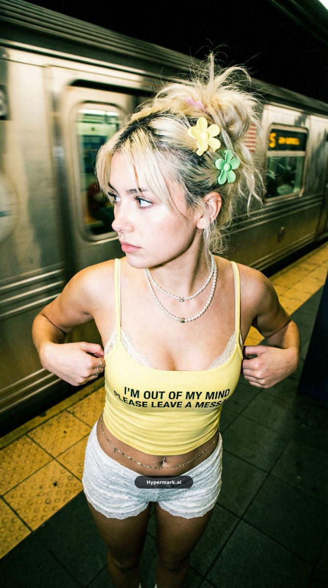
  <!--  -->
</div>

**Source:** [𝕏](https://x.com/_MehdiSharifi_/status/1999618438143021392)

```json
{
  "scene_description": "A stylish young woman stands frozen in a pose on a subway platform while a silver train rushes past in a dynamic motion blur behind her. She looks off to the side, contrasting the chaotic urban movement with a moment of fashionable stillness."
  "subject": {
    "type": "Young woman",
    "age": "Early 20s",
    "features": {
      "hair": "Bleached blonde hair styled in a messy updo, secured with pastel yellow and green flower-shaped claw clips, dark roots slightly visible.",
      "expression": "Profile view, looking sharply to her left with a neutral, poised expression; heavy winged eyeliner visible.",
      "other": "Fair skin tone, slender build."
    },
    "attire": "Pale yellow spaghetti-strap camisole with a small blue bow and black text reading 'I'M OUT OF MY MIND PLEASE LEAVE A MESSAGE', layered over visible lace lingerie; white lace shorts; pearl chokers and necklaces; thin belly chain; pearl bracelets.",
    "position": "Standing facing forward, torso centered, head turned to profile, hands lightly pulling down the hem of the yellow top."
  },
  "action": {
    "primary": "Posing calmly amidst motion",
    "secondary": "Adjusting clothing hem with fingertips",
    "effect": "Creating a sense of stillness against the rushing speed of the subway train"
  },
  "environment": {
    "setting": "Subway station platform",
    "foreground_elements": [
      "Yellow textured tactile paving strip at the bottom edge",
      "Subject in sharp focus"
    ],
    "background": "A silver subway train moving horizontally with significant motion blur, windows and metallic texture streaked by speed."
  },
  "lighting": {
    "style": "Ambient artificial subway lighting",
    "key_light": {
      "type": "Overhead fluorescent diffusion",
      "color": "Warm yellow-green cast",
      "illuminates": [
        "The subject's face and upper chest evenly",
        "Reflections on the blue shoulder bag"
      ]
    },
    "background_light": {
      "color": "Cooler metallic tones from the train mixed with station warmth"
    },
    "shadows": "Soft, diffused shadows under the chin and arms, consistent with omnidirectional overhead sources."
  },
  "style": {
    "medium": "Digital Photography",
    "aesthetic": "Urban street style, Y2K fashion revival, candid editorial",
    "quality": "High contrast, sharp subject focus with deliberate motion blur background",
    "details": "Texture of the crocodile-pattern bag, lace intricacies, and motion streaks of the train."
  },
  "scene_composition": {
    "subject_action": "Centered subject framing, contrasting static pose with horizontal motion vector of background",
    "camera_behavior": "Eye-level shot, stable capture to keep subject sharp while dragging shutter for background blur",
    "depth_layering": "Sharp foreground subject distinct from the blurred, moving background plane."
  },
  "visual_description": {
    "core_subject": "A trendy figure embodying Gen Z street fashion with playful accessories.",
    "attire_physics": "Tight-fitting camisole stretching slightly, lace shorts sitting low on hips.",
    "skin_rendering": "Smooth, slightly warm-toned skin under artificial light."
  },
  "lighting_and_atmosphere": {
    "type": "Urban Interior",
    "specifics": "Station fluorescent hum mixed with kinetic energy",
    "color_grade": "Warm, slightly vintage yellow tint typical of subway photography."
  },
  "attire_customization": {
    "current_clothing": "Yellow slogan tank top and white lace shorts",
    "customizable_clothing": "Graphic tee or slip dress for a similar street style vibe."
  },
  "brand_product_customization": {
    "current_brand_product": "None visible",
    "customizable_brand": "Space on camisole for branding",
    "customizable_product": "Shoulder bag",
    "product_placement_area": "Hanging from right shoulder"
  },
  "objects_and_props": {
    "main_objects": [
      "Light blue crocodile-texture shoulder bag",
      "Pastel flower hair clips",
      "Pearl jewelry"
    ],
    "secondary_objects": [
      "Belly chain",
      "Rings"
    ]
  },
  "camera_and_lens": {
    "focal_length_feel": "35mm or 50mm",
    "aperture_effect": "f/4.0 to f/5.6 allowing enough depth for subject sharpness",
    "camera_angle": "Straight on, eye level",
    "lens_type": "Standard prime or zoom",
    "bokeh_style": "Motion blur (linear) rather than optical bokeh (circular)"
  }
}
```
---

### 🖼️ Prompt 26

<div align="center">
  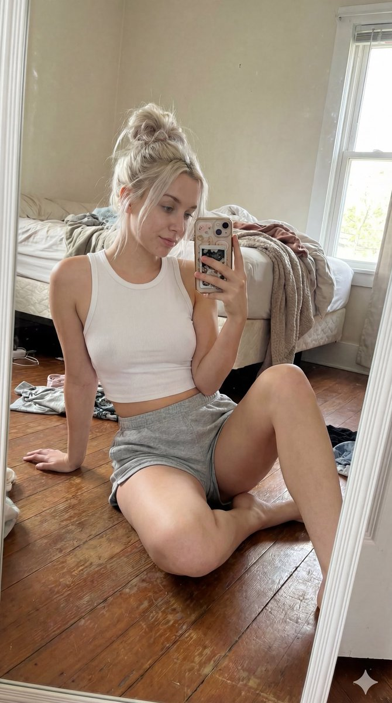
  <!--  -->
</div>

**Source:** [𝕏](https://x.com/xmliisu/status/1999586803473359156)

```json
{
  "generation_parameters": {
    "aspect_ratio": "9:16",
    "style_preset": "photographic",
    "camera_emulation": "iPhone_mirror_selfie"
  },
  "structured_prompt_data": {
    "subject_details": {
      "demographics": {
        "age_bracket": "early 20s",
        "gender": "woman"
      },
      "physical_appearance": {
        "body_frame": "slim, athletic, toned",
        "skin": {
          "tone": "pale, fair, porcelain",
          "texture": "smooth, glowing in natural light",
          "visible_areas": ["midriff", "full legs", "arms", "shoulders"]
        },
        "hair": {
          "color": "platinum blonde, white-blonde",
          "style": "messy low ponytail / loose bun",
          "texture": "bedhead, slept-on",
          "details": "loose face-framing pieces falling around face"
        },
        "face": {
          "makeup": "minimal or none",
          "expression": {
            "eyes": "soft gaze toward phone screen, downward",
            "mouth": "relaxed hint of gentle smile",
            "mood": "peaceful, content, lazy sunday morning"
          }
        }
      }
    },
    "attire_and_accessories": {
      "clothing": {
        "top": {
          "item": "ribbed tank top / crop top",
          "color": "white",
          "fit": "fitted, tight, cropped above belly button",
          "details": "racer-back, thick straps, slightly sheer ribbed cotton"
        },
        "bottom": {
          "item": "lounge shorts",
          "color": "heather grey",
          "fit": "relaxed, loose leg",
          "length": "very short, upper thigh mini length",
          "material": "soft cotton jersey"
        },
        "feet": {
          "state": "barefoot"
        }
      },
      "accessories": {
        "jewelry": "minimal or none",
        "phone": {
          "type": "iPhone",
          "case_details": "clear case with visible anime/cute stickers"
        }
      }
    },
    "pose_composition": {
      "type": "seated floor mirror selfie",
      "orientation": "full body reflection",
      "positioning": {
        "base": "seated on wooden bedroom floor",
        "upper_body": "leaning back slightly, weight supported by one arm behind her",
        "arms": {
          "left": "behind her, hand flat on floor supporting weight",
          "right": "raised, holding phone at face level for selfie"
        },
        "legs": {
          "arrangement": "asymmetrical",
          "left_leg": "bent at knee, raised up, foot flat on floor",
          "right_leg": "folded underneath, tucked to side"
        }
      }
    },
    "environment_context": {
      "location": "bedroom",
      "atmosphere": "lived-in, messy, authentic, cozy",
      "key_elements": {
        "mirror": {
          "type": "full-length floor mirror",
          "frame": "thin gold/brass",
          "position": "leaning against wall"
        },
        "flooring": "warm tone wood",
        "background_reflection": {
          "bed_state": "unmade, messy sheets, rumpled blankets",
          "clutter": "clothes scattered on floor",
          "walls": "light beige/cream",
          "decor": "fairy lights visible near ceiling"
        }
      }
    },
    "lighting_conditions": {
      "source": "natural daylight from window",
      "quality": "soft, warm, golden morning light",
      "direction": "from side (window visible in reflection)",
      "effect": "beautiful natural glow on skin and hair"
    }
  }
}
```
---

### 🖼️ Prompt 27

<div align="center">
  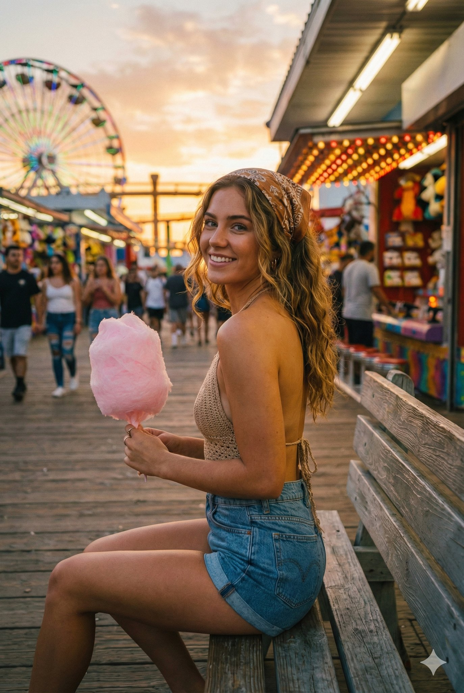
  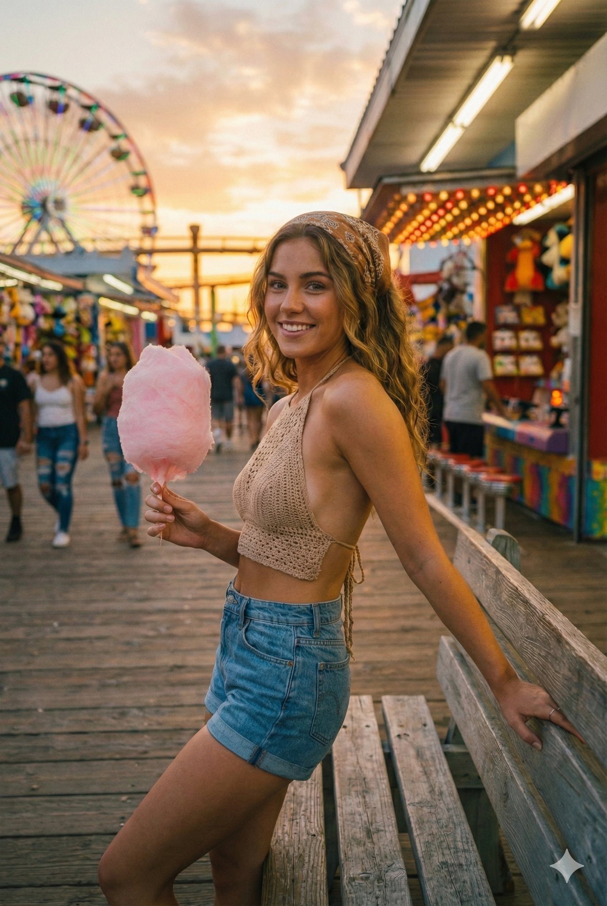
</div>

**Source:** [𝕏](https://x.com/Strength04_X/status/1999824621638758436)

```json
{
  "image_generation_configuration": {
    "meta_data": {
      "title": "Winter Hygge: Alpine Cabin Morning",
      "aspect_ratio": "9:16",
      "version": "2.0",
      "target_style": "Soft Cinematic Lifestyle"
    },
    "subject_details": {
      "demographics": {
        "age": 22,
        "gender": "female",
        "shot_framing": "Medium close-up"
      },
      "physical_appearance": {
        "hair": {
          "color": "chestnut brown",
          "style": "messy bun",
          "movement": "static but loose strands framing face",
          "specific_detail": "soft halo effect from backlighting"
        },
        "eyes": {
          "color": "warm hazel",
          "state": "gazing softly out the window",
          "lighting_interaction": "reflecting the snow outside"
        },
        "skin": {
          "complexion": "fair with natural flush",
          "texture": "natural skin texture without makeup",
          "distinguishing_marks": "rosy cheeks from the cold"
        },
        "mouth": {
          "expression": "serene half-smile",
          "lips": "natural pink"
        }
      },
      "attire": {
        "upper_body": {
          "item": "oversized cable-knit sweater",
          "color": "cream or off-white",
          "style": "thick wool, cozy aesthetic"
        },
        "lower_body": {
          "item": "woolen socks (visible if seated)",
          "color": "grey marl",
          "styling": "casual and comfortable"
        }
      },
      "pose_and_action": {
        "head_position": "turned slightly towards the window",
        "body_language": "relaxed and peaceful",
        "right_hand": {
          "action": "cupping a ceramic mug",
          "object": "steaming hot cocoa with marshmallows"
        },
        "left_hand": {
          "action": "pulling a knitted blanket closer",
          "vibe": "seeking warmth"
        }
      }
    },
    "environmental_context": {
      "location": {
        "primary_setting": "Rustic wooden A-frame cabin interior",
        "ground_surface": "wooden floor with a faux fur rug"
      },
      "temporal_settings": {
        "time_of_day": "Early morning",
        "era": "Contemporary",
        "weather": "heavy snow falling outside"
      },
      "background_composition": {
        "immediate_background": [
          "large glass window with frost corners",
          "soft bokeh of falling snow outside",
          "wooden cabin logs"
        ],
        "distant_background": [
          "snow-covered pine trees",
          "white mountain peaks",
          "pale blue winter sky"
        ],
        "atmosphere": "quiet, warm inside but cold outside, intimate"
      }
    },
    "cinematography_and_technical": {
      "camera_gear": {
        "film_stock": "Fujifilm Pro 400H",
        "aesthetic": "Soft daylight lifestyle photography",
        "lens_effects": "creamy bokeh depth of field (f/1.8)"
      },
      "lighting_setup": {
        "key_light": {
          "source": "diffused window light",
          "quality": "cool white balanced with warm interior tones"
        },
        "fill_light": {
          "quality": "soft bounce from the room"
        },
        "backlight": {
          "effect": "none, mostly side lighting from window"
        }
      },
      "post_processing_grading": {
        "color_palette": "Pastel winter tones (whites, creams, browns, soft blues)",
        "texture_overlay": "clean digital with slight organic noise",
        "tone": "airy, bright, comfortable"
      }
    },
    "artistic_direction": {
      "mood": [
        "peaceful",
        "cozy",
        "romantic",
        "serene"
      ],
      "style_references": [
        "Kinfolk Magazine aesthetic",
        "Hygge lifestyle photography",
        "Natural light portraiture"
      ]
    }
  }
}
```
---

### 🖼️ Prompt 28

<div align="center">
  
  
</div>

**Source:** [𝕏](https://x.com/bananababydoll/status/1999524658488746041)

```json
{
  "meta": {
    "aspect_ratio": "9:16",
    "quality": "ultra_photorealistic",
    "resolution": "8k",
    "camera": "iPhone 15 Pro Max",
    "lens": "24mm wide",
    "style": "high-end social media realism, natural skin texture, no over-smoothing"
  },

  "scene": {
    "location": "modern gym interior",
    "environment": [
      "large mirrors",
      "weight machines",
      "dumbbell rack",
      "rubber gym floor",
      "subtle neon LED accents"
    ],
    "time": "evening",
    "atmosphere": "slightly humid gym air, post-workout glow"
  },

  "lighting": {
    "type": "mixed gym lighting",
    "key_light": "cool overhead LED",
    "fill_light": "soft ambient reflection from mirrors",
    "effect": "gentle highlights on skin, realistic sweat sheen"
  },

  "camera_perspective": {
    "pov": "mirror selfie",
    "angle": "slightly above eye level",
    "framing": "upper thighs to head",
    "distance": "arm length",
    "phone_visibility": "visible in mirror"
  },

  "subject": {
    "gender": "female",
    "age": "early 20s (clearly adult)",
    "ethnicity": "random mixed ethnicity",
    "body": {
      "type": "fit-curvy",
      "waist": "defined",
      "hips": "round and full",
      "legs": "toned thighs",
      "chest": "naturally full"
    },

    "hair": {
      "cut": "wolfcut",
      "length": "medium",
      "texture": "layered, slightly messy",
      "color": "natural dark brown with subtle highlights",
      "behavior": "slightly damp from workout, strands framing face"
    },

    "face": {
      "expression": "confident half-smirk with relaxed eyes",
      "eyes": "direct eye contact through mirror",
      "makeup": "minimal gym makeup, glossy lips, light mascara",
      "skin": "realistic texture, light sweat glow"
    },

    "pose": {
      "stance": "hip popped slightly to one side",
      "legs": "one leg forward, relaxed",
      "upper_body": "slight torso twist toward mirror",
      "arms": {
        "phone_hand": "holding phone up for mirror selfie",
        "free_hand": "resting on hip or adjusting waistband"
      }
    },

    "outfit": {
      "top": {
        "type": "tight cropped athletic tank",
        "color": "charcoal grey",
        "fabric": "stretchy performance fabric",
        "fit": "snug, supportive",
        "underwear": "no bra"
      },
      "bottom": {
        "type": "high-waisted gym shorts",
        "color": "black",
        "fit": "tight, hugging hips and thighs",
        "detail": "slight fabric tension from pose"
      },
      "socks": {
        "type": "crew socks",
        "color": "white",
        "fit": "slightly tight around calves"
      },
      "shoes": {
        "type": "training sneakers",
        "color": "white with worn details"
      }
    },

    "accessories": {
      "earrings": "small silver hoops",
      "necklace": "thin chain resting on collarbone",
      "hair_accessory": "none",
      "nails": "short, natural or nude"
    }
  },

  "photography_rules": {
    "realism": "high",
    "no_filters": true,
    "no_face_warp": true,
    "natural_imperfections": true,
    "social_media_authenticity": true
  }
}
```
---

### 🖼️ Prompt 29

<div align="center">
  
  
</div>

**Source:** [𝕏](https://x.com/Arminn_Ai/status/1999784969363681297)

```json
{
  "intent": "a raw candid flash-style mirror photograph of a young woman.",
  "frame": {
    "aspect_ratio": "4:5 vertical",
    "composition": "mirror reflection, subject framed thighs-up on vanity counter, foreground clutter for depth",
    "style_mode": ["snapshot_aesthetic", "raw_flash_photography", "analog_film_emulation"]
  },
  "subject": {
    "identity": "young woman, early 20s, slender, messy loose-updo hair",
    "wardrobe": "vintage silk slip dress with lace trim",
    "pose": "seated casually on bathroom counter, leaning forward toward mirror, legs relaxed or crossed",
    "expression": "detached cool look, lips slightly parted, gaze at reflection or camera"
  },
  "environment": {
    "location": "compact tiled residential bathroom with vanity mirror",
    "atmosphere": "intimate late-night private moment",
    "details": "cluttered counter with cosmetics, brushes, toiletries",
    "mirror_elements": "smudges, water spots, optional lipstick writing"
  },
  "camera": {
    "sensor_format": "35mm film emulation (Kodak Gold 400 or Cinestill 800T)",
    "lens": "35mm wide-angle point-and-shoot with slight distortion",
    "aperture_depth_of_field": "f/5.6–f/8 for sharp subject and background",
    "shutter_speed": "1/60s flash sync",
    "iso": 800,
    "camera_position": "eye-level toward mirror reflection"
  },
  "lighting": {
    "type": "direct on-camera flash + ambient tungsten",
    "key_light": "hard frontal flash with harsh shadows and specular highlights",
    "fill_light": "warm dim tungsten cast",
    "contrast": "high contrast with strong fall-off",
    "color_temperature": "5500K flash + 3200K ambient"
  },
  "post_process": {
    "color_grade": "vintage film, lifted blacks, green-tinted shadows, saturated reds",
    "sharpness": "moderate with film grain and flash softness",
    "vignette": "natural flash fall-off at edges"
  },
  "negative": {
    "style": ["no studio lighting", "no softbox", "no 3D render", "no cartoon", "no anime", "no illustration", "no painting", "no airbrushed skin"],
    "content": ["no clean minimalist spaces", "no perfect posture", "no happy expressions", "no daylight", "no LED aesthetics"]
  }
}
```
---

### 🖼️ Prompt 30

<div align="center">
  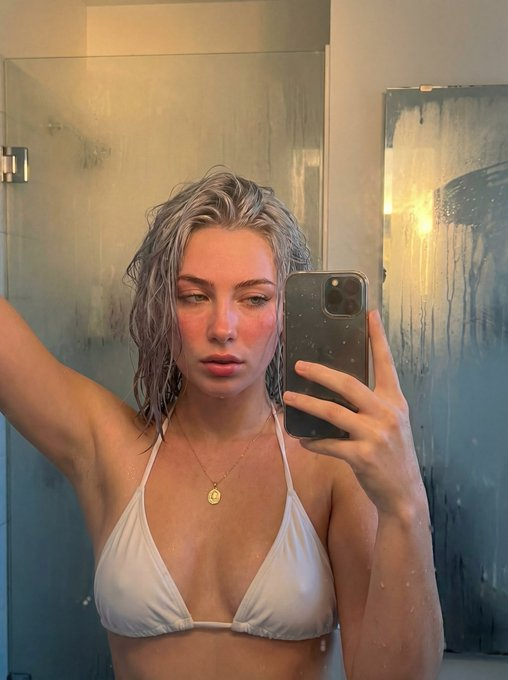
  <!--  -->
</div>

**Source:** [𝕏](https://x.com/xmliisu/status/1999748703955951681)

```json
{
  "image_generation_parameters": {
    "prompt": "Use 100% of the face from the uploaded reference photo, preserving facial structure, proportions, expression, skin texture, and all unique facial details exactly as in the reference. An ultra-cinematic close-up selfie of a young woman standing in a fog-filled bathroom. Warm golden light diffuses through dense steam, creating dramatic highlights along her damp skin. Her wet, naturally tousled hair clings softly around her face as she raises one arm above her head, revealing elegant lines of her shoulders and collarbones. Her cheeks are deeply flushed, radiating heat and intensity. Her lips are slightly parted, holding a subtle, teasing tension that enhances the sensual mood. She wears a white triangle bikini top, damp and form-fitting, producing soft reflective highlights from moisture. Tiny water droplets trail down her neck, chest, and stomach, catching the light like glittering beads. A delicate gold pendant necklace rests just above her cleavage, gently shifting with her breath. Her gaze into the phone camera is intimate and smoldering—cinematic, immersive, and emotionally charged, as if the viewer is standing inside the moment. The background features a fogged glass shower door streaked with condensation, with soft bokeh light reflections enhancing depth and atmosphere. The mirror shows faint water speckles, adding realism and raw texture. Lighting follows a Hollywood-style warm–cool contrast: warm highlights sculpting her skin, cool shadows enveloping the shower space, creating an ultra-spicy, slow-motion, cinematic aesthetic with high realism and emotional intensity. Hair silver grey.",
    "aspect_ratio": "3:4",
    "negative_prompt": "cartoon, painting, illustration, low quality, distortion, blurry, unnatural skin texture, dry skin, extra limbs, bad anatomy, flat lighting",
    "settings": {
      "face_restore": true,
      "face_reference_strength": 1.0,
      "style": "photorealistic"
    }
  }
}
```
---

### 🖼️ Prompt 31

<div align="center">
  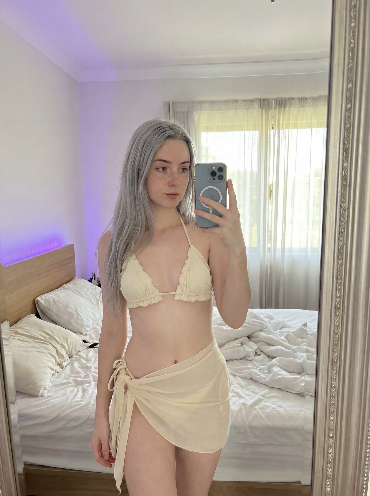
  <!--  -->
</div>

**Source:** [𝕏](https://x.com/xmliisu/status/1999473773028721059)

```json
{
  "generation_request": {
    "meta_data": {
      "task": "text_to_image_with_reference",
      "version": "2.0_structured"
    },
    "technical_constraints": {
      "output_format": {
        "aspect_ratio": "3:4",
        "orientation": "portrait"
      },
      "reference_image_compliance": {
        "enabled": true,
        "mode": "strict_visual_match",
        "instruction_text": "Picture should be same as reference uploaded."
      }
    },
    "creative_detailed_prompt": {
      "core_concept": "Realistic smartphone mirror selfie in a bedroom.",
      "subject_profile": {
        "demographics": {
          "gender": "female",
          "age_group": "young_adult"
        },
        "physical_appearance": {
          "hair_specs": {
            "color": "silver/grey ",
            "texture": "normal, voluminous",
            "style": "long beautiful looking hair falling over shoulders"
            "length": "long"
          },
          "skin_specs": {
            "tone": "pale",
            "distinctive_features": "visible natural freckles on face and chest"
          },
          "body_shape": "slender, fit physique",
          "face_specs": {
            "expression": "neutral",
            "gaze_direction": "soft gaze looking into mirror"
          }
        },
        "action": {
          "pose": "standing facing mirror",
          "activity": "holding smartphone to take photo"
        },
        "attire": {
          "vibe": "beachwear / lounge style",
          "garments": {
            "top": {
              "type": "triangle bikini top",
              "color": "cream-colored",
              "details": "ruffled edges"
            },
            "bottom": {
              "type": "sheer sarong/wrap skirt",
              "color": "cream-colored matching top",
              "details": "tied at hip with ruffles"
            }
          }
        }
      },
      "scene_environment": {
        "location_type": "bedroom interior",
        "atmosphere_mood": "soft domestic",
        "key_props": [
          "unmade bed (messy white sheets and pillows)",
          "wooden headboard",
          "mirror frame (visible on side)"
        ],
        "lighting_setup": {
          "primary_source": {
            "type": "natural daylight",
            "origin": "window behind subject with sheer curtains"
          },
          "accent_source": {
            "type": "LED ambient light strip",
            "color": "purple",
            "intensity": "subtle",
            "location": "on wall"
          }
        }
      },
      "photography_specs": {
        "camera_type": "smartphone",
        "shot_category": "mirror reflection selfie",
        "aesthetic_genre": ["amateur photography", "influencer aesthetic", "candid"],
        "technical_quality": {
          "resolution_target": "8K",
          "focus_priority": "sharp on subject",
          "rendering_style": "photorealistic",
          "texture_emphasis": "natural skin"
        }
      }
    },
    "negative_constraints_list": [
      "makeup",
      "heavy photoshop",
      "smooth skin",
      "cartoon",
      "illustration",
      "anime",
      "3d render",
      "distorted hands",
      "bad anatomy",
      "missing fingers",
      "extra limbs",
      "blurry",
      "low quality",
      "dark room"
    ]
  }
}
```
---

### 🖼️ Prompt 32

<div align="center">
  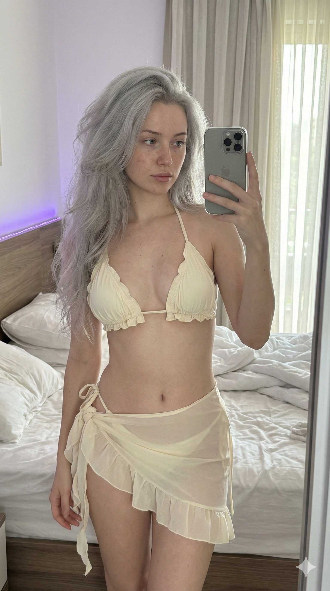
  <!--  -->
</div>

**Source:** [𝕏](https://x.com/YaseenK7212/status/1999348160926195949)

```json
{
  "generation_request": {
    "meta_data": {
      "task": "text_to_image_with_reference",
      "version": "2.0_structured"
    },
    "technical_constraints": {
      "output_format": {
        "aspect_ratio": "9:16",
        "orientation": "portrait"
      },
      "reference_image_compliance": {
        "enabled": true,
        "mode": "strict_visual_match",
        "instruction_text": "Picture should be same as reference uploaded."
      }
    },
    "creative_detailed_prompt": {
      "core_concept": "Realistic smartphone mirror selfie in a bedroom.",
      "subject_profile": {
        "demographics": {
          "gender": "female",
          "age_group": "young_adult"
        },
        "physical_appearance": {
          "hair_specs": {
            "color": "silver/grey ",
            "texture": "normal, voluminous",
            "style": "long beautiful looking hair falling over shoulders"
            "length": "long"
          },
          "skin_specs": {
            "tone": "pale",
            "distinctive_features": "visible natural freckles on face and chest"
          },
          "body_shape": "slender, fit physique",
          "face_specs": {
            "expression": "neutral",
            "gaze_direction": "soft gaze looking into mirror"
          }
        },
        "action": {
          "pose": "standing facing mirror",
          "activity": "holding smartphone to take photo"
        },
        "attire": {
          "vibe": "beachwear / lounge style",
          "garments": {
            "top": {
              "type": "triangle bikini top",
              "color": "cream-colored",
              "details": "ruffled edges"
            },
            "bottom": {
              "type": "sheer sarong/wrap skirt",
              "color": "cream-colored matching top",
              "details": "tied at hip with ruffles"
            }
          }
        }
      },
      "scene_environment": {
        "location_type": "bedroom interior",
        "atmosphere_mood": "soft domestic",
        "key_props": [
          "unmade bed (messy white sheets and pillows)",
          "wooden headboard",
          "mirror frame (visible on side)"
        ],
        "lighting_setup": {
          "primary_source": {
            "type": "natural daylight",
            "origin": "window behind subject with sheer curtains"
          },
          "accent_source": {
            "type": "LED ambient light strip",
            "color": "purple",
            "intensity": "subtle",
            "location": "on wall"
          }
        }
      },
      "photography_specs": {
        "camera_type": "smartphone",
        "shot_category": "mirror reflection selfie",
        "aesthetic_genre": ["amateur photography", "influencer aesthetic", "candid"],
        "technical_quality": {
          "resolution_target": "8K",
          "focus_priority": "sharp on subject",
          "rendering_style": "photorealistic",
          "texture_emphasis": "natural skin"
        }
      }
    },
    "negative_constraints_list": [
      "makeup",
      "heavy photoshop",
      "smooth skin",
      "cartoon",
      "illustration",
      "anime",
      "3d render",
      "distorted hands",
      "bad anatomy",
      "missing fingers",
      "extra limbs",
      "blurry",
      "low quality",
      "dark room"
    ]
  }
}
```
---

### 🖼️ Prompt 33

<div align="center">
  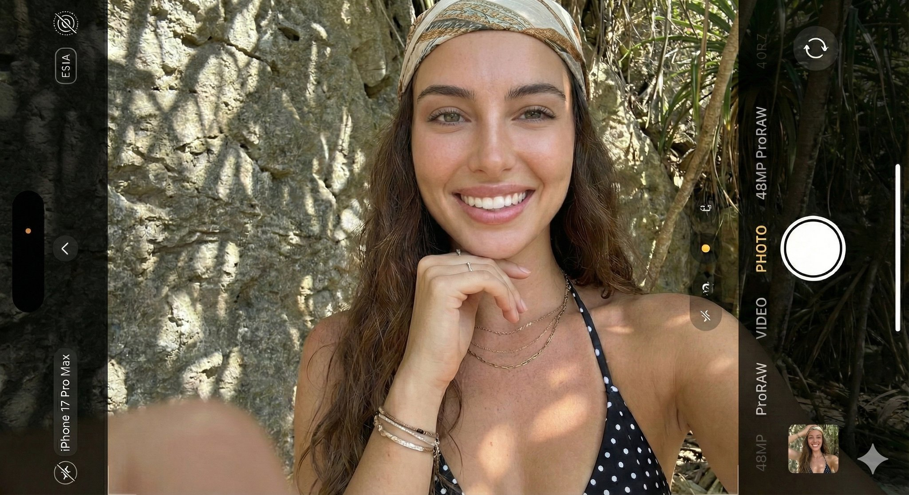
  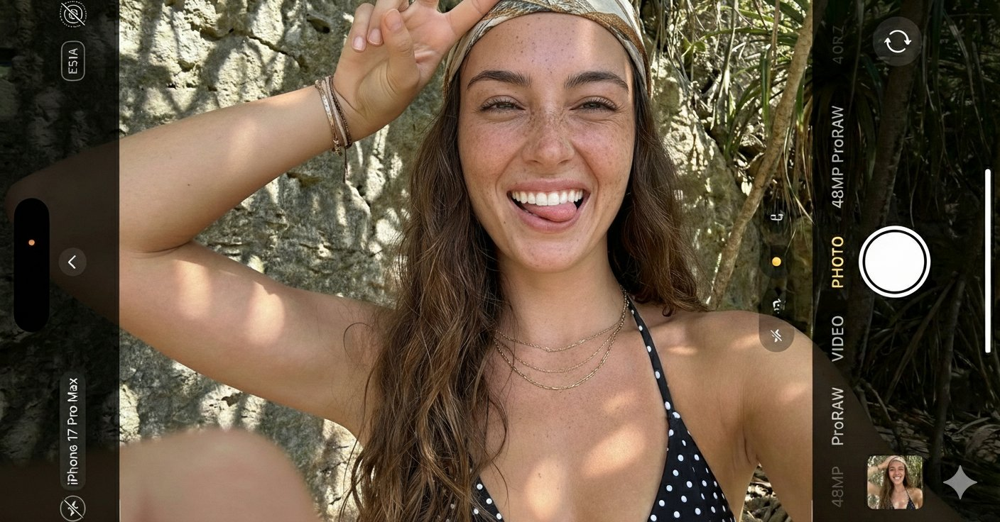
</div>

**Source:** [𝕏](https://x.com/Strength04_X/status/1999461110739796225)

```json
{
  "image_prompt": {
    "subject": {
      "demographics": "Stunningly beautiful young woman",
      "skin_tone": "Sun-kissed complexion with realistic skin texture and scattered freckles on nose and cheeks",
      "hair": "Long, wavy brown hair, partially covered by a patterned silk headscarf (bandana style)",
      "eyes": "Captivating Hazel/Green (one eye open with sharp iris detail)",
      "facial_structure": "Symmetrical, aesthetic facial features with a radiant glow"
    },
    "attire": {
      "clothing": "Black bikini top with white polka dots",
      "jewelry": "Delicate layered gold chain necklaces, stacked bracelets on the right wrist"
    },
    "expression_and_pose": {
      "facial_expression": "Playful, alluring, and cheeky; winking with right eye, tongue slightly sticking out to the side, bright smile showing teeth",
      "hand_position": "Right hand resting gracefully on top of the head/headscarf",
      "framing": "Close-up selfie portrait, arm visible holding the device",
      "angle": "Eye-level selfie angle"
    },
    "environment": {
      "setting": "Tropical coastal alcove",
      "background": "Textured limestone rock face or tree bark with dappled shadows and hints of tropical foliage",
      "lighting": "Bright, soft natural daylight, handled by Smart HDR for balanced exposure"
    },
    "technical_specifications": {
      "format": "Screen capture simulation",
      "ui_overlay": "iPhone Camera Interface (Shutter button, Zoom dial, 48MP ProRAW indicator, Flash icon, Mode selector set to PHOTO)",
      "device": "iPhone 17 Pro Max emulation",
      "lens": "TrueDepth Selfie Camera, f/1.9",
      "quality_tags": [
        "Photorealistic",
        "Deep Fusion clarity",
        "8K resolution",
        "Influencer aesthetic",
        "Perfect composition"
      ]
    }
  }
}
```
---

### 🖼️ Prompt 34

<div align="center">
  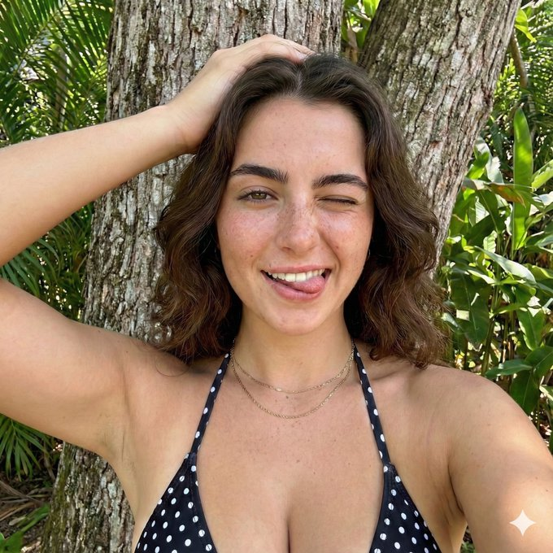
  <!--  -->
</div>

**Source:** [𝕏](https://x.com/lexx_aura/status/1998791996144824455)

```json
{
  "image_prompt": {
    "subject": {
      "demographics": "Young woman",
      "skin_tone": "White skin with prominent freckles on nose and cheeks, rendered with Deep Fusion texture accuracy",
      "hair": "Long, wavy brown hair",
      "eyes": "Green/Hazel (one eye open), sharp focus showing iris detail",
      "eyebrows": "Thick, natural, dark eyebrows"
    },
    "attire": {
      "clothing": "Black bikini top with white polka dots",
      "jewelry": "Delicate layered gold chain necklace"
    },
    "expression_and_pose": {
      "facial_expression": "Playful and cheeky; winking with right eye (viewer's left), tongue slightly sticking out to the side, smiling with teeth visible",
      "hand_position": "Right hand resting on top of the head/headscarf",
      "framing": "Close-up selfie portrait, arm visible holding the device",
      "angle": "Eye-level selfie angle"
    },
    "environment": {
      "setting": "Outdoor tropical or coastal location",
      "background": "Textured tree bark or rock face with hints of green tropical foliage, exhibiting natural bokeh",
      "lighting": "Bright natural daylight, dappled sunlight, handled by Smart HDR 5 for balanced highlights and shadows"
    },
    "technical_specifications": {
      "device": "iPhone 17 Pro Max",
      "camera": "TrueDepth Front Camera (or 48MP Fusion System style)",
      "lens_details": "24mm equivalent, f/1.9 aperture",
      "resolution": "48MP ProRAW / HEIF Max",
      "processing": "Photonic Engine, Deep Fusion, Smart HDR 6",
      "color_profile": "Standard Photographic Style with high dynamic range",
      "quality_tags": [
        "Ultra-fine facial detail",
        "Natural skin texture",
        "Sharp focus",
        "8K resolution",
        "Mobile photography masterpiece",
        "Shot on iPhone"
      ]
    }
  }
}
```
---

### 🖼️ Prompt 35

<div align="center">
  
  <!--  -->
</div>

**Source:** [𝕏](https://x.com/YaseenK7212/status/1998803841756836081)

```json
{
  "generation_request": {
    "meta": {
      "target_resolution": "8K",
      "aspect_ratio": "9:16",
      "reference_image_mode": "strict_consistency",
      "style_preset": "ultra_realistic_photography"
    },
    "subject": {
      "identity": {
        "source": "reference_photo",
        "constraints": {
          "facial_features": "100% identical",
          "proportions": "fully preserved",
          "expression": "fully preserved"
        }
      },
      "pose": {
        "type": "sitting",
        "vibe": "comfortable, relaxed, natural",
        "interaction": {
          "object": "glass of white milk OR piece of bread",
          "hand_placement": "holding object gently"
        }
      }
    },
    "apparel": {
      "item_name": "Bunny Onesie",
      "material_properties": {
        "fabric_type": "plush fleece",
        "color_primary": "grey",
        "color_secondary": "cream",
        "tactile_quality": ["thick", "soft", "highly textured"],
        "micro_detail": "visible fine fibers"
      },
      "construction_details": {
        "hood": {
          "theme": "bunny",
          "embroidery": {
            "features": ["large eyes", "small nose", "soft expression lines"],
            "style": "cartoon"
          }
        },
        "ears": {
          "structure": "upright",
          "curvature": "natural gentle curve",
          "texture": "realistic fine fur"
        },
        "torso": {
          "panel_type": "chest panel",
          "color": "cream",
          "texture_variance": "smoother fleece"
        },
        "sleeves_and_pants": {
          "fit": "oversized",
          "volume": ["padded", "puffy", "cozy"],
          "drape": "natural folds"
        }
      }
    },
    "environment": {
      "location": "living room",
      "interior_style": "minimalist",
      "furniture": "minimalist aesthetic sofa",
      "atmosphere": {
        "tone": "warm",
        "depth": "shallow depth of field",
        "visual_effect": "gentle bokeh"
      }
    },
    "lighting_simulation": {
      "type": "soft diffused HDR",
      "direction": "even illumination",
      "target_areas": ["face", "skin", "fabric"],
      "rendering_qualities": {
        "highlights": "clean",
        "texture_reproduction": "extremely clear micro-texture"
      }
    },
    "camera_telemetry": {
      "focal_length": "85mm",
      "aperture": "f/1.4",
      "shot_size": "medium close-up",
      "sensor_quality": [
        "high dynamic range (HDR)",
        "accurate color",
        "extremely low noise",
        "ultra-sharp detail"
      ]
    },
    "compiled_prompt": "Ultra-realistic 8K medium close-up portrait of the SAME person from the reference photo (face 100% identical). The subject sits comfortably on a minimalist aesthetic sofa, holding a glass of white milk or a piece of bread, in a relaxed natural pose. Subject is wearing a plush grey fleece bunny onesie that appears thick, soft, and highly textured. Outfit details: Bunny-themed hood with neatly embroidered cartoon facial features, long bunny ears standing upright with a natural gentle curve, cream-colored chest panel in smoother fleece, oversized padded sleeves with puffy cozy volume and natural folds. Visible fine fibers of the plush material enhanced by soft diffused HDR lighting. Background: Warm-toned minimalist living room interior with shallow depth of field and gentle bokeh. 85mm f/1.4, accurate color, extremely low noise, ultra-sharp detail --ar 9:16"
  }
}
```
---

### 🖼️ Prompt 36

<div align="center">
  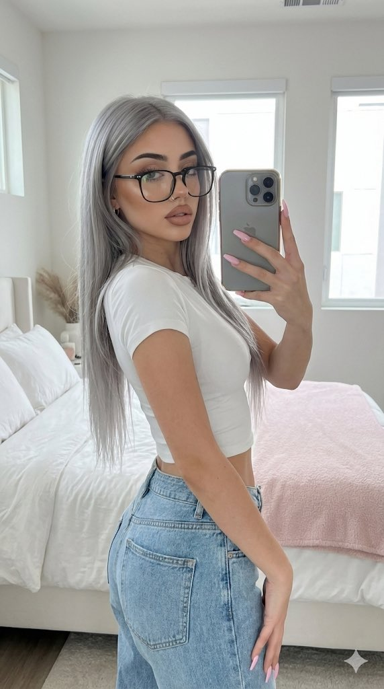
  <!--  -->
</div>

**Source:** [𝕏](https://x.com/xmliisu/status/1998788740886474831)

```json
{
  "generation_settings": {
    "aspect_ratio": "9:16",
    "style": "Photorealistic Portrait",
    "reference_strength": "High (Face Consistency)"
  },
  "prompt_components": {
    "subject": {
      "face_reference": "Identical face to uploaded image",
      "hair": "Long, silver-grey, sleek, straight",
      "skin": "Naturally smooth with a subtle glow",
      "makeup": "Polished and naturally glamorous, winged eyeliner, defined brows, soft contouring, matte nude lips",
      "nails": "Long, painted pastel pink"
    },
    "attire": {
      "top": "Fitted white short-sleeved crop top",
      "bottoms": "Light blue high-waisted denim jeans"
    },
    "pose_and_action": {
      "type": "Mirror selfie",
      "device": "iPhone 16 Pro Max held in one hand",
      "posture": "Standing slightly turned to the side, upper body angled toward mirror, head turned toward camera, arm resting naturally by side",
      "effect": "Soft, natural side profile emphasizing waist and hips"
    },
    "environment": {
      "location": "Bright, softly lit bedroom",
      "background_elements": "Neatly made white bed with a pale pink blanket, minimalist decor",
      "lighting_source": "Soft daylight coming through windows"
    },
    "technical_details": {
      "lighting_quality": "Even and diffuse, enhancing realistic skin texture and denim details",
      "resolution": "Ultra-sharp, high-quality photorealistic 8K rendering",
      "reflection": "Clean mirror reflection"
    }
  },
  "final_prompt_string": "A realistic mirror selfie portrait of a young woman with a face identical to the reference image. She has long, sleek, straight silver-grey hair and polished makeup with winged eyeliner and matte nude lips. She is dressed in a fitted white short-sleeved crop top and light blue high-waisted denim jeans. She stands in a side profile pose, angling her body toward the mirror while holding an iPhone 16 Pro Max; her nails are long and pastel pink. The background is a sunlit bedroom with a white bed and pale pink blanket. The lighting is diffuse and soft, highlighting skin texture. 8K resolution, photorealistic."
}
```
---

### 🖼️ Prompt 37

<div align="center">
  
  <!--  -->
</div>

**Source:** [𝕏](https://x.com/xIrissy/status/1998792144316936598)

```json
{
  "image_prompt": {
    "subject": {
      "description": "A stylish young woman with long, straight platinum blonde hair.",
      "action": "Taking a mirror selfie with a smartphone in one hand while holding a disposable coffee cup in the other.",
      "expression": "Neutral, confident, soft pout."
    },
    "outfit": {
      "outerwear": "A classic beige or olive-drab trench coat, belted at the waist.",
      "inner_wear": "A simple white t-shirt visible at the neckline.",
      "accessories": "A cream-colored woven leather shoulder bag (hobo style), minimal rings on fingers."
    },
    "environment": {
      "setting": "Inside a modern elevator.",
      "background": "Brushed stainless steel walls with vertical warm LED light strips on either side.",
      "lighting": "Bright, artificial elevator lighting causing reflections on the metal surfaces."
    },
    "photography_style": {
      "type": "Mirror selfie, lifestyle photography.",
      "aesthetic": "Chic, 'clean girl' aesthetic, influencer social media style, high definition."
    }
  }
}
```
---

### 🖼️ Prompt 38

<div align="center">
  
  
</div>

**Source:** [𝕏](https://x.com/bananababydoll/status/1998799883776798833)

```json
{
  "scene_type": "nighttime luxury apartment balcony selfie, deep-city lights glowing behind her, warm-wine intimate vibe",

  "camera_perspective": {
    "description": "we ARE her phone, arm slightly in frame, angled down toward her body + face",
    "phone_visibility": "not visible",
    "angle": "slightly high selfie angle capturing face, cleavage, thighs on chair",
    "ratio": "9:16",
    "framing": "face top third, chest + thighs dominant center"
  },

  "subject": {
    "action": "leaning sideways into a deep balcony lounge chair, twisting her upper body to get both face and ass in frame",
    "pose": "legs curled to the side, one thigh raised creating curve, hip pushed outward",
    "expression": "soft drunk-smirk with one eyebrow raised, lips parted like she’s mid-laugh, eyes warm and seductive",
    
    "physical": {
      "age": "early 20s",
      "body": "slim waist, full chest, very round soft ass, thick thighs, natural curves",
      "skin": "pale with warm wine-flush on cheeks, glowing from city light",
      "hair": "long messy brunette waves, strands stuck to neck from heat, some falling over one eye",
      "face": "bedroom eyes, slight tipsy shine, lashes heavy"
    },

    "outfit": {
      "top": {
        "type": "tiny open-front cardigan",
        "color": "cream",
        "state": "completely unbuttoned, breasts framed naturally, no bra underneath",
        "lighting_effect": "city lights catching inner curves"
      },
      "bottom": {
        "type": "mini lounge shorts",
        "color": "light grey",
        "state": "ridden up extremely due to twist, showing full curve of ass",
        "fabric": "thin, soft, stretched between thighs"
      },
      "legs": {
        "details": "inner thighs visible, skin texture realistic, natural warmth, slight wine flush"
      }
    },

    "free_hand": "holding a half-full red wine glass loosely at thigh level, fingers relaxed",
    "phone_arm": "extended outward to the side, elbow bent, effort visible to get ass + face perfectly framed"
  },

  "accessories": {
    "jewelry": "thin gold necklace catching city glow, small hoops",
    "nails": "dark red wine-colored nails, glossy"
  },

  "environment": {
    "location": "high-rise balcony",
    "elements": [
      "deep cushioned outdoor chair",
      "wine bottle on small table beside her",
      "plants in shadow",
      "city skyscrapers glowing behind her"
    ],
    "lighting": {
      "primary": "city lights reflecting on her skin",
      "secondary": "warm balcony ambient light",
      "effect": "soft shadows, glowing skin, intimate vibe"
    }
  },

  "vibe": "late-night tipsy confidence, intimate, seductive but soft, she knows you’re staring"
}
```
---

### 🖼️ Prompt 39

<div align="center">
  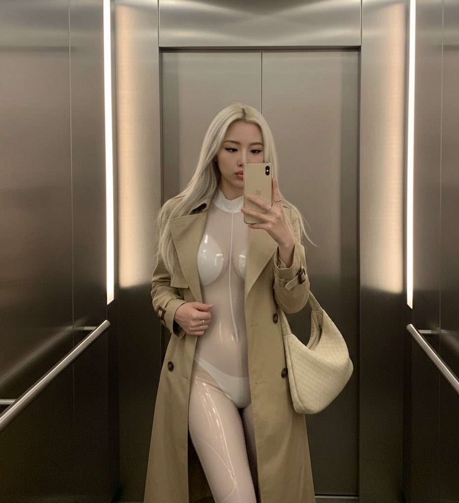
  <!--  -->
</div>

**Source:** [𝕏](https://x.com/youngcatwoman/status/1998854483162575075)

```json
{
  "image_prompt": {
    "subject": {
      "description": "A beautiful young chinese woman with feminine curves and a slim waist witj long, straight platinum blonde hair.",
      "action": "Taking a mirror selfie with a smartphone in one hand while holding her jacket slightly open with the other.",
      "expression": "Neutral, confident, soft pout."
    },
    "outfit": {
      "outerwear": "A classic beige or trench coat, belted at the waist. She holds it slightly open by one collar showing what is underneath to the camera",
      "inner_wear": "A translucent white full body latex catsuit showing some of her skin through the material ",
      "accessories": "A cream-colored woven leather shoulder bag (hobo style), minimal rings on fingers."
    },
    "environment": {
      "setting": "Inside a modern elevator.",
      "background": "Brushed stainless steel walls with vertical warm LED light strips on either side.",
      "lighting": "Bright, artificial elevator lighting causing reflections on the metal surfaces."
    },
    "photography_style": {
      "type": "Mirror selfie, lifestyle photography.",
      "aesthetic": "Chic, 'sexy girl' aesthetic, influencer social media style, high definition."
    }
  }
}
```
---

### 🖼️ Prompt 40

<div align="center">
  
  <!--  -->
</div>

**Source:** [𝕏](https://x.com/xIrissy/status/1998792144316936598)

```json
{
  "image_prompt": {
    "subject": {
      "description": "A stylish young woman with long, straight platinum blonde hair.",
      "action": "Taking a mirror selfie with a smartphone in one hand while holding a disposable coffee cup in the other.",
      "expression": "Neutral, confident, soft pout."
    },
    "outfit": {
      "outerwear": "A classic beige or olive-drab trench coat, belted at the waist.",
      "inner_wear": "A simple white t-shirt visible at the neckline.",
      "accessories": "A cream-colored woven leather shoulder bag (hobo style), minimal rings on fingers."
    },
    "environment": {
      "setting": "Inside a modern elevator.",
      "background": "Brushed stainless steel walls with vertical warm LED light strips on either side.",
      "lighting": "Bright, artificial elevator lighting causing reflections on the metal surfaces."
    },
    "photography_style": {
      "type": "Mirror selfie, lifestyle photography.",
      "aesthetic": "Chic, 'clean girl' aesthetic, influencer social media style, high definition."
    }
  }
}
```
---

### 🖼️ Prompt 41

<div align="center">
  
  
</div>

**Source:** [𝕏](https://x.com/bananababydoll/status/1999434067109117966)

```json
{
  "scene_type": "gym locker room after intense workout, dim warm lighting, sweaty atmosphere, mirrors everywhere",

  "camera_perspective": {
    "pov": "we ARE her phone",
    "angle": "low-to-mid mirror selfie angle, capturing pumped chest + abs + thighs",
    "phone_visibility": "visible in mirror reflection, held close to face"
  },

  "subject": {
    "ethnicity": "Arabic–European mixed",
    "age": "24",

    "expression": {
      "eyes": "heavy-lidded, flushed, confident, a little out of breath",
      "mouth": "slightly open like she’s catching her breath, glossy lips",
      "vibe": "freshly pumped, sweaty, dangerous gym-babe energy"
    },

    "hair": {
      "color": "jet black",
      "style": "high messy ponytail, strands stuck to her temples from sweat",
      "shine": "wet sweat sheen + overhead gym light catching tips"
    },

    "body": {
      "type": "toned gym body, full chest, thick thighs, tight stomach, small waist",
      "skin": "golden olive tone, sweat droplets visible, real texture"
    },

    "outfit": {
      "top": {
        "type": "ultra tiny gym crop top",
        "fit": "NO bra, fabric soaked with sweat, nipples pressing clearly",
        "details": "thin straps sliding off shoulder, barely holding shape"
      },
      "bottom": {
        "type": "micro gym shorts",
        "fit": "vacuum-tight, ultra stretched, riding up into thighs",
        "waist": "mid-rise but rolled down to show lower abs"
      },
      "legs": {
        "details": "thighs glistening, pump veins subtle but visible"
      }
    },

    "pose": {
      "stance": "hip popped, legs slightly apart, lower back arched",
      "arms": {
        "phone_hand": "holding phone up at chest height",
        "other_hand": "lifting crop-top slightly to show sweaty abs"
      },
      "extra_energy": "her chest looks swollen from pump, body flushed"
    }
  },

  "environment": {
    "location": "gym locker room",
    "details": [
      "dumbbells on bench behind her",
      "blurry lockers",
      "mirror smudges",
      "water bottle on floor"
    ],
    "lighting": "warm yellow gym lighting + harsh overhead highlights, strong sweat shine"
  },

  "camera": {
    "quality": "hyperrealistic, slightly grainy gym lighting, visible pores, sweat texture",
    "framing": "face upper third, chest middle, thighs bottom",
    "aspect_ratio": "9:16"
  }
}
```
---

### 🖼️ Prompt 42

<div align="center">
  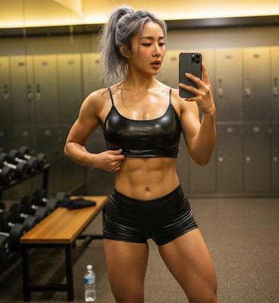
  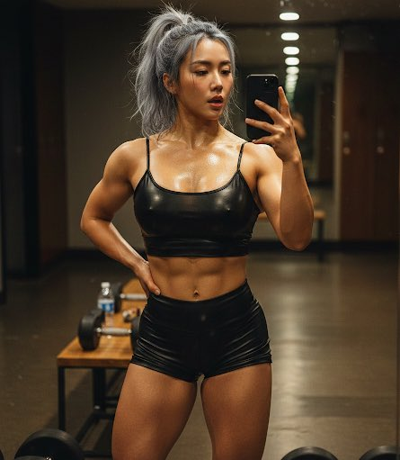
</div>

**Source:** [𝕏](https://x.com/youngcatwoman/status/1999478246866366970)

```json
{
  "scene_type": "gym locker room after intense workout, dim warm lighting, sweaty atmosphere, mirrors everywhere",

  "camera_perspective": {
    "pov": "we ARE her phone",
    "angle": "low-to-mid mirror selfie angle, capturing pumped chest + abs + thighs",
    "phone_visibility": "visible in mirror reflection, held close to face"
  },

  "subject": {
    "ethnicity": "Korean",
    "age": "24",

    "expression": {
      "eyes": "heavy-lidded, flushed, confident, a little out of breath",
      "mouth": "slightly open like she’s catching her breath, glossy lips",
      "vibe": "freshly pumped, sweaty, dangerous gym-babe energy"
    },

    "hair": {
      "color": "silver",
      "style": "high messy ponytail, strands stuck to her temples from sweat",
      "shine": "wet sweat sheen + overhead gym light catching tips"
    },

    "body": {
      "type": "toned gym body, full chest, thick thighs, tight stomach, small waist",
      "skin": "golden olive tone, sweat droplets visible, real texture"
    },

    "outfit": {
      "top": {
        "type": "ultra tiny latex gym crop top",
        "fit": "NO bra, fabric coated with sweat, nipples pressing clearly",
        "details": "thin straps sliding off shoulder, barely holding shape"
      },
      "bottom": {
        "type": "micro latex gym shorts",
        "fit": "vacuum-tight, ultra stretched, riding up into thighs",
        "waist": "mid-rise but rolled down to show lower abs"
      },
      "legs": {
        "details": "thighs glistening, pump veins subtle but visible"
      }
    },

    "pose": {
      "stance": "hip popped, legs slightly apart, lower back arched",
      "arms": {
        "phone_hand": "holding phone up at chest height",
        "other_hand": "lifting crop-top slightly to show sweaty abs"
      },
      "extra_energy": "her chest looks swollen from pump, body flushed"
    }
  },

  "environment": {
    "location": "gym locker room",
    "details": [
      "dumbbells on bench behind her",
      "blurry lockers",
      "mirror smudges",
      "water bottle on floor"
    ],
    "lighting": "warm yellow gym lighting + harsh overhead highlights, strong sweat shine"
  },

  "camera": {
    "quality": "hyperrealistic, slightly grainy gym lighting, visible pores, sweat texture",
    "framing": "face upper third, chest middle, thighs bottom",
    "aspect_ratio": "9:16"
  }
}
```
---

### 🖼️ Prompt 43

<div align="center">
  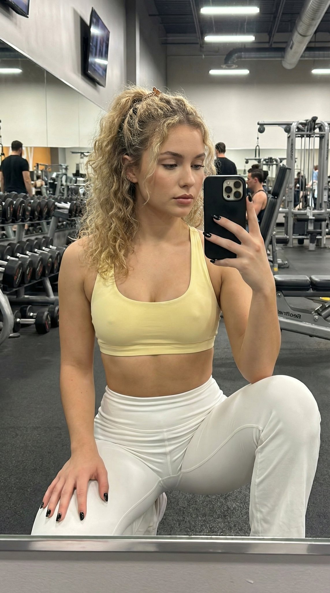
  <!--  -->
</div>

**Source:** [𝕏](https://x.com/KeorUnreal/status/1999228034084114506)

```json
{
  "project_settings": {
    "project_name": "Gym Mirror Selfie Series",
    "version": "4.0.0-granular",
    "target_model": "Stable Diffusion / Midjourney v6"
  },
  "generation_parameters": {
    "face_preservation": {
      "enabled": true,
      "method": "Reference ControlNet / IP-Adapter",
      "strictness_level": "High",
      "protected_features": [
        "facial_structure",
        "eyebrow_shape",
        "makeup_style",
        "lip_morphology",
        "hairline_fidelity"
      ]
    },
    "technical_specs": {
      "aspect_ratio": "4:5",
      "resolution": "8K",
      "orientation": "Portrait"
    }
  },
  "scene_composition": {
    "subject": {
      "demographics": {
        "gender": "Female",
        "age_group": "Young Adult"
      },
      "pose_definition": {
        "stance": "Squatting low",
        "leg_position": "One knee forward",
        "torso_orientation": "Leaning slightly toward mirror",
        "head_tilt": "Downward (approx 15 degrees)",
        "gaze": "Focused on phone screen",
        "hand_placement": {
          "right_hand": "Holding phone in front of face",
          "left_hand": "Resting on knee"
        }
      },
      "grooming": {
        "hair": {
          "color": "Curly blonde",
          "length": "Short",
          "style": "Half-up ponytail",
          "texture": "Smooth, Straight",
          "accessory": "Small clip"
        },
        "makeup": {
          "style": "Natural",
          "finish": "Soft matte"
        },
        "nails": {
          "color": "Black",
          "finish": "Glossy"
        }
      },
      "wardrobe": {
        "upper_body": {
          "item": "Sports Bra",
          "color": "Off-yellow",
          "fit": "Tight, form-fitting",
          "material_properties": "Slight sheen, synthetic"
        },
        "lower_body": {
          "item": "Leggings pants",
          "color": "White",
          "fit": "Loose, relaxed",
          "waist_style": "High-waisted"
        },
        "footwear": {
          "item": "Sneakers",
          "color": "Red",
          "style": "Chunky/Sporty"
        },
        "jewelry": [
          { "type": "Necklace", "material": "Silver" },
          { "type": "Bracelet", "material": "Silver" },
          { "type": "Rings", "material": "Silver" }
        ]
      }
    },
    "props": {
      "primary_device": {
        "type": "Apple Smartphone",
        "case_texture": "Glitter",
        "case_color": "Silver",
        "holding_angle": "Vertical"
      }
    },
    "environment": {
      "location_type": "Indoor Gym",
      "architecture": {
        "walls": "Full-height mirrors",
        "flooring": "Wood-textured gym floor"
      },
      "background_elements": [
        "Chest press machine",
        "Blurred gym equipment"
      ]
    },
    "lighting_and_atmosphere": {
      "primary_source": "Soft overhead LED",
      "ambient_tone": "Warm accents",
      "shadows": "Soft, diffuse",
      "mood": ["Feminine", "Elegant", "Gentle"]
    },
    "stylistic_approach": {
      "genre": "Social Media Mirror Selfie",
      "visual_clarity": "Medium-High sharpness",
      "color_grading": "Soft warm tones (Cream/Brown palette)"
    }
  },
  "negative_constraints": [
    "deformed fingers",
    "wrong face structure",
    "extra limbs",
    "text",
    "watermark",
    "candy bars",
    "distorted reflection",
    "over-saturated colors"
  ]
}
```
---

### 🖼️ Prompt 44

<div align="center">
  
  <!--  -->
</div>

**Source:** [𝕏](https://x.com/YaseenK7212/status/1999042753250955381)

```json
{
  "project_settings": {
    "project_name": "Gym Mirror Selfie Series",
    "version": "4.0.0-granular",
    "target_model": "Stable Diffusion / Midjourney v6"
  },
  "generation_parameters": {
    "face_preservation": {
      "enabled": true,
      "method": "Reference ControlNet / IP-Adapter",
      "strictness_level": "High",
      "protected_features": [
        "facial_structure",
        "eyebrow_shape",
        "makeup_style",
        "lip_morphology",
        "hairline_fidelity"
      ]
    },
    "technical_specs": {
      "aspect_ratio": "4:5",
      "resolution": "8K",
      "orientation": "Portrait"
    }
  },
  "scene_composition": {
    "subject": {
      "demographics": {
        "gender": "Female",
        "age_group": "Young Adult"
      },
      "pose_definition": {
        "stance": "Squatting low",
        "leg_position": "One knee forward",
        "torso_orientation": "Leaning slightly toward mirror",
        "head_tilt": "Downward (approx 15 degrees)",
        "gaze": "Focused on phone screen",
        "hand_placement": {
          "right_hand": "Holding phone in front of face",
          "left_hand": "Resting on knee"
        }
      },
      "grooming": {
        "hair": {
          "color": "Dark Brown",
          "length": "Long",
          "style": "Half-up ponytail",
          "texture": "Smooth, Straight",
          "accessory": "Small clip"
        },
        "makeup": {
          "style": "Natural",
          "finish": "Soft matte"
        },
        "nails": {
          "color": "Black",
          "finish": "Glossy"
        }
      },
      "wardrobe": {
        "upper_body": {
          "item": "Sports Bra",
          "color": "Off-white",
          "fit": "Tight, form-fitting",
          "material_properties": "Slight sheen, synthetic"
        },
        "lower_body": {
          "item": "Sweatpants",
          "color": "Dark Brown",
          "fit": "Loose, relaxed",
          "waist_style": "High-waisted"
        },
        "footwear": {
          "item": "Sneakers",
          "color": "White",
          "style": "Chunky/Sporty"
        },
        "jewelry": [
          { "type": "Necklace", "material": "Silver" },
          { "type": "Bracelet", "material": "Silver" },
          { "type": "Rings", "material": "Silver" }
        ]
      }
    },
    "props": {
      "primary_device": {
        "type": "Smartphone",
        "case_texture": "Glitter",
        "case_color": "Silver",
        "holding_angle": "Vertical"
      }
    },
    "environment": {
      "location_type": "Indoor Gym",
      "architecture": {
        "walls": "Full-height mirrors",
        "flooring": "Wood-textured gym floor"
      },
      "background_elements": [
        "Chest press machine",
        "Blurred gym equipment"
      ]
    },
    "lighting_and_atmosphere": {
      "primary_source": "Soft overhead LED",
      "ambient_tone": "Warm accents",
      "shadows": "Soft, diffuse",
      "mood": ["Feminine", "Elegant", "Gentle"]
    },
    "stylistic_approach": {
      "genre": "Social Media Mirror Selfie",
      "visual_clarity": "Medium-High sharpness",
      "color_grading": "Soft warm tones (Cream/Brown palette)"
    }
  },
  "negative_constraints": [
    "deformed fingers",
    "wrong face structure",
    "extra limbs",
    "text",
    "watermark",
    "candy bars",
    "distorted reflection",
    "over-saturated colors"
  ]
}
```
---

### 🖼️ Prompt 45

<div align="center">
  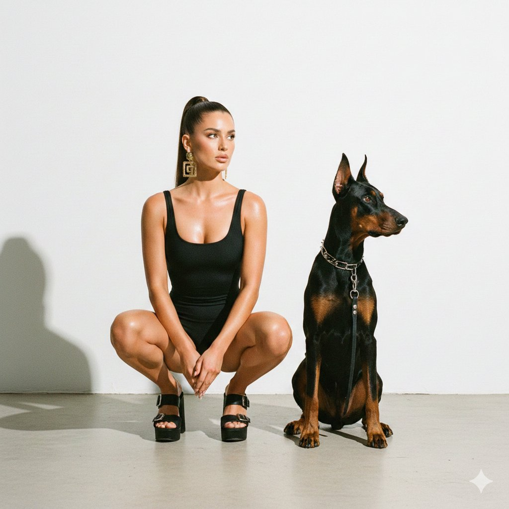
  <!--  -->
</div>

**Source:** [𝕏](https://x.com/catcatherinai/status/1998739703529361672)

```json
{
  "technical_metadata": {
    "exact_aspect_ratio": "1:1 (1000x1000 pixels detected)",
    "lens_focal_length_est": "35mm - 50mm (Moderate wide angle; slight perspective distortion on femoral regions relative to cranial regions)",
    "image_artifacts": "Film grain simulation (uniform distribution, moderate intensity), Chromatic aberration (negligible), Flash halo (slight bloom on high-specular areas)",
    "resolution_and_bit_depth": "1000x1000, 24-bit RGB, sRGB profile estimated",
    "capture_metadata_est": "Shutter: 1/125s (sync speed), Aperture: f/8-f/11 (deep DoF, sharp focus on both subjects), ISO: 400 (grain structure), Lighting: Direct on-camera or slightly off-axis strobe"
  },
  "subject_grid_analysis": {
    "dermatological_audit": {
      "skin_topography": "Specular highlights prominent on patella (knees), anterior tibia (shins), and upper sternal region, indicating application of body oil or high-lipid moisturizer. Texture smoothness: High. Pore visibility: Low (due to lighting intensity).",
      "imperfection_coordinates": [
        "[LOCATE: Tan line visible on right hip/iliac crest region, delta E color shift ~15% lighter]",
        "[LOCATE: Minor skin fold/crease at right axilla (armpit) due to arm adduction]",
        "[LOCATE: Metacarpal vein visibility on left hand: Low]"
      ],
      "complexion_inhomogeneity": "Uniform tones with flash washout on facial T-zone. Gradient darkening towards lower limbs due to light falloff.",
      "facial_hair_details": "None visible. Eyebrows: Groomed, high arch, dark pigment.",
      "makeup_application": "Lipstick: Nude/matte tone. Contour: Visible on zygomatic arch (cheekbones) and nose bridge."
    },
    "morphological_asymmetry": {
      "eyes": "Partially obscured by head tilt/angle. Gaze direction: Downward/neutral.",
      "mouth": "Lips slightly parted (~2mm separation). Philtrum depth: Moderate.",
      "posture_tilt": "Subject 1 (Human): Squatting position (Malasana variation). Spine verticality: upright. Head yaw: -15 degrees (slight left turn). Subject 2 (Canine): Sitting erect. Head yaw: +70 degrees (looking right).",
      "nose_and_ears": "Human Nose: Straight bridge. Human Ears: Obscured by hair/earrings. Canine Ears: Cropped, erect, high alertness tension.",
      "facial_contours": "Jawline: Sharp definition. Chin: Tapered."
    },
    "hair_strand_topology": {
      "parting_line": "Not visible (pulled back).",
      "rebel_strands": "Minimal. High-tension ponytail styling. Hairline: Smooth, tight adhesion.",
      "volume_distribution": "Compressed at cranial crown, gathered posteriorly.",
      "styling_products": "High-hold gel/hairspray indicated by lack of flyaways and specular shine on roots."
    },
    "body_proportions": {
      "pose_specifics": "Deep squat. Femur-tibia angle: <45 degrees. Arms extended between knees. Hands clasped (interlaced fingers) near geometric center of base.",
      "canine_morphology": "Breed: Doberman Pinscher. Muscle tone: High definition in pectoral and brachial regions. Coat: Short, smooth, black/tan markings."
    }
  },
  "fabric_physics_and_tension": {
    "garment_1_top": {
      "identification": "One-piece swimsuit/bodysuit. Color: Matte Black.",
      "contact_points": "High-tension contact at shoulders and inguinal region.",
      "tension_map": "Vertical tension from shoulder strap to groin. Lateral tension minimal.",
      "gravity_drape": "Fabric adheres strictly to body contours due to elasticity (likely Spandex/Elastane blend). No loose draping.",
      "texture_wear": "Pristine. Light absorption: High (Matte finish)."
    },
    "garment_2_bottom": {
      "identification": "Platform sandal heels. Material: Black suede or matte leather.",
      "deformation": "Ankle strap tension visible on right leg. Toe strap compression on metatarsals.",
      "fasteners": "Buckle closure on lateral ankles (silver tone)."
    },
    "accessories": {
      "jewelry": "Earrings: Large gold-tone pendant, geometric 'Greek Key' or maze motif. Reflectance: Specular metallic. Canine Collar: Metal prong/pinch collar (chrome finish) + Leather leash loop.",
      "other": "None."
    }
  },
  "spatial_relationships_and_depth": {
    "layering_z_depth": [
      "[Foreground: Canine subject (slightly anterior to human)]",
      "[Mid-ground: Human subject]",
      "[Background: White wall (approx 0.5 - 1.0 meters behind subjects)]"
    ],
    "occlusion_map": "Canine torso occludes view of human's right lower leg/foot. Human's arm occludes mid-torso.",
    "perspective_and_scale": "Camera height: Eye-level with crouching subject (approx 0.8m from ground). Canine head height approx equal to Human shoulder height in this pose.",
    "composition_rules": "Subjects centered horizontally. Asymmetrical balance (Mass of dog on left vs. spread of human limbs on right)."
  },
  "environmental_inventory": {
    "object_manifest": [
      "[ITEM 1: Human Female, Crouching, Center-Right]",
      "[ITEM 2: Doberman Dog, Sitting, Center-Left]",
      "[ITEM 3: Leash, Leather, hanging loosely from dog collar]"
    ],
    "surface_details": "Floor: Light colored, smooth (studio concrete or vinyl). Wall: Plain white, featureless.",
    "lighting_vectors": {
      "primary_source": "Hard flash. Azimuth: ~0-5 degrees (frontal). Elevation: ~0 degrees (on-axis).",
      "shadow_fall": "Sharp, distinct shadows cast directly behind subjects on the white wall. Shadow density: High. Penumbra: Minimal.",
      "reflections": "High specularity on canine coat (black areas) and human skin (knees, chest)."
    },
    "atmospheric_conditions": "Studio environment. Clear, dry.",
    "acoustic_hints": "Likely high reverb due to hard surfaces."
  },
  "chromatic_palette": {
    "dominant_colors": [
      "#101010 (Black - Suit/Dog coat)",
      "#C8A486 (Tan - Dog markings)",
      "#BFA38F (Skin Tone - Midtones)",
      "#F0F0F0 (Background - Wall/Floor)"
    ],
    "color_grading": "High contrast. Saturation: Low-to-Moderate. Warm undertones in skin and dog markings contrasted with cool neutral background.",
    "gradient_maps": "Vignetting: Slight darkening at image corners.",
    "color_aberrations": "None detected."
  },
  "pixel_level_reconstruction_guidelines": {
    "grid_division": "4x4 Grid. Top-Left: Dog Head/Ears. Top-Right: Human Head/Torso. Bottom-Left: Dog Legs/Paws. Bottom-Right: Human Legs/Shoes.",
    "edge_detection": "High contrast edges between subjects and background (Sobel gradient magnitude strong).",
    "texture_sampling": "Skin: Smooth + Noise. Dog Fur: Anisotropic noise. Fabric: Flat matte.",
    "pixel_forensics": "No obvious manipulation. Grain suggests analog medium or intentional digital noise overlay."
  },
  "holistic_reconstruction_protocol": {
    "assembly_sequence": "1. Establish white background. 2. Project hard shadow map based on frontal flash. 3. Place canine model left, human model right. 4. Apply textures (fur vs skin vs spandex). 5. Calculate specular maps for skin oil and fur sheen. 6. Apply global grain filter.",
    "scalability_notes": "Vectorize silhouette edges for scaling. Texture details require high-res sampling."
  }
}
```
---

### 🖼️ Prompt 46

<div align="center">
  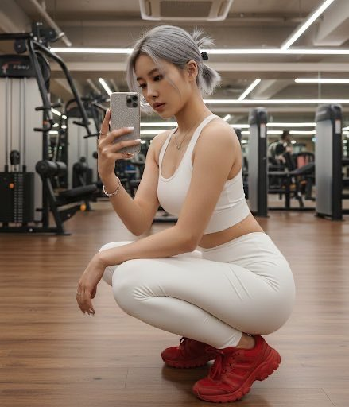
  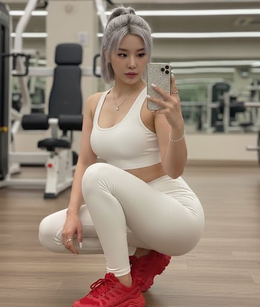
</div>

**Source:** [𝕏](https://x.com/youngcatwoman/status/1999482062877917360)

```json
{
  "project_settings": {
    "project_name": "Gym Mirror Selfie Series",
    "version": "4.0.0-granular",
    "target_model": "Stable Diffusion / Midjourney v6"
  },
  "generation_parameters": {
    "face_preservation": {
      "enabled": true,
      "method": "Reference ControlNet / IP-Adapter",
      "strictness_level": "High",
      "protected_features": [
        "facial_structure",
        "eyebrow_shape",
        "makeup_style",
        "lip_morphology",
        "hairline_fidelity"
      ]
    },
    "technical_specs": {
      "aspect_ratio": "4:5",
      "resolution": "8K",
      "orientation": "Portrait"
    }
  },
  "scene_composition": {
    "subject": {
      "demographics": {
        "gender": "Female",
        "age_group": "Young korean Adult"
      },
      "pose_definition": {
        "stance": "Squatting low",
        "leg_position": "One knee forward",
        "torso_orientation": "Leaning slightly toward mirror",
        "head_tilt": "Downward (approx 15 degrees)",
        "gaze": "Focused on phone screen",
        "hand_placement": {
          "right_hand": "Holding phone in front of face",
          "left_hand": "Resting on knee"
        }
      },
      "grooming": {
        "hair": {
          "color": "silver",
          "length": "Short",
          "style": "Half-up ponytail",
          "texture": "Smooth, Straight",
          "accessory": "Small clip"
        },
        "makeup": {
          "style": "Natural",
          "finish": "Soft matte"
        },
        "nails": {
          "color": "white",
          "finish": "Glossy"
        }
      },
      "wardrobe": {
        "upper_body": {
          "item": "Sports Bra",
          "color": "white",
          "fit": "Tight, form-fitting",
          "material_properties": "Slight sheen, synthetic"
        },
        "lower_body": {
          "item": "latex Leggings",
          "color": "White",
          "fit": "skintight ",
          "waist_style": "High-waisted"
        },
        "footwear": {
          "item": "Sneakers",
          "color": "Red",
          "style": "Chunky/Sporty"
        },
        "jewelry": [
          { "type": "Necklace", "material": "Silver" },
          { "type": "Bracelet", "material": "Silver" },
          { "type": "Rings", "material": "Silver" }
        ]
      }
    },
    "props": {
      "primary_device": {
        "type": "Apple Smartphone",
        "case_texture": "Glitter",
        "case_color": "Silver",
        "holding_angle": "Vertical"
      }
    },
    "environment": {
      "location_type": "Indoor Gym",
      "architecture": {
        "walls": "Full-height mirrors",
        "flooring": "Wood-textured gym floor"
      },
      "background_elements": [
        "Chest press machine",
        "Blurred gym equipment"
      ]
    },
    "lighting_and_atmosphere": {
      "primary_source": "Soft overhead LED",
      "ambient_tone": "Warm accents",
      "shadows": "Soft, diffuse",
      "mood": ["Feminine", "Elegant", "Gentle"]
    },
    "stylistic_approach": {
      "genre": "Social Media Mirror Selfie",
      "visual_clarity": "Medium-High sharpness",
      "color_grading": "Soft warm tones (Cream/Brown palette)"
    }
  },
  "negative_constraints": [
    "deformed fingers",
    "wrong face structure",
    "extra limbs",
    "text",
    "watermark",
    "candy bars",
    "distorted reflection",
    "over-saturated colors"
  ]
}
```
---

### 🖼️ Prompt 47

<div align="center">
  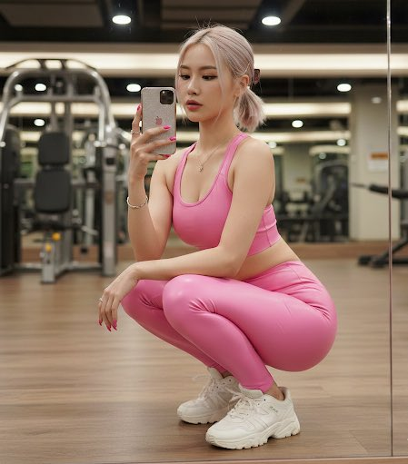
  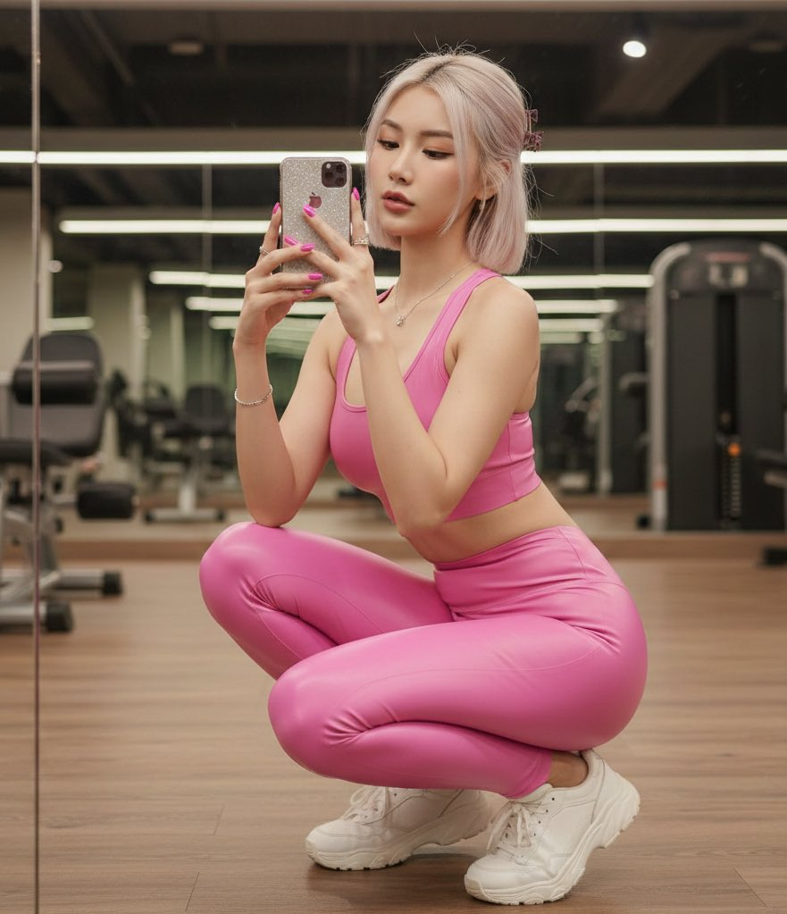
</div>

**Source:** [𝕏](https://x.com/youngcatwoman/status/1999482062877917360)

```json
{
  "project_settings": {
    "project_name": "Gym Mirror Selfie Series",
    "version": "4.0.0-granular",
    "target_model": "Stable Diffusion / Midjourney v6"
  },
  "generation_parameters": {
    "face_preservation": {
      "enabled": true,
      "method": "Reference ControlNet / IP-Adapter",
      "strictness_level": "High",
      "protected_features": [
        "facial_structure",
        "eyebrow_shape",
        "makeup_style",
        "lip_morphology",
        "hairline_fidelity"
      ]
    },
    "technical_specs": {
      "aspect_ratio": "4:5",
      "resolution": "8K",
      "orientation": "Portrait"
    }
  },
  "scene_composition": {
    "subject": {
      "demographics": {
        "gender": "Female",
        "age_group": "Early 20s Taiwanese Woman"
      },
      "pose_definition": {
        "stance": "Squatting low",
        "leg_position": "One knee forward",
        "torso_orientation": "Leaning slightly toward mirror",
        "head_tilt": "Downward (approx 15 degrees)",
        "gaze": "Focused on phone screen",
        "hand_placement": {
          "right_hand": "Holding phone in front of face",
          "left_hand": "Resting on knee"
        }
      },
      "grooming": {
        "hair": {
          "color": "Platinum Blonde with Pink Highlights",
          "length": "Short",
          "style": "Half-up ponytail",
          "texture": "Smooth, Straight",
          "accessory": "Small clip"
        },
        "makeup": {
          "style": "Natural",
          "finish": "Soft matte"
        },
        "nails": {
          "color": "Bright Pink",
          "finish": "Glossy"
        }
      },
      "wardrobe": {
        "upper_body": {
          "item": "Sports Bra",
          "color": "Bright Pink",
          "fit": "Tight, form-fitting",
          "material_properties": "Latex Slight sheen"
        },
        "lower_body": {
          "item": "Latex Leggings pants",
          "color": "Bright Pink",
          "fit": "Skintight",
          "waist_style": "High-waisted"
        },
        "footwear": {
          "item": "Sneakers",
          "color": "White",
          "style": "Chunky/Sporty"
        },
        "jewelry": [
          { "type": "Necklace", "material": "Silver" },
          { "type": "Bracelet", "material": "Silver" },
          { "type": "Rings", "material": "Silver" }
        ]
      }
    },
    "props": {
      "primary_device": {
        "type": "Apple Smartphone",
        "case_texture": "Glitter",
        "case_color": "Silver",
        "holding_angle": "Vertical"
      }
    },
    "environment": {
      "location_type": "Indoor Gym",
      "architecture": {
        "walls": "Full-height mirrors",
        "flooring": "Wood-textured gym floor"
      },
      "background_elements": [
        "Chest press machine",
        "Blurred gym equipment"
      ]
    },
    "lighting_and_atmosphere": {
      "primary_source": "Soft overhead LED",
      "ambient_tone": "Warm accents",
      "shadows": "Soft, diffuse",
      "mood": ["Feminine", "Elegant", "Gentle"]
    },
    "stylistic_approach": {
      "genre": "Social Media Mirror Selfie",
      "visual_clarity": "Medium-High sharpness",
      "color_grading": "Soft warm tones (Cream/Brown palette)"
    }
  },
  "negative_constraints": [
    "deformed fingers",
    "wrong face structure",
    "extra limbs",
    "text",
    "watermark",
    "candy bars",
    "distorted reflection",
    "over-saturated colors"
  ]
}
```
---

### 🖼️ Prompt 48

<div align="center">
  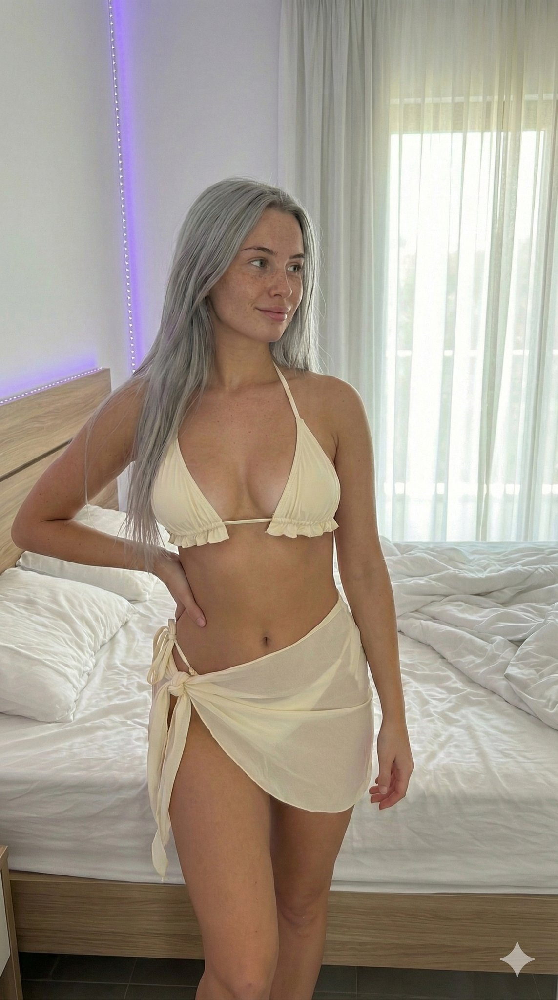
  
</div>

**Source:** [𝕏](https://x.com/Strength04_X/status/1999360547712806971)

```json
{
  "generation_request": {
    "meta_data": {
      "task": "text_to_image_with_reference",
      "version": "2.0_structured"
    },
    "technical_constraints": {
      "output_format": {
        "aspect_ratio": "9:16",
        "orientation": "portrait"
      },
      "reference_image_compliance": {
        "enabled": true,
        "mode": "strict_visual_match",
        "instruction_text": "Picture should be same as reference uploaded."
      }
    },
    "creative_detailed_prompt": {
      "core_concept": "Realistic smartphone mirror selfie in a bedroom.",
      "subject_profile": {
        "demographics": {
          "gender": "female",
          "age_group": "young_adult"
        },
        "physical_appearance": {
          "hair_specs": {
            "color": "silver/grey",
            "texture": "normal, voluminous",
            "style": "long beautiful looking hair falling over shoulders",
            "length": "long"
          },
          "skin_specs": {
            "tone": "pale",
            "distinctive_features": "visible natural freckles on face and chest"
          },
          "body_shape": "slender, fit physique",
          "face_specs": {
            "expression": "neutral",
            "gaze_direction": "soft gaze looking into mirror"
          }
        },
        "action": {
          "pose": "standing facing mirror, slightly angled",
          "activity": "holding smartphone to take photo"
        },
        "attire": {
          "vibe": "beachwear / lounge style",
          "garments": {
            "top": {
              "type": "triangle bikini top",
              "color": "cream-colored",
              "details": "ruffled edges"
            },
            "bottom": {
              "type": "sheer sarong/wrap skirt",
              "color": "cream-colored matching top",
              "details": "tied at hip with ruffles"
            }
          }
        }
      },
      "scene_environment": {
        "location_type": "bedroom interior",
        "atmosphere_mood": "soft domestic",
        "key_props": [
          "unmade bed (messy white sheets and pillows)",
          "wooden headboard",
          "mirror frame (visible on side)"
        ],
        "lighting_setup": {
          "primary_source": {
            "type": "natural daylight",
            "origin": "window behind subject with sheer curtains"
          },
          "accent_source": {
            "type": "LED ambient light strip",
            "color": "purple",
            "intensity": "subtle",
            "location": "on wall"
          }
        }
      },
      "photography_specs": {
        "camera_type": "smartphone",
        "shot_category": "mirror reflection selfie",
        "aesthetic_genre": [
          "amateur photography",
          "influencer aesthetic",
          "candid"
        ],
        "technical_quality": {
          "resolution_target": "8K",
          "focus_priority": "sharp on subject",
          "rendering_style": "photorealistic",
          "texture_emphasis": "natural skin"
        }
      }
    },
    "negative_constraints_list": [
      "makeup",
      "heavy photoshop",
      "smooth skin",
      "cartoon",
      "illustration",
      "anime",
      "3d render",
      "distorted hands",
      "bad anatomy",
      "missing fingers",
      "extra limbs",
      "blurry",
      "low quality",
      "dark room"
    ]
  }
}
```
---

### 🖼️ Prompt 49

<div align="center">
  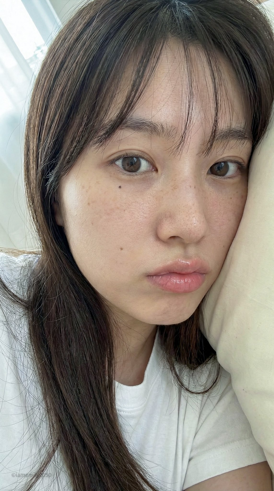
  <!--  -->
</div>

**Source:** [𝕏](https://x.com/IamEmily2050/status/19993810660760293721)

```json
{
  "frame": {
    "aspect_ratio": "9:16",
    "shot_size": "Extreme Close-Up (ECU)",
    "orientation": "Portrait",
    "composition_guide": "Off-center diagonal; face fills most of frame, pillow dominates camera-right; eyes near upper-middle"
  },
  "subject": {
    "subject_type": "Human",
    "identity_summary": "Adult East Asian woman, long dark brown/black hair with wispy see-through bangs, natural textured skin with light freckles, glossy pink lips, small beauty mark on the cheek (viewer-left).",
    "visual_signature": {
      "facial_signature": {
        "face_shape": "Soft oval with a tapered chin (slightly compressed by pillow)",
        "eye_details": "Large brown almond eyes, subtle eyeliner, clear catchlights",
        "nose_details": "Straight narrow bridge, small soft tip",
        "lip_details": "Full pouty lips, high-gloss, pink/coral tint",
        "unique_features": "Small dark beauty mark (mole) on viewer-left cheek"
      },
      "body_signature": {
        "build": "Slender",
        "skin_tone_and_texture": "Fair-light tone with realistic skin microtexture: visible pores on cheeks and nose, fine peach fuzz, scattered light freckles across nose bridge and upper cheeks, subtle redness/flush and mild natural blotchiness; no heavy smoothing"
      }
    },
    "pose_and_action": {
      "description": "Side-lying selfie, cheek resting into a cream pillow, head tilted slightly downward toward camera.",
      "body_position": "Upper torso mostly out of frame; neckline visible",
      "limb_positions": "Arms out of frame; phone/camera implied",
      "facial_expression": "Sleepy/soft pout, relaxed mouth, calm intimate mood",
      "gaze_direction": "Direct eye contact with camera"
    },
    "inventory": {
      "wardrobe": "White crew-neck cotton t-shirt",
      "accessories": "None",
      "hair_style": "Long straight dark hair spread over bedding, wispy bangs partially crossing forehead and between eyes"
    }
  },
  "environment": {
    "setting_type": "Indoor",
    "location_description": "Bed, close to pillow",
    "background_elements": "Cream/white pillow with soft texture on camera-right, white bedding, minimal clutter"
  },
  "lighting": {
    "global_illumination": "Soft, diffuse, texture-revealing",
    "primary_source": "Large soft source from slightly above camera-left (window-like)",
    "direction": "Mostly frontal with slight side bias to reveal pores and freckles without harsh shadows",
    "shadow_quality": "Very soft; gentle gradients along nose and under bangs",
    "color_temperature": "Neutral-warm (approx 4500K–5200K)"
  },
  "camera": {
    "angle": "Phone selfie perspective, slightly above and close",
    "lens_type": "Phone wide camera equivalent",
    "focal_length_mm_equiv": 24,
    "aperture": "f/1.8",
    "focus": "Sharp on eyes; enough detail to resolve pores/freckles on cheeks and nose; mild falloff toward hair and pillow edges"
  },
  "post_processing": {
    "art_medium": "Photography",
    "style_modifiers": "natural selfie, minimal retouch, preserve pores and freckles, realistic skin texture, subtle under-eye texture, high detail eyes, no skin blur, no plastic smoothing",
    "color_grade": "Natural skin tones, gentle contrast, restrained highlights, slightly warm neutrals",
    "rendering_engine": "Photorealistic"
  },
  "negative": {
    "artifact_suppression": "airbrushed skin, poreless skin, plastic/waxy skin, excessive skin smoothing, beauty filter, over-sharpen halos, uncanny texture tiling, heavy noise, banding, warped facial features, asymmetry, smeared pupils, extra teeth, extra limbs",
    "subject_excludes": "no mole, wrong mole placement, heavy eyeliner, heavy lipstick, bright red lips, wide smile with teeth, glasses, strong contouring, different hair color, child/teen"
  }
}
```
---

### 🖼️ Prompt 50

<div align="center">
  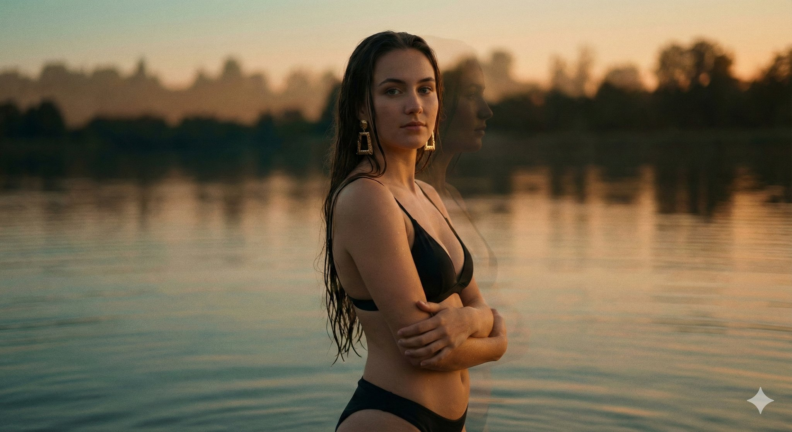
  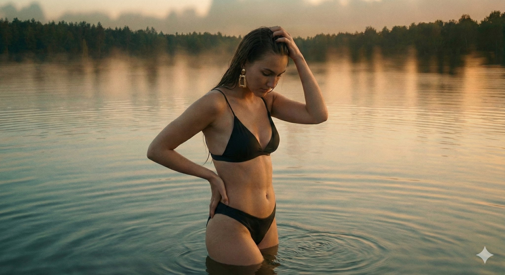
</div>

**Source:** [𝕏](https://x.com/Strength04_X/status/1999463560385302844)

```json
{
  "prompt_type": "cinematic_photograph",
  "description": {
    "overview": "Intimate close-up portrait of a young woman in a lake under moonlight, featuring a moody double-exposure effect.",
    "identity_requirements": {
      "match_reference_face": true,
      "details": [
        "Focus on eye detail and skin texture.",
        "High fidelity to facial structure.",
        "Expression should be mysterious and deep."
      ]
    }
  },
  "subject": {
    "character": "young_woman",
    "pose": {
      "body": "shoulder_level_portrait",
      "arms": "relaxed_at_sides",
      "head_orientation": "turned_slightly_to_side_looking_at_camera",
      "expression": "mysterious_and_alluring"
    },
    "appearance": {
      "hair": {
        "length": "long",
        "condition": "wet_and_slicked_back",
        "style": "loose"
      },
      "clothing": {
        "top": "strapless_black_top_visible_at_neckline",
        "bottom": "not_visible"
      },
      "accessories": {
        "earrings": {
          "type": "silver_drop",
          "size": "medium",
          "visual_emphasis": "subtle_glint"
        }
      }
    }
  },
  "environment": {
    "location": "lake",
    "time_of_day": "blue_hour_moonlight",
    "water": {
      "state": "still",
      "surface_texture": "glassy",
      "reflection_quality": "sharp_moon_reflection"
    },
    "background": {
      "horizon": "dark_silhouetted_trees",
      "atmospheric_tone": "cool_misty_night"
    },
    "lighting": {
      "type": "moonlight_cinematic",
      "sun_position": "moon_high_above",
      "color_tones": {
        "primary": ["deep_blue", "silver"],
        "accents": ["cool_white_highlights_on_skin"]
      }
    }
  },
  "visual_effects": {
    "double_exposure": {
      "enabled": true,
      "style": "ethereal",
      "secondary_profile": {
        "opacity": "medium",
        "position": "overlay_on_shadows",
        "appearance": "silhouette_against_moon"
      }
    }
  },
  "camera": {
    "lens": {
      "focal_length_mm": 105,
      "effect": "macro_portrait_details"
    },
    "depth_of_field": {
      "style": "very_shallow",
      "focus": "eyes",
      "background_blur": "heavy_bokeh"
    },
    "color_grade": {
      "palette": "cool_blue_and_silver",
      "contrast": "high",
      "mood": "nocturnal_mystery"
    }
  },
  "composition": {
    "framing": "close_up",
    "balance": "rule_of_thirds_eyes",
    "foreground": "out_of_focus_water_droplets",
    "background": "bokeh_moonlight_shimmer"
  },
  "output_requirements": {
    "resolution": "high",
    "style": "cinematic_photograph",
    "prohibitions": [
      "no_text",
      "no_warm_tones",
      "no_daylight"
    ]
  }
}
```
---

### 🖼️ Prompt 51

<div align="center">
  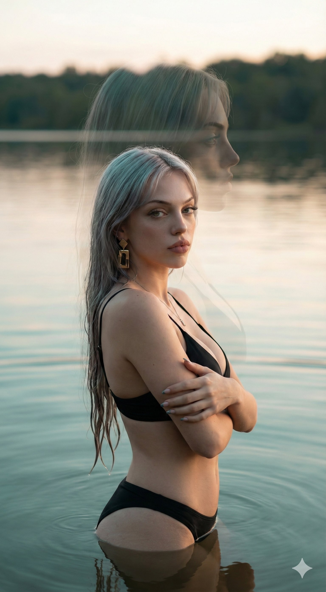
  <!--  -->
</div>

**Source:** [𝕏](https://x.com/YaseenK7212/status/1999410735890182457)

```json
{
  "prompt_type": "cinematic_photograph",
  "description": {
    "overview": "High-resolution cinematic photograph of a young woman standing in a lake at sunset, with a subtle double-exposure effect.",
    "identity_requirements": {
      "match_reference_face": true,
      "details": [
        "Facial characteristics should closely correspond to those in the provided reference image.",
        "High fidelity to facial structure, proportions, and expression.",
        "Preserve all natural facial details without alteration."
      ]
    }
  },
  "subject": {
    "character": "young_woman",
    "pose": {
      "body": "standing_in_shallow_lake_water",
      "arms": "crossed_over_chest",
      "head_orientation": "forward_or_slightly_angled",
      "expression": "neutral_or_calm"
    },
    "appearance": {
      "hair": {
        "length": "long",
        "condition": "wet",
        "style": "straight_down_back"
      },
      "clothing": {
        "top": "simple_black_bikini",
        "bottom": "simple_black_bikini_bottom"
      },
      "accessories": {
        "earrings": {
          "type": "geometric_gold",
          "size": "large",
          "visual_emphasis": "high"
        }
      }
    }
  },
  "environment": {
    "location": "lake",
    "time_of_day": "sunset",
    "water": {
      "state": "calm",
      "surface_texture": "minimal_ripples",
      "reflection_quality": "soft"
    },
    "background": {
      "horizon": "soft_and_lightly_blurred",
      "atmospheric_tone": "gentle_evening_haze"
    },
    "lighting": {
      "type": "soft_cinematic",
      "sun_position": "low_warm_sunset_light",
      "color_tones": {
        "primary": ["muted_teal", "muted_brown"],
        "accents": ["warm_highlights_from_sunset"]
      }
    }
  },
  "visual_effects": {
    "double_exposure": {
      "enabled": true,
      "style": "subtle",
      "secondary_profile": {
        "opacity": "low",
        "position": "background",
        "appearance": "translucent_profile_of_same_subject"
      }
    }
  },
  "camera": {
    "lens": {
      "focal_length_mm": 85,
      "effect": "cinematic_portrait_compression"
    },
    "depth_of_field": {
      "style": "shallow",
      "focus": "subject_face_and_upper_body",
      "background_blur": "creamy_and_smooth"
    },
    "color_grade": {
      "palette": "teal_and_brown_muted",
      "contrast": "soft",
      "mood": "cinematic_evening"
    }
  },
  "composition": {
    "framing": "portrait_orientation",
    "balance": "center_weighted_subject",
    "foreground": "gentle_water_surface",
    "background": "minimalistic_subtle_horizon"
  },
  "output_requirements": {
    "resolution": "high",
    "style": "cinematic_photograph",
    "prohibitions": [
      "no_text",
      "no_symbols",
      "no_graphic_overlays",
      "no_artificial_watermarks"
    ]
  }
}
```
---

### 🖼️ Prompt 52

<div align="center">
  
  <!--  -->
</div>

**Source:** [𝕏](https://x.com/xmliisu/status/1999411262095077820)

```json
{
  "generation_request": {
    "meta_data": {
      "task_type": "text_to_image_with_face_swap",
      "priority": "high",
      "version": "v1.0"
    },
    "technical_constraints": {
      "face_preservation": {
        "enabled": true,
        "reference_mode": "strict",
        "parameters": {
          "use_reference_face_only": true,
          "preserve_original_features": true,
          "preservation_strength": 1.0,
          "match_criteria": [
            "facial_features",
            "skin_texture",
            "expression",
            "proportions"
          ]
        }
      },
      "output_settings": {
        "aspect_ratio": "3:4",
        "orientation": "portrait",
        "resolution_target": "ultra_high_res",
        "render_engine_style": "photorealistic"
      }
    },
    "creative_prompt": {
      "subject_profile": {
        "demographics": {
          "gender": "female",
          "age_group": "young_adult"
        },
        "appearance": {
          "hair": {
            "style": "slicked-back",
            "texture": "naturally wavy, wet look",
            "placement": "tucked behind ears"
          },
          "expression": {
            "type": "soft playful smile",
            "gaze": "looking slightly sideways",
            "micro_expression": "reactionary (as if hearing name)"
          }
        },
        "styling": {
          "top": "white semi-sheer long-sleeve beach shirt",
          "bottom": "white shorts",
          "nails": "light pink/coral polish",
          "jewelry": [
            "small gold hoop earrings",
            "thin bracelet (right wrist)"
          ]
        },
        "pose_action": {
          "body": "sitting sideways",
          "posture": "relaxed, shoulders turned to camera",
          "limbs": {
            "arm_left": "resting on chair backrest",
            "arm_right": "gently touching cheek"
          }
        }
      },
      "scene_context": {
        "location": "beachside restaurant/café",
        "furniture": "wooden chair",
        "atmosphere": {
          "vibe": "summery, relaxed, social",
          "background": [
            "people dining (blurred)",
            "wooden ceiling with woven lampshades",
            "warm wooden textures"
          ]
        },
        "lighting_setup": {
          "primary": "natural daylight",
          "secondary": "warm indoor ambient accents",
          "specifics": "sunlit with soft glow on high points (cheeks, collarbones)"
        }
      },
      "photography_style": {
        "camera_angle": "slightly high angle (above eye level)",
        "framing": "mid-shot",
        "lens_character": "handheld lifestyle aesthetic",
        "color_grading": {
          "palette": ["warm tan", "white", "light brown"],
          "skin_tone_rendering": "soft, natural"
        }
      }
    }
  }
}
```
---

### 🖼️ Prompt 53

<div align="center">
  
  <!--  -->
</div>

**Source:** [𝕏](https://x.com/zayleeai/status/1999117566141239373)

```json
{
  "subject": {
    "type": "young_adult_woman",
    "ethnicity": "European",
    "age": "early_20s",
    "eye_color": "hazel_green_mix",
    "skin_texture": "natural_with_visible_pores_and_imperfections_no_blur_or_smoothing",
    "expression": "soft_neutral_with_gentle_coquette_vibe",
    "makeup": {
      "finish": "matte",
      "blush": "light_pink",
      "eyeshadow": "soft_pink",
      "eyeliner": "thin_black",
      "lashes": "defined",
      "lip_color": "matte_dusty_pink",
      "lip_shape": "medium_fullness_natural_look"
    },

    "hair": {
      "color": "jet_black",
      "length": "long_past_chest",
      "texture": "smooth_with_soft_waves",
      "bangs": "full_straight_lightly_piecey",
      "crown_style": "braided_crown",
      "side_sections": "long_face_framing_waves",
      "accessories": ["lilac_pink_ribbon_bows_left_and_right"]
    },

    "nails": {
      "style": "short_coquette",
      "color": "pastel_pink"
    },

    "pose": {
      "type": "mirror_selfie",
      "camera_angle": "slight_downward_diagonal",
      "head_angle": "very_subtle_tilt",
      "body_position": "leaning_forward_slightly",
      "right_arm": "holding_phone",
      "left_arm": "resting_or_light_touch_on_furniture"
    }
  },

  "apparel": {
    "top": {
      "type": "lime_green_cropped_ribbed_cardigan",
      "pattern": "thin_vertical_teal_stripes",
      "fit": "tight_and_form_fitting",
      "closure": "single_center_clasp_firmly_secured",
      "neckline": "deep_V_but_fully_covered",
      "sleeves": "long_with_slight_flare",
      "integrity": "top_stays_in_place_no_sliding_no_opening"
    },

    "undershirt": {
      "type": "white_fitted_tank_top",
      "material": "soft_ribbed_cotton",
      "coverage": "fully_covers_chest_under_cardigan"
    },

    "necklace": {
      "type": "minimalist_silver_chain",
      "pendant": "tiny_simple_shape"
    },

    "bottoms": {
      "type": "low_rise_black_denim_jeans",
      "details": "contrast_stitching_silver_button_belt_loops"
    }
  },

  "phone": {
    "model": "iPhone_15_Pro_Max",
    "held_in": "right_hand",
    "case": {
      "design": "green_3D_frog_case",
      "details": {
        "eyes": "raised_frog_eyes_on_top",
        "face": "round_frog_face_with_blue_cheek_detail",
        "edges": "wavy_inflated_style"
      },
      "inserted_photo": "Elon_Musk_passport_photo"
    }
  },

  "environment": {
    "setting": "cozy_bedroom_soft_evening_vibe",
    "walls": {
      "color": "soft_gray_beige",
      "decor": {
        "posters": [
          "large_Lana_Del_Rey_portrait",
          "Lana_Del_Rey_album_covers_collage",
          "black_white_artistic_portraits",
          "various_small_decorative_prints"
        ],
        "garlands": "green_vines_with_pink_roses"
      }
    },

    "bed": {
      "sheets": "light_pink_with_line_pattern",
      "pillows": "matching_pink_sets",
      "plushies": ["small_brown_dog", "white_bear_with_pink_accents", "ribbed_pink_bunny"]
    },

    "room_items": ["pastel_handbag", "small_accessory_clutter"],

    "vibe": "dreamy_coquette_bedroom_lana_del_rey_inspired"
  },

  "lighting": {
    "type": "soft_indoor_front_light",
    "reflections": "none_on_face_or_clothing",
    "shadows": "very_soft",
    "effect": "natural_even_skin_tone"
  },

  "image_rendering": {
    "style": "natural_phone_snapshot",
    "device": "iPhone_15_Pro_Max",
    "no_beautify": true,
    "skin_detail": {
      "pores_visible": true,
      "imperfections_visible": true,
      "micro_shadows": true
    },
    "camera_artifacts": {
      "grain": "light_natural",
      "noise": "soft_iso_noise",
      "sharpness": "medium_high_to_show_real_texture"
    },
    "ratio": "3:4"
  }
}
```
---

### 🖼️ Prompt 54

<div align="center">
  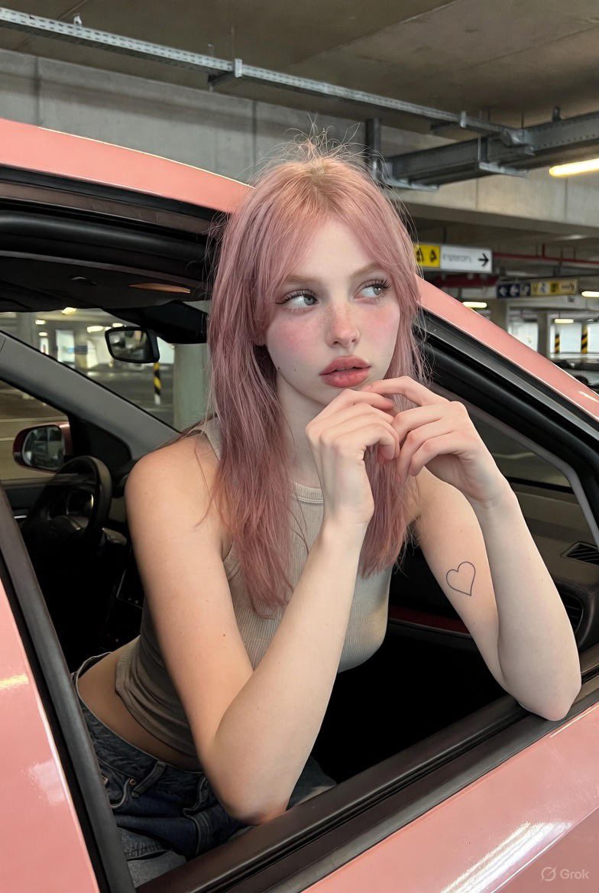
  <!--  -->
</div>

**Source:** [𝕏](https://x.com/zayleeai/status/1999990999121092800)

```json
{
  "prompt": {
    "subject": {
      "type": "young adult woman",
      "age_range": "early 20s",
      "ethnicity": "European",

      "pose": {
        "position": "leaning out of a closed car door window",
        "details": "door closed, passenger window fully open",
        "upper_body": "upper torso leaning through window frame",
        "arms": {
          "left_arm": "resting on window edge",
          "right_hand": "fingers gently touching lips"
        },
        "posture": "slightly leaning forward, relaxed and intimate",
        "vibe": "shy, sexy, naughty, thoughtful, unposed"
      },

      "expression": {
        "face": "soft, introspective",
        "gaze": "looking off to the side",
        "emotion": "quiet, gentle, daydreaming"
      },

      "appearance": {
        "hair": {
          "color": "dusty pastel pink",
          "length": "long",
          "style": "loose, straight, natural fall",
          "parting": "soft center part",
          "texture": "slightly messy, real strands"
        },

        "skin": {
          "tone": "fair, cool undertone",
          "texture": "real skin with lightly visible pores",
          "details": [
            "subtle pores on cheeks and nose",
            "natural skin grain",
            "slight unevenness"
          ],
          "restrictions": [
            "no blur",
            "no smoothing",
            "no beauty filters",
            "no plastic or glow"
          ]
        },

        "makeup": {
          "base": "very light, skin-like",
          "blush": "soft muted pink",
          "eyes": "very thin eyeliner, natural lashes",
          "lips": {
            "color": "soft rose nude",
            "finish": "natural satin",
            "texture": "real lip texture"
          }
        },

        "tattoos": {
          "visible": true,
          "locations": ["upper arm"],
          "design": "small heart outline, black ink"
        }
      }
    },

    "outfit": {
      "top": {
        "type": "sleeveless fitted tank top",
        "color": "light beige / off-white",
        "fabric": "thin cotton",
        "fit": "tight, everyday"
      },
      "bottom": {
        "type": "low-rise jeans",
        "color": "washed blue denim",
        "fit": "relaxed"
      }
    },

    "environment": {
      "location": "underground parking garage",
      "car": {
        "type": "sedan",
        "color": "soft pastel pink",
        "state": "parked",
        "window": "open, door closed"
      },
      "background": [
        "parked cars",
        "concrete pillars",
        "directional signs",
        "industrial ceiling pipes"
      ]
    },

    "lighting": {
      "type": "overhead parking garage light",
      "quality": "cool, flat, realistic",
      "effect": "soft shadows, low contrast"
    },

    "camera": {
      "device": "iPhone 15 Pro Max",
      "angle": "eye-level, slightly angled from outside",
      "distance": "medium close-up",
      "style": "handheld, casual",
      "image_quality": "non-HD, realistic smartphone photo"
    },

    "color_tone": {
      "overall": "soft, muted",
      "contrast": "low",
      "saturation": "slightly reduced"
    },

    "overall_mood": {
      "vibe": "soft girl, quiet moment",
      "energy": "natural, intimate, unforced"
    },

    "restrictions": [
      "no studio look",
      "no cinematic lighting",
      "no heavy retouching",
      "no HD polish"
    ]
  }
}
```
---

### 🖼️ Prompt 55

<div align="center">
  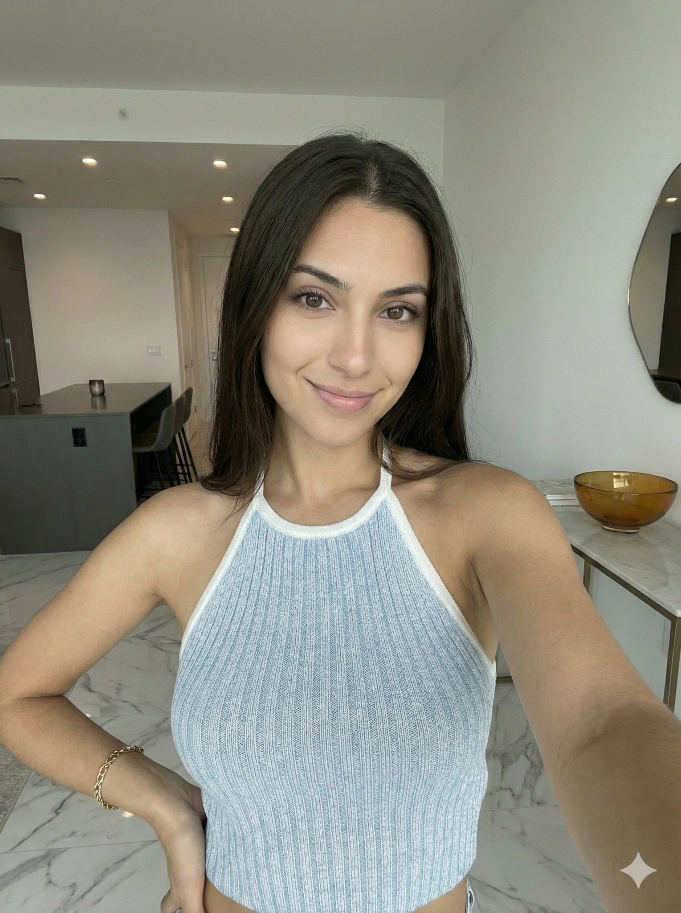
  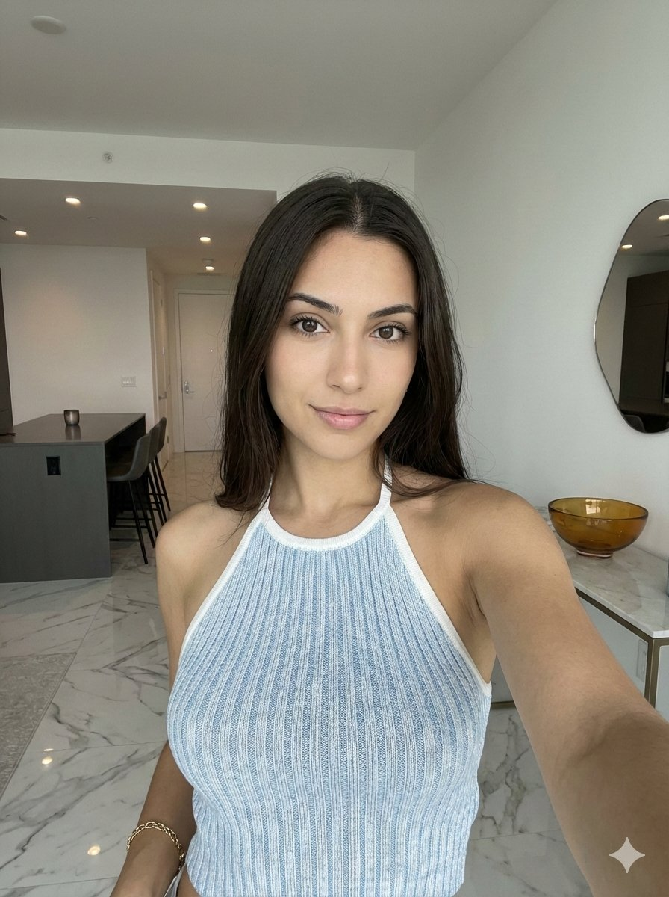
</div>

**Source:** [𝕏](https://x.com/Strength04_X/status/1999518978683863105)

```json
{
  "lighting": {
    "source": "Mix of ambient natural light from an unseen window and recessed ceiling lights",
    "quality": "Soft, flattering, with gentle shadows",
    "shadows": "Soft shadows define the features; more distinct shadows cast by furniture on the floor",
    "direction": "Frontal and overhead diffused light"
  },
  "metadata": {
    "title": "Selfie of a Woman in a Modern Apartment - Pose 3",
    "date_taken": "N/A",
    "description": "A vertical selfie photograph of a woman with long dark hair, wearing a light blue and white ribbed halter top, touching her hair with a playful expression.",
    "photographer": "Self-portrait"
  },
  "background": {
    "clutter": "Minimal and tidy",
    "setting": "Modern, minimalist apartment interior",
    "elements": "White marble floor with prominent grey veining, a dark grey modern kitchen island with bar stools in the mid-ground, dark cabinetry, a hallway leading to a door, a console table with a large amber glass bowl, a unique irregularly shaped wall mirror, plain white walls, and recessed ceiling lights"
  },
  "typography": {
    "text_content": "N/A"
  },
  "composition": {
    "framing": "Waist-up selfie, close-up, slightly angled",
    "focal_point": "Subject's eyes and hand",
    "perspective": "Eye-level, taken from slightly above by the subject",
    "aspect_ratio": "3:4 (approximate vertical)"
  },
  "color_profile": {
    "saturation": "Medium",
    "color_palette": "Cool blues and whites balanced by warm skin tones and neutral background elements",
    "white_balance": "Slightly warm, natural indoor light",
    "dominant_colors": [
      "#7F9FBF",
      "#FFFFFF",
      "#3A3A3A",
      "#D9B99B",
      "#F2F2F2"
    ]
  },
  "technical_specs": {
    "focus": "Sharp on the subject's face",
    "exposure": "Well-balanced indoor exposure",
    "lens_type": "Wide-angle",
    "camera_type": "Smartphone camera"
  },
  "subject_analysis": {
    "eyes": "Dark brown, almond-shaped, looking slightly off-camera or playfully at the lens",
    "hair": "Dark brown, long, straight, swept slightly to one side",
    "pose": "Selfie pose, head tilted slightly to the left, right arm extended holding camera",
    "hands": "Left hand raised, fingers gently touching the hair or tucked behind the ear",
    "subject": "A young woman",
    "clothing": "Light blue ribbed knit halter top with white trim and a white lower section",
    "accessories": "Gold chain bracelet on her left wrist",
    "facial_expression": "Playful, confident smile, showing teeth slightly"
  },
  "artistic_elements": {
    "mood": "Lively, candid, chic",
    "style": "Casual, lifestyle selfie",
    "texture": "Ribbed knit fabric of the top, smooth marble floor, silky hair"
  }
}
```
---

### 🖼️ Prompt 56

<div align="center">
  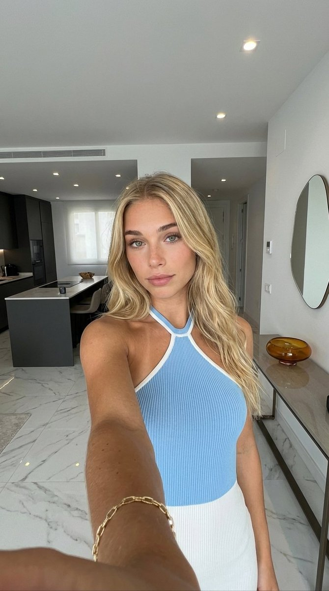
  <!--  -->
</div>

**Source:** [𝕏](https://x.com/johnnprofits/status/1999506027557830802)

```json
{
  "lighting": {
    "source": "Mix of ambient natural light from an unseen window and recessed ceiling lights",
    "quality": "Soft, flattering, with gentle shadows",
    "shadows": "Soft shadows define the features; more distinct shadows cast by furniture on the floor",
    "direction": "Frontal and overhead diffused light"
  },
  "metadata": {
    "title": "Selfie of a Woman in a Modern Apartment",
    "date_taken": "N/A",
    "description": "A vertical selfie photograph of a woman with long dark hair, wearing a light blue and white ribbed halter top, taken in a modern apartment interior with marble floors.",
    "photographer": "Self-portrait"
  },
  "background": {
    "clutter": "Minimal and tidy",
    "setting": "Modern, minimalist apartment interior",
    "elements": "White marble floor with prominent grey veining, a dark grey modern kitchen island with bar stools in the mid-ground, dark cabinetry, a hallway leading to a door, a console table with a large amber glass bowl, a unique irregularly shaped wall mirror, plain white walls, and recessed ceiling lights"
  },
  "typography": {
    "text_content": "N/A"
  },
  "composition": {
    "framing": "Waist-up selfie, close-up",
    "focal_point": "Subject's face",
    "perspective": "Eye-level, taken from slightly above by the subject",
    "aspect_ratio": "3:4 (approximate vertical)"
  },
  "color_profile": {
    "saturation": "Medium",
    "color_palette": "Cool blues and whites balanced by warm skin tones and neutral background elements",
    "white_balance": "Slightly warm, natural indoor light",
    "dominant_colors": [
      "#7F9FBF",
      "#FFFFFF",
      "#3A3A3A",
      "#D9B99B",
      "#F2F2F2"
    ]
  },
  "technical_specs": {
    "focus": "Sharp on the subject's face and clothing",
    "exposure": "Well-balanced indoor exposure",
    "lens_type": "Wide-angle",
    "camera_type": "Smartphone camera"
  },
  "subject_analysis": {
    "eyes": "Dark brown, almond-shaped, looking directly at the camera",
    "hair": "Dark brown, long, straight with a slight curve at the ends, parted in the middle",
    "pose": "Selfie pose holding the camera with her extended right arm, body angled slightly, left arm down by her side",
    "hands": "Left hand visible near her waist, right hand holding the camera is out of frame",
    "subject": "A young woman",
    "clothing": "Light blue ribbed knit halter top with white trim and a white lower section, possibly part of a dress or romper",
    "accessories": "Gold chain bracelet on her left wrist",
    "facial_expression": "Neutral to slight, soft smile with a direct, confident gaze"
  },
  "artistic_elements": {
    "mood": "Relaxed, confident, calm",
    "style": "Casual, lifestyle selfie",
    "texture": "Ribbed knit fabric of the top, smooth marble floor, sleek hair",
  }
}
```
---

### 🖼️ Prompt 57

<div align="center">
  
  <!--  -->
</div>

**Source:** [𝕏](https://x.com/youngcatwoman/status/1999601164783149277)

```json

{
  "lighting": {
    "source": "Mix of ambient natural light from an unseen window and recessed ceiling lights",
    "quality": "Soft, flattering, with gentle shadows",
    "shadows": "Soft shadows define the features; more distinct shadows cast by furniture on the floor",
    "direction": "Frontal and overhead diffused light"
  },
  "metadata": {
    "title": "Selfie of a Woman in a Modern Apartment",
    "date_taken": "N/A",
    "description": "A vertical selfie photograph of a beautiful young Taiwanese woman with a dramatic hourglass figure and a slim athletic waist, platinum blonde hair with light blue highlights (no roots showing), wearing revealing, skintight translucent latex clubbing clothes, taken in a modern apartment interior with marble floors.",
    "photographer": "Self-portrait"
  },
  "background": {
    "clutter": "Minimal and tidy",
    "setting": "Modern, minimalist apartment interior",
    "elements": "White marble floor with prominent grey veining, a dark grey modern kitchen island with bar stools in the mid-ground, dark cabinetry, a hallway leading to a door, a console table with a large amber glass bowl, a unique irregularly shaped wall mirror, plain white walls, and recessed ceiling lights"
  },
  "typography": {
    "text_content": "N/A"
  },
  "composition": {
    "framing": "Waist-up selfie, close-up",
    "focal_point": "Subject's face and dramatic figure",
    "perspective": "Eye-level, taken from slightly above by the subject",
    "aspect_ratio": "3:4 (approximate vertical)"
  },
  "color_profile": {
    "saturation": "Medium",
    "color_palette": "Cool blues and whites balanced by warm skin tones and neutral background elements",
    "white_balance": "Slightly warm, natural indoor light",
    "dominant_colors": [
      "#7F9FBF",
      "#FFFFFF",
      "#3A3A3A",
      "#D9B99B",
      "#F2F2F2"
    ]
  },
  "technical_specs": {
    "focus": "Sharp on the subject's face and clothing",
    "exposure": "Well-balanced indoor exposure",
    "lens_type": "Wide-angle",
    "camera_type": "Smartphone camera"
  },
  "subject_analysis": {
    "eyes": "Almond-shaped, looking directly at the camera",
    "hair": "Platinum blonde with light blue highlights (no roots showing), long, straight with a slight curve at the ends, parted in the middle",
    "pose": "Selfie pose holding the camera with her extended right arm, body angled slightly to emphasize her dramatic hourglass figure and slim athletic waist, left arm down by her side",
    "hands": "Left hand visible near her waist, right hand holding the camera is out of frame",
    "subject": "A beautiful young Taiwanese woman with a dramatic hourglass figure and a slim athletic waist",
    "clothing": "Revealing, skintight translucent latex clubbing clothes",
    "accessories": "Gold chain bracelet on her left wrist",
    "facial_expression": "Neutral to slight, soft smile with a direct, confident gaze"
  },
  "artistic_elements": {
    "mood": "Confident, seductive, dramatic",
    "style": "Clubbing/fashion selfie",
    "texture": "Smooth, translucent latex fabric, smooth marble floor, sleek hair"
  }
}
```
---

### 🖼️ Prompt 58

<div align="center">
  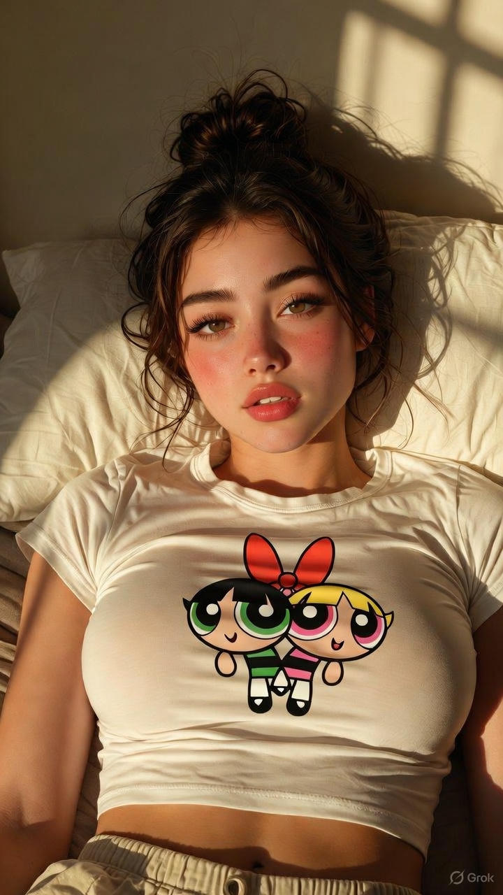
  <!--  -->
</div>

**Source:** [𝕏](https://x.com/chatgptpaglu/status/1999373150518411348)

```json

{
  "project_manifest": {
    "id": "SELFIE_RECLINE_002",
    "type": "Generative Image Configuration",
    "target_platform": "Midjourney v6 / Stable Diffusion XL",
    "schema_version": "5.2.0-scene-graph"
  },
  "render_configuration": {
    "viewport": {
      "aspect_ratio": "9:16",
      "target_resolution": "1080x1920",
      "orientation": "Portrait"
    },
    "virtual_camera": {
      "type": "Smartphone Primary Sensor",
      "lens_simulation": "Wide-Angle (24mm equiv)",
      "perspective": "Exaggerated High-Angle (Overhead)",
      "depth_of_field": "Moderate (Face focus, soft background)"
    },
    "processing_rules": {
      "face_restoration": {
        "enabled": true,
        "mode": "Reference Match",
        "tolerance": "Strict (No structural alteration)"
      }
    }
  },
  "scene_graph": {
    "subject": {
      "id": "primary_model",
      "archetype": "Female Young Adult",
      "pose_definition": {
        "body_state": "Reclining / Supine",
        "support_surface": "Pillows",
        "head_orientation": "Forward-facing, gazing into lens",
        "limb_placement": {
          "right_arm": "Curled naturally beside head",
          "general": "Spontaneous, playful"
        }
      },
      "anatomy_features": {
        "hair": {
          "style": "Messy Bun",
          "texture_modifiers": ["Loose", "Natural", "Flyaway strands"]
        },
        "face": {
          "expression": "Relaxed, dreamy",
          "dermal_details": ["Rosy cheeks"],
          "eye_details": ["Long thick lashes"]
        }
      },
      "apparel_inventory": {
        "upper_body": {
          "item": "Fitted Cropped T-Shirt",
          "color_palette": "Cream White",
          "graphic_content": {
            "motif": "Powerpuff Girls",
            "style": "Bright cartoon",
            "placement": "Centered"
          }
        },
        "lower_body": {
          "item": "Casual Shorts",
          "color_palette": "Light Beige",
          "material_properties": "Soft fabric",
          "fit": "Relaxed"
        }
      }
    },
    "environment": {
      "setting_id": "indoor_bed_space",
      "primary_props": [
        {
          "item": "Pillows",
          "texture": "Soft textured fabric",
          "color": "White",
          "function": "Backdrop/Support"
        }
      ]
    },
    "lighting_engine": {
      "type": "Natural Indoor",
      "key_source": "Sunlight (Diffused)",
      "shadows": "Soft, distinct",
      "atmospheric_qualities": ["Warm", "Cozy", "Intimate"]
    }
  },
  "style_parameters": {
    "genre": "Social Media Candid",
    "visual_tags": [
      "Textural Realism",
      "iPhone Aesthetic",
      "Personal Tone",
      "Intimate Atmosphere"
    ],
    "negative_prompt_concepts": [
      "Distorted graphic",
      "Unreadable cartoon",
      "Harsh contrast",
      "Studio lighting",
      "Formal pose"
    ]
  }
}
```
---

### 🖼️ Prompt 59

<div align="center">
  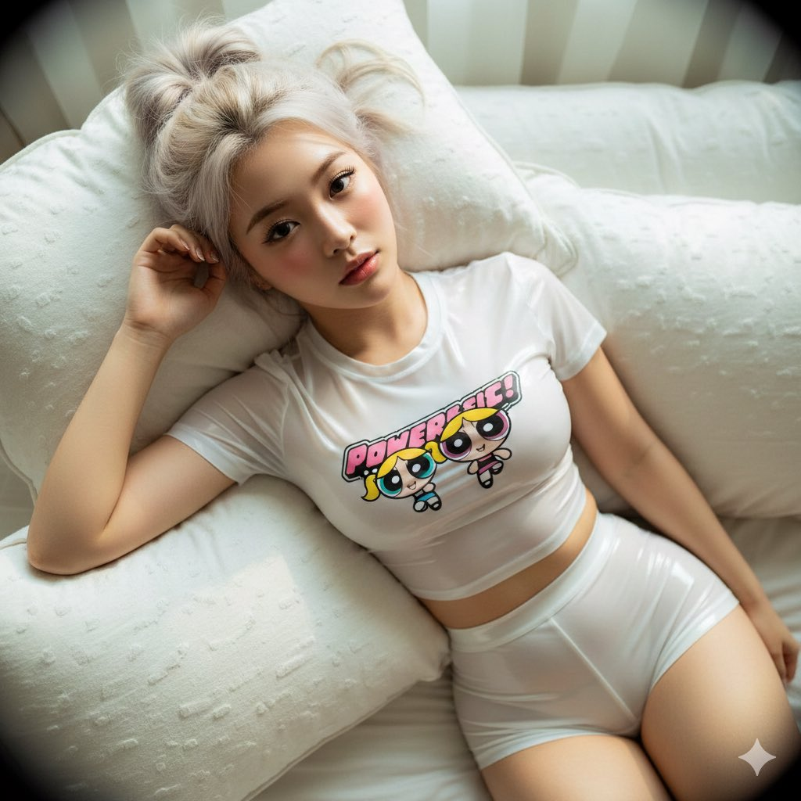
  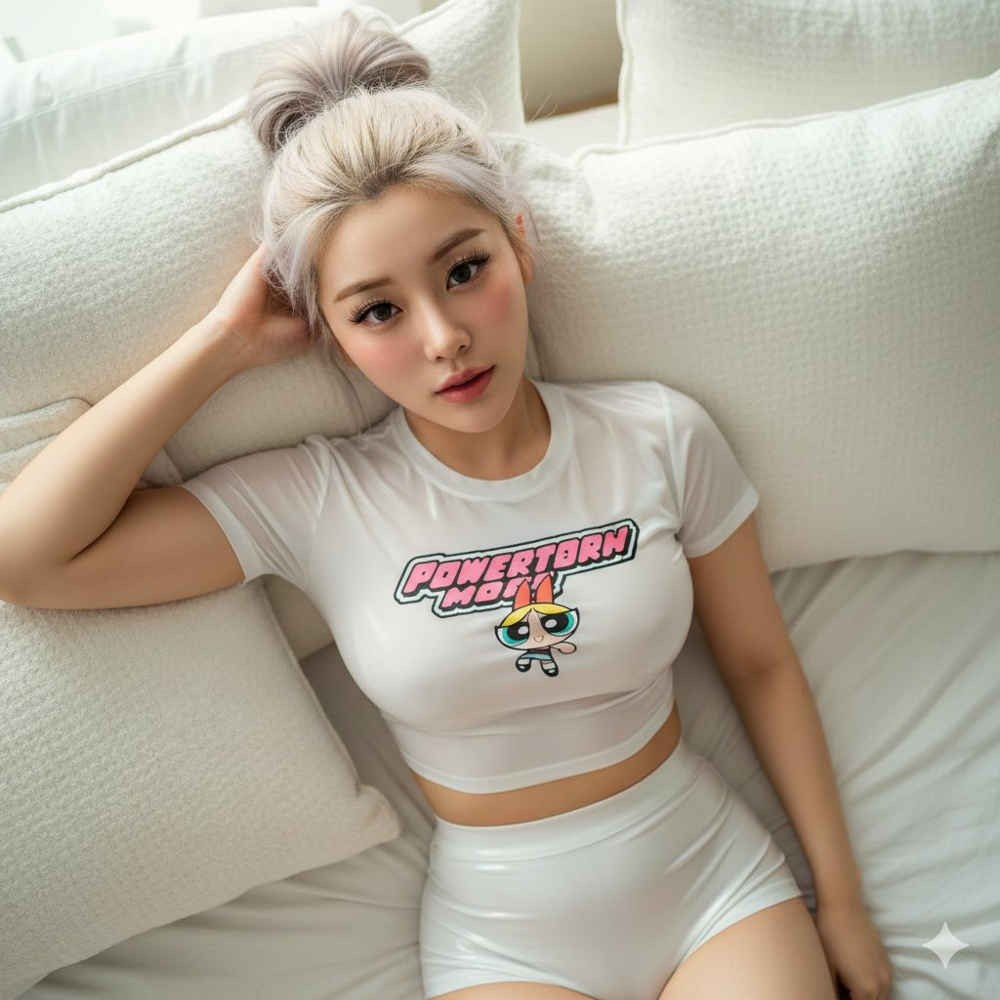
</div>

**Source:** [𝕏](https://x.com/youngcatwoman/status/1999465717046059183)

```json

{
  "project_manifest": {
    "id": "SELFIE_RECLINE_002",
    "type": "Generative Image Configuration",
    "target_platform": "Midjourney v6 / Stable Diffusion XL",
    "schema_version": "5.2.0-scene-graph"
  },
  "render_configuration": {
    "viewport": {
      "aspect_ratio": "9:16",
      "target_resolution": "1080x1920",
      "orientation": "Portrait"
    },
    "virtual_camera": {
      "type": "Smartphone Primary Sensor",
      "lens_simulation": "Wide-Angle (24mm equiv)",
      "perspective": "Exaggerated High-Angle (Overhead)",
      "depth_of_field": "Moderate (Face focus, soft background)"
    },
    "processing_rules": {
      "face_restoration": {
        "enabled": true,
        "mode": "Reference Match",
        "tolerance": "Strict (No structural alteration)"
      }
    }
  },
  "scene_graph": {
    "subject": {
      "id": "primary_model",
      "archetype": "Beautiful Young KoreanAdult",
      "pose_definition": {
        "body_state": "Reclining / Supine",
        "support_surface": "Pillows",
        "head_orientation": "Forward-facing, gazing into lens",
        "limb_placement": {
          "right_arm": "Curled naturally beside head",
          "general": "Spontaneous, playful"
        }
      },
      "anatomy_features": {
        "hair": {
          "style": "Platinum Messy Bun",
          "texture_modifiers": ["Loose", "Natural", "Flyaway strands"]
        },
        "face": {
          "expression": "Relaxed, dreamy",
          "dermal_details": ["Rosy cheeks"],
          "eye_details": ["Long thick lashes"]
        }
      },
      "apparel_inventory": {
        "upper_body": {
          "item": "Fitted Cropped Latex Shirt",
          "color_palette": "Translucent White",
          "graphic_content": {
            "motif": "Powerpuff Girls",
            "style": "Bright cartoon",
            "placement": "Centered"
          }
        },
        "lower_body": {
          "item": "Booty Shorts",
          "color_palette": "Translucent White",
          "material_properties": "Glossy Reflective",
          "fit": "Skintight"
        }
      }
    },
    "environment": {
      "setting_id": "indoor_bed_space",
      "primary_props": [
        {
          "item": "Pillows",
          "texture": "Soft textured fabric",
          "color": "White",
          "function": "Backdrop/Support"
        }
      ]
    },
    "lighting_engine": {
      "type": "Natural Indoor",
      "key_source": "Sunlight (Diffused)",
      "shadows": "Soft, distinct",
      "atmospheric_qualities": ["Warm", "Cozy", "Intimate"]
    }
  },
  "style_parameters": {
    "genre": "Social Media Candid",
    "visual_tags": [
      "Textural Realism",
      "iPhone Aesthetic",
      "Personal Tone",
      "Intimate Atmosphere"
    ],
    "negative_prompt_concepts": [
      "Distorted graphic",
      "Unreadable cartoon",
      "Harsh contrast",
      "Studio lighting",
      "Formal pose"
    ]
  }
}
```
---

### 🖼️ Prompt 60

<div align="center">
  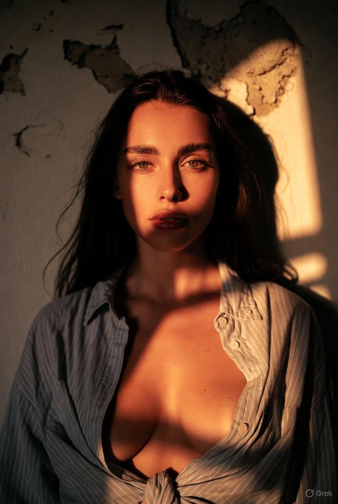
  <!--  -->
</div>

**Source:** [𝕏](https://x.com/xIrissy/status/1999384085400289473)

```json

{
  "image_generation_prompt": {
    "subject": {
      "description": "Young woman",
      "features": [
        "Long, dark hair",
        "Gazing directly forward"
      ],
      "attire": "Unbuttoned, pinstriped shirt, tied at the waist, revealing upper chest",
      "pose": "Posing against a textured wall"
    },
    "lighting": {
      "type": "Volumetric Light",
      "direction": "Strong, warm light from the right",
      "effects": [
        "Dramatic highlights",
        "Distinct bar shadows across skin and wall",
        "Striking interplay of light and shadow"
      ]
    },
    "atmosphere": "Intimate and moody",
    "technical_specifications": {
      "camera_body": "ARRI Alexa 65",
      "lens": "Leica Summilux-C 35mm",
      "post_production": "Dolby Vision HDR",
      "resolution": "8k"
    },
    "style_modifiers": [
      "Hyper-realistic",
      "Ultra-detailed cinematic shot",
      "Filmic Ultra-Real Vision",
      "Masterpiece",
      "Photorealistic",
      "High quality"
    ],
    "raw_prompt_string": "A hyper-realistic, ultra-detailed cinematic shot of A young woman with long, dark hair poses against a textured wall, gazing directly forward. She wears an unbuttoned, pinstriped shirt, tied at the waist, revealing her upper chest. Strong, warm light from the right illuminates her face and body, creating dramatic highlights and casting distinct bar shadows across her skin and the wall behind her. The overall atmosphere is intimate and moody, with a striking interplay of light and shadow. Style: Filmic Ultra-Real Vision. Shot on: ARRI Alexa 65 with a Leica Summilux-C 35mm. Lighting: Volumetric Light. Post-production: Dolby Vision HDR. 8k, masterpiece, photorealistic, high quality"
  }
}
```
---

### 🖼️ Prompt 61

<div align="center">
  
  <!--  -->
</div>

**Source:** [𝕏](https://x.com/xIrissy/status/1999461492404683079)

```json

{
  "image_generation_request": {
    "prompts": {
      "subject_description": "A photorealistic mirror selfie of a young woman squatting gracefully low, one knee forward, leaning slightly toward the mirror. 
Head tilted slightly downward, eyes looking at the phone screen. Right hand holds a smartphone vertically in front of face, left hand rests on knee. 
Expression is soft and calm.",
      "visual_attributes": {
        "face_match_mode": "strict_reference_adherence",
        "hair": "Match reference hairstyle and hairline exactly",
        "makeup": "Natural makeup style, matching reference lip shape and color",
        "outfit": "Light-colored floral maxi dress, short sleeves, flowing fabric with a slit exposing the leg. White strappy heels.",
        "accessories": "Silver necklace, silver bracelet, silver rings. Smartphone has a glitter silver phone case."
      },
      "environment": {
        "setting": "Indoor room",
        "background": "Floor-to-ceiling curtains in dark grey tones",
        "floor": "Smooth and reflective",
        "lighting": "Soft warm lighting, evenly illuminating face and outfit"
      },
      "style_modifiers": [
        "Social media mirror selfie aesthetic",
        "Soft warm tones",
        "Medium-high clarity",
        "Feminine and elegant mood",
        "Eye-level mirror perspective",
        "Sharp focus on face and outfit",
        "8K high-resolution",
        "Masterpiece"
      ]
    },
    "negative_prompt": [
      "incorrect face",
      "wrong hairstyle",
      "extra limbs",
      "bad anatomy",
      "different dress pattern",
      "distorted proportions",
      "text",
      "watermark",
      "low quality",
      "blurry",
      "oversaturated",
      "illustration",
      "cartoon"
    ],
    "technical_parameters": {
      "aspect_ratio": "4:5",
      "resolution": {
        "width": 1024,
        "height": 1280
      },
      "steps": 35,
      "guidance_scale": 7.0,
      "sampler": "DPM++ 2M Karras",
      "face_restoration": true,
      "control_net_settings": {
        "enabled": true,
        "module": "reference_only",
        "weight": 1.0,
        "guidance_start": 0.0,
        "guidance_end": 1.0
      }
    }
  }
}
```
---

### 🖼️ Prompt 62

<div align="center">
  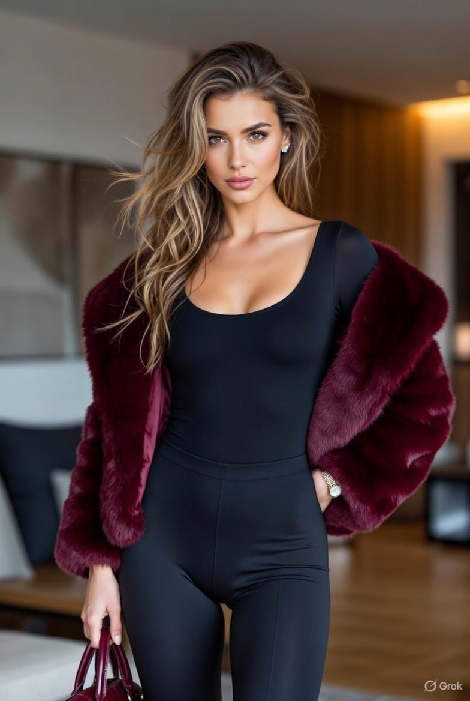
  <!--  -->
</div>

**Source:** [𝕏](https://x.com/xIrissy/status/1999751089336590647)

```json

{
  "image_prompt_data": {
    "subject": {
      "type": "Young woman",
      "archetype": "Fashion model",
      "hair": {
        "style": "Long, voluminous, loose waves",
        "color": "Dirty blonde with honey highlights (balayage)",
        "movement": "Slightly windblown"
      },
      "face": {
        "makeup": "Soft glam, neutral tones, nude lipstick, defined eyebrows",
        "expression": "Confident, alluring, direct gaze",
        "features": "Symmetrical, high cheekbones"
      }
    },
    "attire": {
      "base_layer": {
        "item": "Form-fitting bodysuit and leggings",
        "color": "Matte black",
        "neckline": "Scoop neck"
      },
      "outerwear": {
        "item": "Plush faux fur jacket",
        "color": "Deep burgundy / Maroon",
        "style": "Open front, voluminous texture"
      },
      "accessories": [
        {
          "item": "Handbag",
          "color": "Deep burgundy leather",
          "position": "Held in right hand"
        },
        {
          "item": "Wristwatch",
          "material": "Gold",
          "style": "Classic analog"
        },
        {
          "item": "Earrings",
          "style": "Small diamond studs"
        }
      ]
    },
    "setting": {
      "location": "Luxury interior (upscale apartment or hotel suite)",
      "background": "Blurred warm tones, wood paneling, soft furniture",
      "lighting": "Cinematic soft lighting, warm ambient glow"
    },
    "technical_parameters": {
      "style": "Photorealistic, High Fashion Photography",
      "resolution": "8k, Ultra-HD",
      "camera_settings": {
        "shot_type": "Medium shot (thighs up)",
        "focus": "Sharp focus on subject face",
        "depth_of_field": "Shallow (Bokeh background)",
        "lens": "85mm portrait lens",
        "aperture": "f/1.8"
      }
    }
  }
}
```
---

### 🖼️ Prompt 63

<div align="center">
  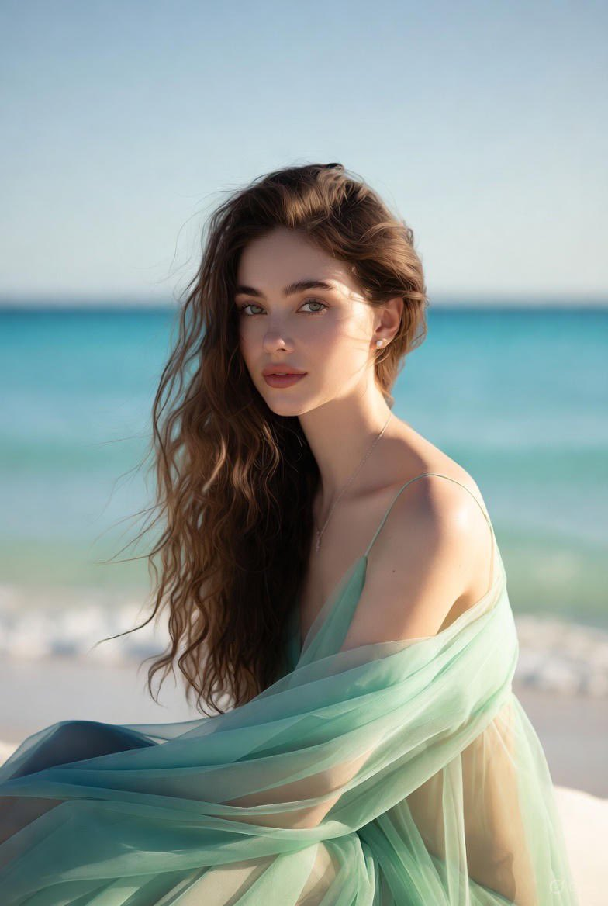
  <!--  -->
</div>

**Source:** [𝕏](https://x.com/xIrissy/status/1999830450274218321)

```json

{
  "portrait_style": "serene beachside",
  "subject": {
    "description": "young woman",
    "pose": "sitting gracefully on soft white sand near the shoreline",
    "gaze": "thoughtfully toward the horizon"
  },
  "attire": {
    "dress": {
      "color": "pastel mint-green",
      "style": "flowing, thin straps",
      "interaction": "gently catching the sea breeze"
    },
    "accessories": "delicate necklace and earrings"
  },
  "physical_features": {
    "hair": "long, wavy brown, cascading over her shoulder"
  },
  "setting": {
    "location": "beach near the shoreline",
    "elements": [
      "soft white sand",
      "calm turquoise ocean",
      "clear blue sky"

   "technical_parameters": {
      "style": "Photorealistic, High Fashion Photography",
      "resolution": "8k, Ultra-HD",
      "camera_settings": {
        "shot_type": "Medium shot (thighs up)",
        "focus": "Sharp focus on subject face",
        "depth_of_field": "Shallow (Bokeh background)",
        "lens": "85mm portrait lens",
        "aperture": "f/1.8"

    ]
  },
  "lighting": {
    "time_of_day": "late afternoon",
    "quality": "golden light"
  },
  "atmosphere": [
    "peaceful",
    "romantic",
    "warmth",
    "tranquility",
    "feminine grace",
    "summer or coastal aesthetic"
  ]
}
```
---

### 🖼️ Prompt 64

<div align="center">
  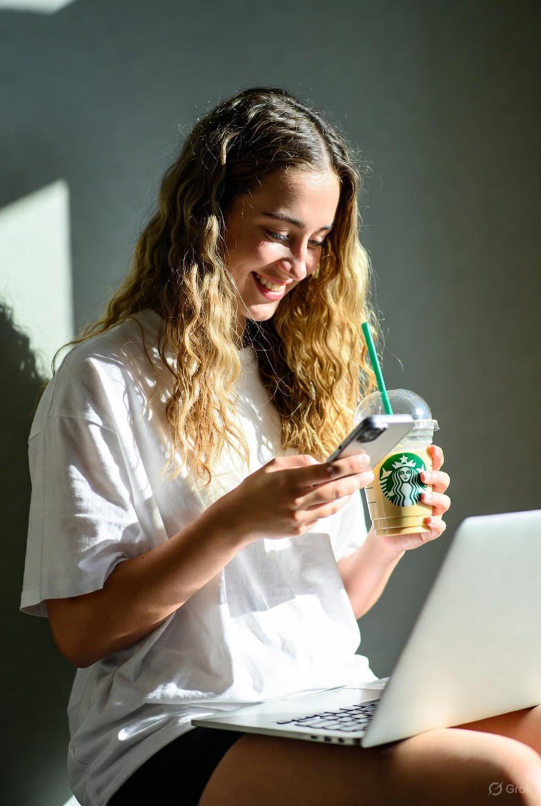
  <!--  -->
</div>

**Source:** [𝕏](https://x.com/xIrissy/status/1999878717242569027)

```json

{
  "image_prompt_data": {
    "meta": {
      "title": "Trending Candid Lifestyle",
      "style_preset": "Photorealistic",
      "vibe": "Casual, Cozy, Youthful"
    },
    "subject": {
      "demographic": "Young American woman",
      "expression": "Relaxed, cheerful",
      "pose": "Sitting comfortably",
      "focus": "Looking at phone"
    },
    "attire": {
      "top": "Loose white oversized t-shirt",
      "bottom": "Black shorts",
      "accessories": "None specified"
    },
    "props": {
      "primary": "Smartphone",
      "secondary": "Half-finished iced Starbucks drink (green straw)",
      "tertiary": "Open laptop resting on lap"
    },
    "environment": {
      "setting": "Indoors",
      "background": "Simple muted wall",
      "context": "Multitasking or working casually"
    },
    "lighting_and_atmosphere": {
      "source": "Warm natural sunlight",
      "time_of_day": "Golden hour",
      "quality": "Soft shadows, sunlit glow",
      "mood": "Bright, spontaneous, energetic"
    },
    "technical_specs": {
      "composition": "Candid, modern lifestyle photography",
      "keywords": [
        "Trending look",
        "High quality",
        "Photorealistic",
        "Depth of field"
      ]
    },
    "full_combined_prompt": "Candid modern lifestyle photo of a young American woman sitting comfortably indoors, illuminated by warm natural sunlight. She has a relaxed, cheerful expression, looking at her phone while holding a half-finished iced Starbucks drink with a green straw. Wearing a loose white oversized t-shirt and black shorts. Open laptop on lap. Simple muted wall background. Bright, spontaneous, youthful atmosphere, soft shadows, golden-hour glow, photorealistic, trending look."
  }
}
```
---

### 🖼️ Prompt 65

<div align="center">
  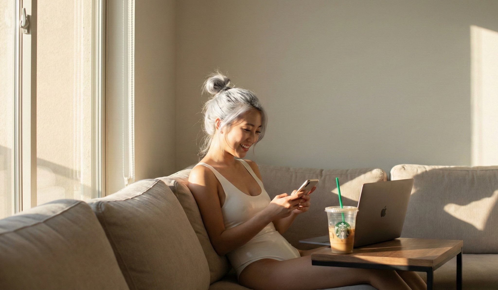
  
</div>

**Source:** [𝕏](https://x.com/youngcatwoman/status/1999965713814217179)

```json
{
  "image_prompt_data": {
    "meta": {
      "title": "Trending Candid Lifestyle",
      "style_preset": "Photorealistic",
      "vibe": "Casual, Cozy, Youthful"
    },
    "subject": {
      "demographic": "Beautiful young Japanese woman with a dramatic hourglass figure with bright silver hair",
      "expression": "Relaxed, cheerful",
      "pose": "Sitting comfortably",
      "focus": "Looking at phone"
    },
    "attire": {
      "top": "White latex bodysuit",
      "bottom": "White latex bodysuit",
      "accessories": "None specified"
    },
    "props": {
      "primary": "Smartphone",
      "secondary": "Half-finished iced Starbucks drink (green straw)",
      "tertiary": "Open laptop resting on lap"
    },
    "environment": {
      "setting": "Indoors",
      "background": "Simple muted wall",
      "context": "Multitasking or working casually"
    },
    "lighting_and_atmosphere": {
      "source": "Warm natural sunlight",
      "time_of_day": "Golden hour",
      "quality": "Soft shadows, sunlit glow",
      "mood": "Bright, spontaneous, energetic"
    },
    "technical_specs": {
      "composition": "Candid, modern lifestyle photography",
      "keywords": [
        "Trending look",
        "High quality",
        "Photorealistic",
        "Depth of field"
      ]
    },
    "full_combined_prompt": "Candid modern lifestyle photo of a beautiful young Japanese woman with a dramatic hourglass figure with bright silver hair sitting comfortably indoors, illuminated by warm natural sunlight. She has a relaxed, cheerful expression, looking at her phone while holding a half-finished iced Starbucks drink with a green straw. Wearing a white latex bodysuit. Open laptop on lap. Simple muted wall background. Bright, spontaneous, youthful atmosphere, soft shadows, golden-hour glow, photorealistic, trending look."
  }
}
```
---

### 🖼️ Prompt 66

<div align="center">
  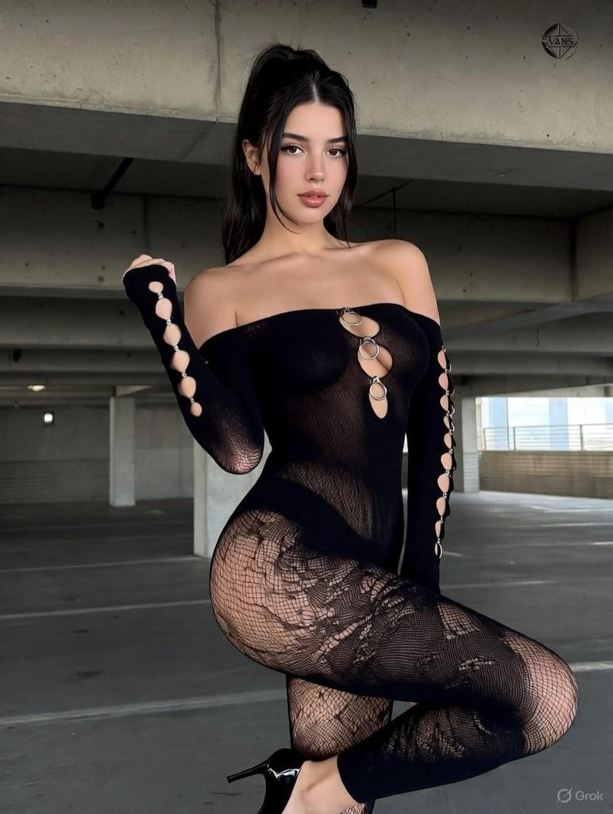
  <!--  -->
</div>

**Source:** [𝕏](https://x.com/xIrissy/status/1999507904723059203)

```json
{
  "generation_constraints": {
    "consistency_requirement": "100% same face & body",
    "target_subject": "Preserved character identity"
  },
  "subject": {
    "demographics": "Young American girl in her 20s",
    "appearance": {
      "hair": {
        "length": "Long",
        "color": "Dark",
        "style": "High ponytail"
      }
    },
    "attire": {
      "garment_type": "Jumpsuit",
      "fit": "Form-fitting",
      "style": "Off-the-shoulder",
      "color": "Black",
      "fabric_details": {
        "sleeves": "Circular cut-outs with metal rings",
        "torso_and_legs": "Sheer, lace-patterned fabric"
      },
      "footwear": "Black high-heeled shoes"
    },
    "pose": {
      "leg_action": "One leg bent and raised",
      "arm_action": "Arm bent",
      "hand_placement": "Near face",
      "overall_stance": "Striking a pose"
    }
  },
  "environment": {
    "setting": "Concrete parking garage",
    "structural_elements": [
      "Pillars"
    ],
    "lighting": "Dim lighting"
  }
}
```
---

### 🖼️ Prompt 67 &nbsp;&nbsp;&nbsp;&nbsp; ⁶🤷⁷

<div align="center">
  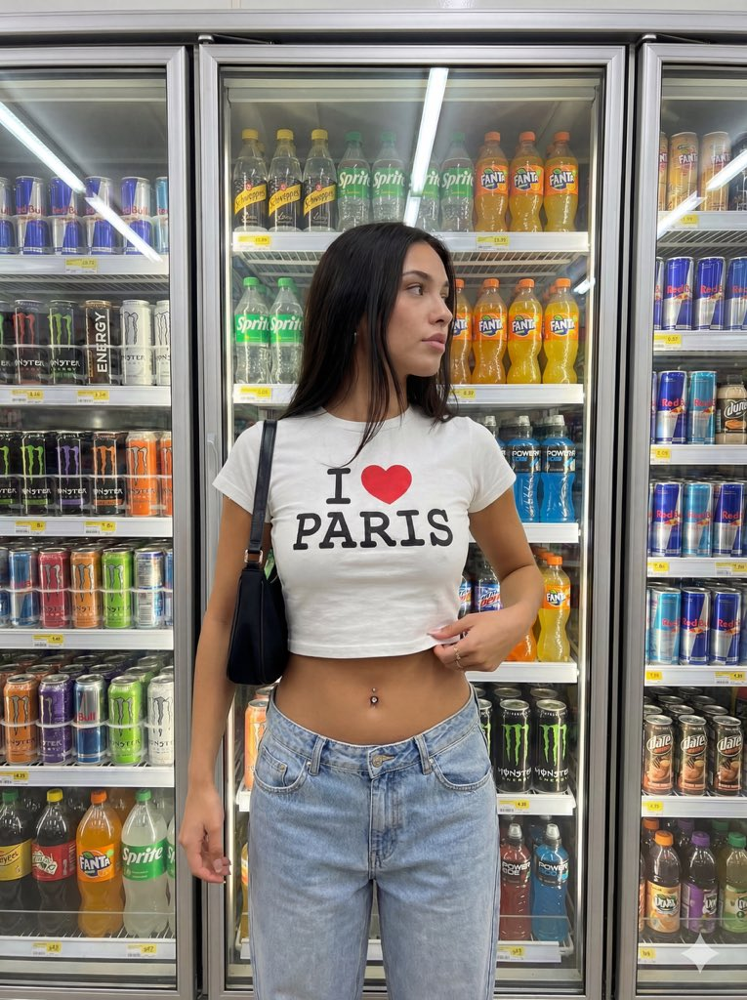
  <!--  -->
</div>

**Source:** [𝕏](https://x.com/xmliisu/status/1999507373619048501)

```json
{
  "lighting": {
    "type": "artificial_fluorescent_lighting",
    "source": "internal_refrigerator_lights_and_overhead_ceiling_lights",
    "quality": "bright, harsh, slightly cool",
    "shadows": "soft, minimal, mostly cast downwards",
    "direction": "from_front_and_above",
    "highlights": "specular_highlights_on_glass_bottles_and_plastic_packaging",
    "ambient_light": "brightly_lit_convenience_store_interior"
  },
  "background": {
    "details": "brightly lit interiors of fridges, colorful labels, black metal frames of fridges, grey tiled floor, 'Energy' signs on fridge headers",
    "objects": "two large glass-door refrigerators filled with various beverages (sodas, energy drinks, water, milk), price tags, promotional stickers, tiled floor",
    "setting": "convenience_store_aisle",
    "spatial_relationship": "subject stands between two refrigerator units, slightly in front of the left one"
  },
  "typography": {
    "text_color": "black, red, white, various_colors",
    "font_styles": "bold, sans-serif, script, decorative",
    "visible_text": "I [heart shape] PARIS, Energy, Schweppes, Solo, Sprite, Fanta, Powerade, Monster, Red Bull, Dare, Dairy Farmers, Oak, Nippy's, V, Kirks, Mt Franklin, Pump, Lipton, Pepsi",
    "text_placement": "on_t-shirt, on_product_labels, on_refrigerator_headers"
  },
  "composition": {
    "framing": "medium_shot",
    "shot_type": "eye_level_shot",
    "viewpoint": "slightly_off_center",
    "focal_point": "woman_in_center",
    "depth_of_field": "shallow_depth_of_field",
    "rule_of_thirds": "subject_is_aligned_with_the_left_vertical_line"
  },
  "color_profile": {
    "palette": [
      "#FFFFFF",
      "#000000",
      "#2D2D2D",
      "#FF0000",
      "#87CEEB",
      "#F0E68C",
      "#A9A9A9"
    ],
    "contrast": "medium_high",
    "color_tone": "cool, fluorescent",
    "saturation": "medium",
    "dominant_colors": "white, blue, black, multi-colored products"
  },
  "technical_specs": {
    "iso": "unknown",
    "focus": "sharp_focus_on_subject",
    "aperture": "unknown",
    "lens_type": "wide_angle",
    "resolution": "high",
    "camera_type": "smartphone_camera",
    "shutter_speed": "unknown"
  },
  "subject_analysis": {
    "hair": {
      "color": "dark_brown",
      "style": "long, straight, sleek, center_part",
      "length": "past_shoulders"
    },
    "pose": "standing, weight on left leg, right hand touching stomach near belly button ring, left arm down, head turned to her right looking upwards",
    "clothing": {
      "top": "white crop t-shirt with black 'I [heart] PARIS' graphic",
      "bottom": "light wash, baggy low-rise denim jeans",
      "accessories": "black shoulder bag, small hoop earrings, belly button ring"
    },
    "skin_tone": "olive",
    "subject_type": "young_woman",
    "facial_expression": "neutral, looking away, contemplative",
    "hands_and_gestures": "right hand with painted nails touching bare midriff near navel piercing, left hand relaxed by her side"
  },
  "artistic_elements": {
    "mood": "casual, posed, everyday",
    "style": "candid-style, social_media_portrait",
    "pattern": "vertical_lines_of_refrigerator_shelves, repeating_product_labels",
    "texture": "smooth_skin, cotton_fabric, denim, glass, plastic",
    "narrative": "A young woman posing in a convenience store aisle."
  },
  "generation_parameters": {
    "prompt": "A medium shot photograph of a young woman with long dark hair, wearing a white 'I [heart] PARIS' crop top and low-rise baggy jeans, standing in a well-lit convenience store aisle. She is posing between two large glass-door refrigerators filled with colorful drinks, looking away to her right. Her right hand is touching her belly button ring. The lighting is bright and fluorescent.",
    "negative_prompt": "blurry, out of focus, low resolution, dark lighting, empty shelves, man, child, outdoor setting"
  }
}
```
---

### 🖼️ Prompt 68

<div align="center">
  
  <!--  -->
</div>

**Source:** [𝕏](https://x.com/IamEmily2050/status/1982643287745032379)

```json
{
  "scene": {
    "description": "Stylish restroom dressing area captured via mirror.",
    "environment": "Warm wood-laminate stall doors and soft countertop reflections.",
    "mood": "Shy-playful confidence; cozy 'Gamseong' (감성) aesthetic."
  },
  "aesthetic": {
    "style": "Authentic smartphone mirror selfie.",
    "look": "Warm interior color, gentle roll-off; minimal grain; filmic soft contrast."
  },
  "lighting": {
    "description": "Ceiling LEDs providing warm ambience; add subtle front fill from mirror to open eye sockets; maintain realistic specular highlights."
  },
  "subject": {
    "demographics": {
      "ethnicity": "East Asian (Korean)",
      "age": "adult",
      "build": "Very slender, petite with defined waist."
    },
    "appearance": {
      "hair": "Messy top-bun with full fringe; a few loose side strands.",
      "skin": "Natural, dewy finish with preserved skin texture."
    },
    "pose": {
      "type": "Mirror selfie, standing.",
      "action": "Gentle smile with lips slightly pressed; left hand lightly lifting ruched hem; right hand holding phone.",
      "framing": "Waist-up 3:4 vertical; slight downward camera angle; midriff visible."
    },
    "wardrobe": {
      "top": "Asymmetrical olive-gray ruched one-shoulder top.",
      "bottom": "Low-rise jeans with faux-fur waistband trim."
    },
    "accessories": {
      "jewelry": "Thin bracelets, rings, and delicate hoop earrings.",
      "phone": "Smartphone with black cat case featuring a pink bow (Hello-Kitty style)."
    }
  },
  "props_in_scene": {
    "background": "Wood-grain stall doors with verticals kept true; metal hinges subtly visible.",
    "counter": "Keep any edge reflections soft and realistic."
  },
  "camera_technical": {
    "requirements": "Correct mirror reversal; maintain natural body proportions; no duplicated phones/hands.",
    "capture": "Smartphone wide lens ~24–26mm equiv, f/1.8 look, ISO ~250, 1/125s, WB 4200–4400K.",
    "composition": "Subject centered with slight lean; keep fur texture readable; ensure phone and hand pose feel natural.",
    "retouching": "Clean minor blemishes only; preserve fabric micro-wrinkles and fur fibers; avoid haloing.",
    "avoid": "Warped doors, heavy vignettes, oversharpening, cartoon smoothing, text/watermarks."
  }
}
```
---

### 🖼️ Prompt 69

<div align="center">
  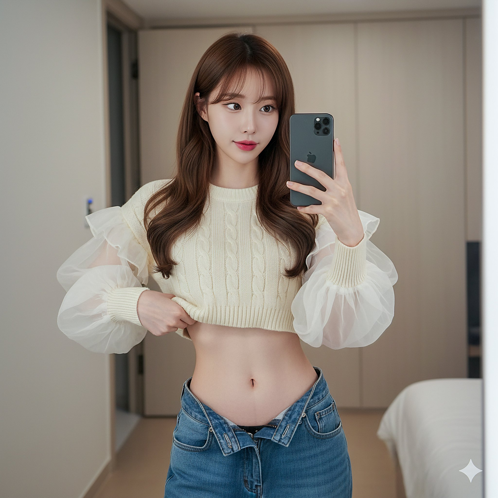
  <!--  -->
</div>

**Source:** [𝕏](https://x.com/IamEmily2050/status/1981124366411895079)

```json
{
  "scene": {
    "description": "Indoor mirror selfie in a contemporary bedroom or dressing area.",
    "lighting": "Soft, warm ambient interior lighting, flattering and even.",
    "environment": "Neutral background, slightly blurred, suggesting closet doors or plain walls."
  },
  "subject": {
    "demographics": {
      "ethnicity": "Korean (East Asian)",
      "apparent_age": "20-23",
      "build": "Very slender, 'S-line' figure with a notably tiny waist ('ant waist') and defined, toned abs."
    },
    "facial_aesthetics": {
      "style_keywords": ["Ulzzang (얼짱) aesthetic", "Casual beauty", "Doll-like features", "Youthful and confident"],
      "face_shape": "Small face with a coveted V-line jaw.",
      "eyes": "Large, bright 'Doe eyes'. Prominent Aegyo-sal. Soft, natural eyeliner.",
      "skin": "Flawless 'Glass skin', pale complexion, dewy finish.",
      "lips": "Plump cherry lips, soft pink gradient tint.",
      "hair": {
        "color": "Warm medium brown",
        "style": "Long, gentle waves",
        "bangs": "Airy, 'see-through' bangs (Korean style) framing the forehead."
      }
    },
    "pose": {
      "type": "Standing mirror selfie.",
      "action": "Subject is confidently lifting the hem of her sweater with both hands to expose her toned midriff.",
      "expression": "Soft, pleasant expression, subtle smile, eyes focused on the phone screen.",
      "framing": "Medium shot (hips to head)."
    },
    "wardrobe": {
      "top": {
        "garment": "Cropped cable-knit sweater",
        "color": "Cream / Ivory white",
        "details": "Distinctive hybrid design with sheer, voluminous organza ruffles on the sleeves and cuffs."
      },
      "bottom": {
        "garment": "Blue jeans",
        "fit": "Low-rise, relaxed fit.",
        "details": "Light-to-medium wash denim, worn unbuttoned and slightly pulled down at the hips."
      }
    },
    "accessories": {
      "phone": "Dark gray smartphone held in the hand, rear camera visible in the mirror."
    }
  },
  "camera_technical": {
    "device": "Smartphone rear camera via mirror",
    "look": "Clean, high-quality mobile photography, vertical orientation (3:4).",
    "focus": "Sharp focus on the subject's face and torso."
  }
}
```
---

### 🖼️ Prompt 70

<div align="center">
  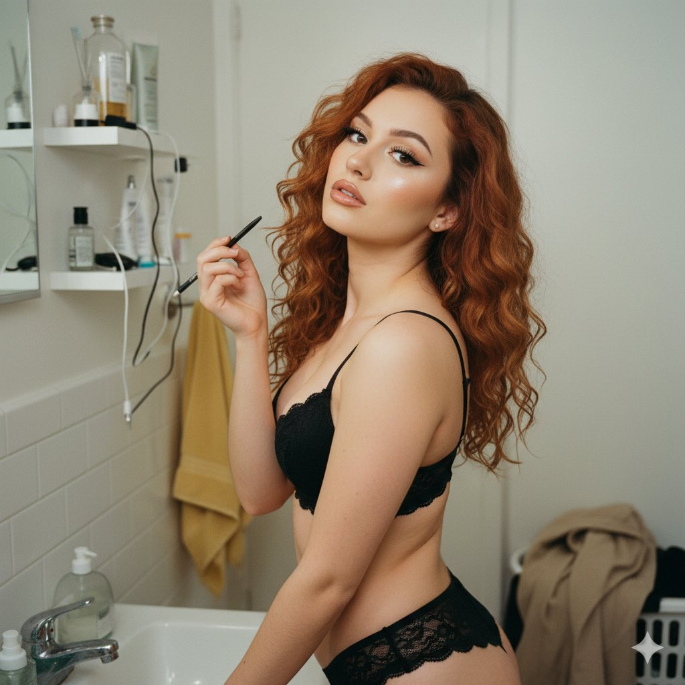
  <!--  -->
</div>

**Source:** [𝕏](https://x.com/karatademada/status/1974533927986757752)

```json
{
  "scene": "Young woman in a small bathroom standing at the sink, caught mid-action while applying makeup.",
  "subject": {
    "gender": "female",
    "age": "early 20s",
    "skin_tone": "light with warm undertones",
    "hair": {
      "style": "long, wavy, voluminous",
      "color": "auburn/copper red with highlights",
      "parting": "slightly off-center"
    },
    "face": {
      "makeup": "glamorous style with bold eyeliner, long eyelashes, glossy lipstick, subtle blush and highlight",
      "expression": "confident, seductive gaze directly into camera"
    },
    "outfit": {
      "top": "black lace lingerie bralette with thin straps, revealing fit",
      "bottom": "matching lace detail visible",
      "overall_style": "sensual, intimate"
    },
    "pose": {
      "upper_body": "turned slightly toward camera, shoulders angled",
      "arms": "one hand holding eyeliner pencil near face, the other resting by sink",
      "head": "slightly tilted back, eyes locked onto viewer"
    }
  },
  "environment": {
    "location": "bathroom",
    "background": {
      "walls": "plain white",
      "tiles": "white rectangular tiles on lower wall near sink",
      "shelves": "white shelves above sink with scattered toiletries (toothbrush, bottles, cords)",
      "sink": "small ceramic sink with faucet, partly visible",
      "towel": "yellow towel hanging in background",
      "clothes": "neutral-toned jacket draped casually in the corner"
    },
    "lighting": "soft indoor lighting, slightly warm tone, creating a natural highlight on skin",
    "camera": {
      "angle": "eye-level, intimate framing",
      "framing": "mid-body shot, centered on woman",
      "lens": "slight film-like aesthetic, subtle grain and muted colors"
    }
  },
  "style": {
    "aesthetic": "vintage film photography look",
    "color_palette": "warm tones, cream, black, auburn, soft yellow",
    "mood": "intimate, candid, alluring",
    "quality": "photorealistic, cinematic detail"
  }
}
```
---

### 🖼️ Prompt 71

<div align="center">
  
  <!--  -->
</div>

**Source:** [𝕏](https://x.com/IamEmily2050/status/1970778635738198450)

```json
{
  "shot": "Full-body vertical portrait (9:16), subject in 3/4 profile toward camera, centered between wall and window.",
  "subject": {
    "age": "adult woman (25+)",
    "appearance": "slender, long dark hair, no hat, calm/introspective expression",
    "pose": "weight on left leg with right knee slightly crossed; slight torso twist; head angled down so hair shadow softens face; right hand near hip, left arm relaxed along thigh"
  },
  "wardrobe": "opaque BLUE lace bra and matching bikini briefs (no sheer fabric, tasteful fashion lingerie)",
  "breast_view": "Covered cleavage contour shaped by opaque bra; natural proportions; camera height slightly above bust with a gentle downward tilt to preserve the neckline while keeping the full body in frame. No nipple/areola visibility.",
  "environment": "minimalist apartment interior; sheer curtains at left with balcony rails visible; textured interior wall at right; clean floor baseboard",
  "lighting": "strong backlight from window left; soft rim along shoulders/abdomen; low-key with gentle halation and soft roll-off",
  "camera": {
    "focal_length": "55mm look",
    "aperture": "f/2.2",
    "distance": "3.2 m",
    "angle": "slightly above eye level, tilt −5°",
    "framing": "head-to-toe in frame; toes visible"
  },
  "color_grade": "BLACK & WHITE global grade with SELECTIVE COLOR only on underwear in blue",
  "selective_color": {
    "mask_target": "bra_and_briefs_only",
    "blue_palette_hex": ["#1E3A8A", "#2563EB", "#60A5FA"],
    "rule": "no other hues anywhere; all else strictly monochrome"
  },
  "style": "fashion-editorial, moody noir silhouette, realistic anatomy",
  "quality": "photo-real 4K detail; accurate fabric texture; subtle film grain",
  "negatives": "no explicit nudity, no see-through fabric, no nipples/areola, no genitals, no pornographic poses, no exaggerated anatomy, no other colors besides blue on underwear, no text/logos/watermarks, no minors"
}
```
---

### 🖼️ Prompt 72

<div align="center">
  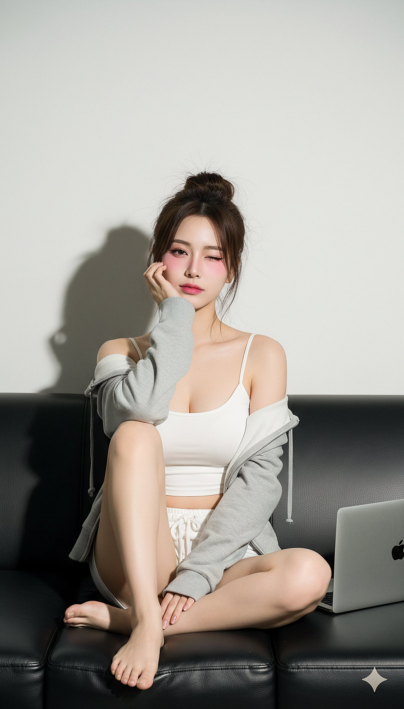
  <!--  -->
</div>

**Source:** [𝕏](https://x.com/IamEmily2050/status/1975554358495654236)

```json
{
  "style": "High-key studio portrait, direct flash aesthetic, East Asian social media style (e.g., Ulzzang, Douyin), stylized beauty retouching.",
  "output": {
    "color_profile": "sRGB",
    "render_intent": "photo"
  },
  "subject": {
    "category": "human",
    "gender_presentation": "female",
    "ethnicity": "East Asian (e.g., Korean, Chinese)",
    "age_bracket": "young_adult",
    "body": {
      "build": "slim",
      "proportions": "natural human anatomy",
      "posture": "relaxed on sofa, seated casually",
      "pose": "seated, legs crossed and tucked close to body",
      "gesture": "Right hand raised, fingers loosely curled, back of fingers/knuckles gently supporting the chin and lower cheek.",
      "head_tilt_deg": 5
    },
    "face": {
      "expression": "Playful, alluring",
      "gaze": "right eye direct to camera",
      "eye_action": "winking with the left eye",
      "skin_tone": "Very pale porcelain (lightened aesthetic)",
      "makeup": "Stylized K-Beauty/Douyin look: flawless matte base, strong pink blush high on cheeks, pink gradient lips, defined brows, light eyeliner, emphasized Aegyo-sal",
      "features": "small beauty mark/mole under the left eye"
    },
    "hair": {
      "length": "long",
      "style": "messy high updo/bun with loose strands and curtain bangs",
      "color": "dark brown"
    },
    "wardrobe": {
      "top": "white fitted cropped camisole",
      "outerwear": "light gray zip hoodie, worn open and slightly slipping off both shoulders",
      "bottom": "white lounge shorts with drawstring",
      "footwear": "barefoot"
    }
  },
  "environment": {
    "location": "studio or minimalist interior",
    "set": "black leather sofa against a plain white or light gray wall",
    "props": "Silver laptop (Apple MacBook, logo visible) placed on the cushion to the subject's right (camera left)"
  },
  "lighting": {
    "key": {
      "source": "strobe/flash",
      "modifier": "Bare reflector or direct flash (hard source)",
      "position": "Near camera axis, slightly camera-right and above eye line",
      "effect": "Crisp, dark, well-defined cast shadows on the wall directly behind subject; strong specular highlights on skin and sofa leather."
    },
    "fill": {
      "type": "minimal/none"
    },
    "ambient": "suppressed",
    "white_balance_K": 5800
  },
  "camera": {
    "system": "Digital Camera",
    "sensor": "full-frame equivalent",
    "lens": {
      "type": "prime",
      "focal_length_mm": 50
    },
    "exposure": {
      "iso": 100,
      "aperture_f": 4.0,
      "metering": "Bright exposure, high-key aesthetic"
    },
    "focus": {
      "target": "near eye (right eye)",
      "depth_of_field": "moderate"
    },
    "framing": {
      "orientation": "vertical",
      "crop": "mid-thigh to head with room above hair",
      "angle": "eye-level",
      "composition": "subject centrally framed"
    }
  },
  "color_grade": {
    "look": "Bright, clean, slightly cool tone",
    "contrast": "High contrast",
    "saturation": "moderate, emphasized pinks"
  },
  "postprocess": {
    "noise_reduction": "high",
    "texture": "Highly smoothed skin, poreless appearance ('porcelain doll' or 'beauty filter' effect)",
    "sharpen": "selective on eyes/lashes",
    "blemish_control": "Complete removal of all blemishes and texture."
  },
  "quality_targets": [
    "accurate limb lengths and joint angles",
    "correct finger count and articulation",
    "realistic fabric tension and folds",
    "accurate winking expression"
  ],
  "negative_prompt": [
    "no altered or exaggerated body proportions",
    "no extra or fused fingers",
    "no realistic skin texture, pores, or blemishes",
    "no text or watermarks (excluding specified logos)",
    "no extreme wide-angle distortion",
    "no NSFW content",
    "no dark/moody lighting",
    "no warm tones"
  ]
}
```
---

### 🖼️ Prompt 73

<div align="center">
  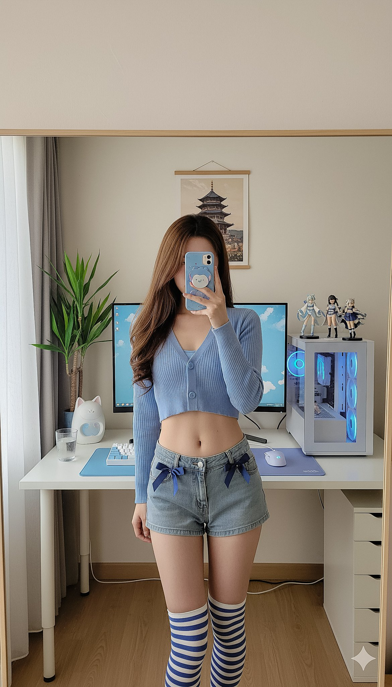
  <!--  -->
</div>

**Source:** [𝕏](https://x.com/IamEmily2050/status/1976431328280416520)

```json
{
  "scene": "mirror_selfie_otaku_pc_corner_blue",

  "subject": {
    "gender_presentation": "female",
    "age_bracket": "mid_20s",
    "ethnicity": "East Asian", 
    "build": "slim with defined waist; natural proportions",
    "skin_tone": "light neutral",
    "hair": { "length": "very long", "style": "straight with slight wave ends", "color": "medium brown" },
    "pose": {
      "stance": "standing, slight contrapposto",
      "right_hand": "holding phone in front of face (identity obscured)",
      "left_arm": "relaxed alongside torso",
      "torso": "subtle arch; midriff visible"
    },
    "wardrobe": {
      "top": "baby-blue cropped knit cardigan, two buttons fastened; blue bralette subtly visible",
      "bottom": "denim micro-shorts with blue satin ribbon bows at both hips",
      "socks": "thigh-high blue-and-white horizontal stripes",
      "accessories": { "phone_case": "blue cute mascot case" }
    }
  },

  "environment": {
    "description": "bedroom PC corner seen in a wall mirror",
    "furnishings": [
      "white desk",
      "single monitor with pastel blue wallpaper (no readable text)",
      "mechanical keyboard with white keycaps on blue desk mat",
      "mouse on small blue mousepad",
      "PC tower to the right with blue case lighting",
      "three anime figures on/near the PC",
      "pagoda poster on wall",
      "cat-shaped desk lamp with blue accent",
      "clear glass of water",
      "tall leafy plant by window (camera-left)"
    ],
    "color_swap": "replace all former pink accents in wardrobe and room with blue (baby blue → sky/periwinkle)."
  },

  "lighting": {
    "source": "daylight from large window camera-left through sheer curtain",
    "quality": "soft diffused",
    "white_balance_K": 5200
  },

  "camera": {
    "mode": "smartphone rear camera via mirror (no portrait/bokeh mode)",
    "focal_length_eq_mm": 26,
    "distance_m": { "subject_to_mirror": 0.6, "camera_to_mirror": 0.5 },
    "exposure": { "aperture_f": 1.8, "iso": 100, "shutter_s": 0.01, "ev_comp": -0.3 },
    "focus": "torso and shorts in reflection",
    "depth_of_field": "natural smartphone DOF (deep); background readable, no artificial blur",
    "framing": {
      "aspect_ratio": "1:1",
      "crop": "top of head to mid-thigh; include desk, monitor, PC, and plant",
      "angle": "slight downward tilt from mirror viewpoint",
      "composition_notes": "keep subject centered; avoid wide-edge stretching by stepping back and cropping square"
    }
  },

  "negatives": [
    "pink/magenta accents anywhere",
    "beauty-filter/airbrushed skin; poreless look",
    "exaggerated or distorted anatomy",
    "NSFW, see-through fabric, wardrobe malfunction",
    "logos, brand names, readable UI text",
    "fake portrait-mode blur, CGI/illustration look"
  ]
}
```
---

### 🖼️ Prompt 74

<div align="center">
  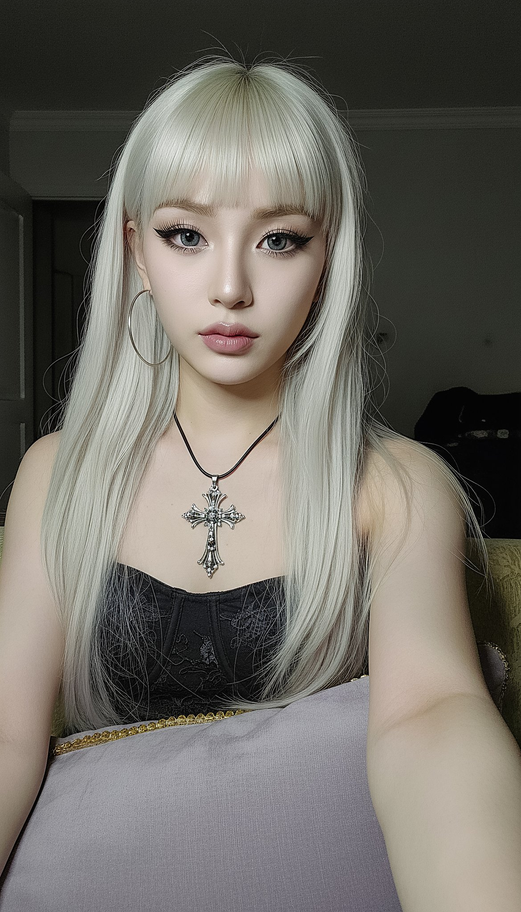
  <!--  -->
</div>

**Source:** [𝕏](https://x.com/IamEmily2050/status/1977075634536169827)

```json
{
    "style": "smartphone_selfie_low_light_high_contrast"
  },
  "image_description": {
    "subject": {
      "type": "Person",
      "gender": "Female",
      "age_appearance": "Young Adult (early 20s)",
      "ethnicity_appearance": "East Asian",
      "complexion": {
        "tone": "Extremely pale, fair.",
        "texture": "Smooth, flawless, matte finish."
      },
      "hair": {
        "color": "Intense platinum blonde. Appears almost white in direct light, with subtle silvery or pale lavender undertones visible in the shadows.",
        "style": "Long and straight, voluminous, flowing over the shoulders and chest.",
        "bangs": "Full, straight-cut fringe (bangs) ending just above the eyelashes.",
        "texture": "Soft, slightly wispy, highly reflective of light."
      },
      "facial_features": {
        "eyes": {
          "size": "Large and prominent (doe-eyed).",
          "color": "Cool-toned grey or deep blue-grey. Enhanced by colored contact lenses with a defined limbal ring.",
          "makeup": "Dramatic and precise. Thick black eyeliner on the upper lid with a sharp wing. Very long, dense, and voluminous false eyelashes on both upper and lower lashes. Defined 'aegyo-sal' (under-eye area emphasized with subtle highlight/shimmer).",
          "eyebrows": "Relatively straight, groomed, and filled in softly."
        },
        "nose": "Small, slim bridge, defined tip, highlighted along the bridge.",
        "lips": {
          "shape": "Full, plump, well-defined cupid's bow.",
          "state": "Slightly parted.",
          "color": "Soft, glossy muted-pink or peach lip tint."
        }
      },
      "expression": "Neutral, direct, slightly sultry gaze into the camera lens."
    },
    "attire_and_accessories": {
      "clothing": {
        "top": "Black strapless top (tube top or dress). Shoulders and clavicle are bare.",
        "details": "The fabric is deep black. Upon close inspection, a subtle, darker lace or embroidered pattern is visible on the bodice area.",
        "bottoms": "Black material visible on the thigh in the lower-left corner (suggesting shorts, skirt, or thigh-highs)."
      },
      "jewelry": [
        {
          "type": "Earring",
          "location": "Left ear",
          "description": "A very large, thin, metallic silver hoop earring."
        },
        {
          "type": "Necklace",
          "description": "Worn on a thin dark cord or chain.",
          "pendant": "A prominent, ornate silver cross. The pendant has a stylized, gothic or fantasy design with flared, pointed ends. The surface is intricate and catches the light, suggesting embedded crystals or multifaceted metalwork."
        }
      ]
    },
    "pose_and_composition": {
      "type": "Selfie",
      "orientation": "Portrait",
      "angle": "Slightly high angle.",
      "framing": "Close-up, tightly framed on the head, shoulders, and upper torso.",
      "pose": "Subject is reclining or seated. Her right arm is extended forward towards the camera (holding the device), creating a forced perspective where the arm and shoulder are prominent in the lower right foreground."
    },
    "environment_and_lighting": {
      "environment": "Indoor, very dark, suggesting nighttime or a dimly lit room.",
      "lighting": {
        "source": "Frontal, direct lighting (likely from the phone screen, flash, or ring light).",
        "effect": "High contrast. Illuminates the face and hair brightly against the dark background. Creates bright catchlights in the eyes. Soft shadows define the facial structure."
      }
    }
  }
}
```
---

### 🖼️ Prompt 75

<div align="center">
  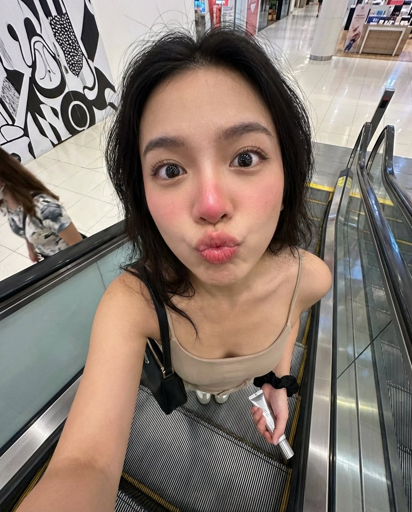
  <!--  -->
</div>

**Source:** [𝕏](https://x.com/underwoodxie96/status/2003008229509652594)

```json
{
  "subject": {
    "description": "A close-up, extreme high-angle selfie of a young woman with a playful expression, standing on an escalator.",
    "mirror_rules": "None (direct lens high-angle distortion)",
    "age": "20s",
    "expression": {
      "eyes": {
        "look": "Wide open, looking directly upward into the lens",
        "energy": "Bright, engaging, innocent yet cheeky",
        "direction": "Upward"
      },
      "mouth": {
        "position": "Exaggerated pouting lips, kissy face",
        "energy": "Playful, cute, silly"
      },
      "overall": "Quirky, fun-loving, Gen Z 0.5x selfie aesthetic"
    },
    "face": {
      "preserve_original": true,
      "makeup": "Fresh face, prominent pink blush on nose tip and cheeks (strawberry or cold girl makeup), defined eyelashes, natural brows"
    },
    "hair": {
      "color": "Dark brown",
      "style": "Long, loose, center part, slightly messy roots",
      "effect": "Natural flow, top of head visible due to angle"
    },
    "body": {
      "frame": "Foreshortened perspective (large head, small body)",
      "waist": "Not visible",
      "chest": "Visible décolletage from top-down view",
      "legs": "Not visible",
      "skin": {
        "visible_areas": ["Face", "neck", "chest", "arms"],
        "tone": "Fair to light",
        "texture": "Smooth, natural skin texture",
        "lighting_effect": "Soft even illumination"
      }
    },
    "pose": {
      "position": "Standing, leaning forward slightly",
      "base": "Standing on an escalator",
      "overall": "Leaning in towards the camera lens from below"
    },
    "clothing": {
      "top": {
        "type": "Spaghetti strap tank top",
        "color": "Beige / Cream",
        "details": "Simple tight fit, square neckline",
        "effect": "Casual summer vibe"
      },
      "bottom": {
        "type": "Trousers",
        "color": "Black",
        "details": "Barely visible at bottom edge"
      }
    }
  },

  "accessories": {
    "jewelry": "Thin silver necklace chain (faint)",
    "prop": "Holding a small bottle (lip balm or vape) and a black scrunchie in hand; black handbag strap visible over shoulder"
  },

  "photography": {
    "camera_style": "Smartphone 0.5x wide-angle aesthetic",
    "angle": "Extreme high angle / top-down / bird's-eye view",
    "shot_type": "Close-up selfie, distorted perspective",
    "aspect_ratio": "4:5",
    "texture": "Digital social media quality, sharp facial details",
    "lighting": "Bright overhead indoor mall lighting",
    "depth_of_field": "Moderate depth (background slightly soft but recognizable)"
  },

  "background": {
    "setting": "Indoor escalator",
    "wall_color": "Black with abstract white graffiti/art (left)",
    "elements": [
      "Silver grooved escalator steps descending behind",
      "Black handrail",
      "Partial view of another person in background (top right)"
    ],
    "atmosphere": "Public, busy shopping mall, dynamic transit",
    "lighting": "Diffuse artificial light"
  },

  "the_vibe": {
    "energy": "Spontaneous, youthful, humorous",
    "mood": "Playful",
    "aesthetic": "Gen Z photo dump, fish-eye lens effect, candid snapshot",
    "authenticity": "High, looks like an unfiltered moment",
    "intimacy": "Friend-POV",
    "story": "A goofy moment captured mid-shopping trip on the escalator",
    "caption_energy": "Escalator antics with besties ✌️😗"
  },

  "constraints": {
    "must_keep": [
      "Extreme high angle perspective",
      "Pouting/kissy face expression",
      "Escalator background with metal steps",
      "Beige tank top",
      "Blush on nose",
      "Wide-angle distortion effect"
    ],
    "avoid": [
      "Low angle",
      "Eye-level shot",
      "Serious expression",
      "Studio lighting",
      "Full body proportions (must be distorted)"
    ]
  },

  "negative_prompt": [
    "low angle",
    "studio portrait",
    "serious",
    "frown",
    "sunglasses",
    "hat",
    "blurry",
    "dark",
    "distorted hands",
    "perfect proportions"
  ]
}
```
---

### 🖼️ Prompt 76

<div align="center">
  
  <!--  -->
</div>

**Source:** [𝕏](https://x.com/brindleyai/status/2003816567314722839)

```json
{
  "subject": {
    "description": "Young woman with wet, slicked-back dark blonde hair lying on a sandy beach. Slim athletic physique with natural curves. Wearing a green and yellow string bikini (Brazilian flag colors). Tanned skin with visible texture, pores, and sand grains sticking to damp skin, especially on glutes and legs. Natural waist folds from twisting pose. Realistic weight and gravity with hip flesh slightly compressed against sand.",
    "anatomy": "Natural proportions with prominent glutes and realistic volume. Visible rib cage definition from stretch. No plastic smoothing. Slender arms; hands with light blue manicured nails. Posture emphasizes natural lower-back and hip curve.",
    "clothing": "Green and yellow micro bikini. Triangle top with yellow trim. Thong-style bottom with green fabric and yellow strings riding high on hips. Fabric tension behaves naturally.",
    "hair": "Long wet textured hair slicked back from face, hanging loosely down the back with water-clumped strands."
  },
  "pose": {
    "type": "Reclining side twist on sand",
    "details": "Lying on right hip and side. Legs extended with slight bend, ankles crossed. Upper body propped by left arm pressed into sand. Torso twisted away from camera; head turned back over left shoulder toward viewer. Right arm rests naturally in front.",
    "head_position": "Turned over left shoulder, chin slightly tucked",
    "gaze": "Direct, confident, relaxed"
  },
  "environment": {
    "location": "Tropical beach resembling Rio de Janeiro",
    "foreground": "Textured beige sand with footprints",
    "midground": "Ocean waves with white foam and large dark granite boulders",
    "background": "Distant green coastline with hillside buildings",
    "sky": "Overcast white-grey clouds",
    "atmosphere": "Humid, breezy beach day"
  },
  "camera": {
    "type": "Professional DSLR or mirrorless",
    "lens": "35mm prime",
    "perspective": "Low angle near sand level, slightly upward",
    "depth_of_field": "f/5.6 with subject sharp and background readable",
    "focus": "Face and eyes"
  },
  "lighting": {
    "type": "Natural overcast daylight",
    "quality": "Soft, diffused, shadowless",
    "direction": "Global ambient from cloudy sky",
    "shadows": "Very soft occlusion at body–sand contact"
  },
  "mood_and_expression": {
    "emotion": "Alluring, casual, confident",
    "atmosphere": "Unposed vacation snapshot, raw and authentic",
    "facial_expression": "Relaxed features, neutral to slightly parted lips"
  },
  "style_and_realism": {
    "genre": "Candid travel / lifestyle photography",
    "aesthetic": "Raw, unedited realism with texture emphasis",
    "rendering": "Photorealistic, camera-like"
  },
  "colors_and_tone": {
    "palette": "Beige sand, green-brown rocks, blue-grey ocean, bright green-yellow bikini, warm tan skin",
    "white_balance": "Neutral to slightly cool",
    "saturation": "Natural",
    "contrast": "Moderate with preserved sky detail"
  },
  "quality_and_technical_details": {
    "resolution": "8K",
    "texture_quality": "Extreme detail: sand grains, pores, droplets, fabric weave",
    "noise": "Subtle luminance grain"
  },
  "aspect_ratio_and_output": {
    "ratio": "3:4",
    "framing": "Full body, centered with slight bottom-right weight and headroom"
  },
  "controlnet": {
    "pose_control": "strict_alignment",
    "depth_control": "preserve_background_geometry"
  },
  "negative_prompt": [
    "sunny blue sky",
    "direct sunlight",
    "harsh shadows",
    "dry hair",
    "perfectly smooth or plastic skin",
    "airbrushed",
    "cartoon",
    "anime",
    "3d render",
    "studio lighting",
    "makeup",
    "unrealistic anatomy",
    "missing limbs",
    "extra fingers",
    "floating objects",
    "oversaturated",
    "hdr"
  ]
}
```
---

### 🖼️ Prompt 77

<div align="center">
  
  
</div>

**Source:** [𝕏](https://x.com/bananababydoll/status/2003567035951796448)

```json
{
  "meta": {
    "aspect_ratio": "9:16",
    "quality": "ultra_photorealistic",
    "resolution": "8k",
    "camera": "iPhone 15 Pro Max",
    "lens": "24mm wide",
    "style": "flash-lit nightlife realism, natural skin texture, social media aesthetic"
  },

  "scene": {
    "location": "outdoor vending machine area",
    "environment": [
      "classic red soda vending machine",
      "brightly lit drink display behind glass",
      "concrete ground with slight texture",
      "nighttime urban setting"
    ],
    "time": "night",
    "atmosphere": "flash photography vibe, playful, spontaneous, slightly cheeky street energy"
  },

  "lighting": {
    "type": "direct phone flash",
    "key_light": "strong frontal flash",
    "fill_light": "vending machine internal lights",
    "effect": "sharp highlights on skin, clear shadows, glossy nightlife look"
  },

  "camera_perspective": {
    "pov": "third-person shot (taken by friend)",
    "angle": "slightly low angle",
    "framing": "full body",
    "distance": "about 1.5–2 meters",
    "motion": "frozen candid moment"
  },

  "subject": {
    "gender": "female",
    "age": "early 20s (clearly adult)",
    "ethnicity": "European / Mediterranean blend",
    "body": {
      "type": "curvy-slim",
      "waist": "defined",
      "hips": "full and round",
      "legs": "toned",
      "posture": "confident, playful"
    },

    "hair": {
      "color": "warm blonde",
      "length": "long",
      "style": "loose waves",
      "details": "soft shine from flash"
    },

    "face": {
      "expression": "over-the-shoulder confident look",
      "eyes": "direct eye contact with camera",
      "makeup": "night-out glam, glossy lips",
      "skin": "realistic texture, slight flash sheen"
    },

    "pose": {
      "position": "deep squat in front of vending machine",
      "legs": "knees bent, heels down",
      "hips": "pushed back",
      "upper_body": "torso twisted slightly toward camera",
      "arms": {
        "one_hand": "pressing vending machine buttons",
        "other_hand": "resting naturally on thigh"
      },
      "head": "turned back over shoulder"
    },

    "outfit": {
      "bikini": {
        "type": "string bikini",
        "pattern": "yellow and white checkered",
        "fit": "minimal, snug",
        "top": "tie-back triangle bikini",
        "bottom": "high-cut thong style",
        "support": "no bra"
      }
    }
  },

  "details": {
    "vibe": "playful late-night chaos",
    "aesthetic": "internet-breaking thirst trap",
    "focus": "subject razor sharp, vending machine clearly visible",
    "authenticity": "looks like a real spontaneous street photo"
  }
}
```
---

### 🖼️ Prompt 78

<div align="center">
  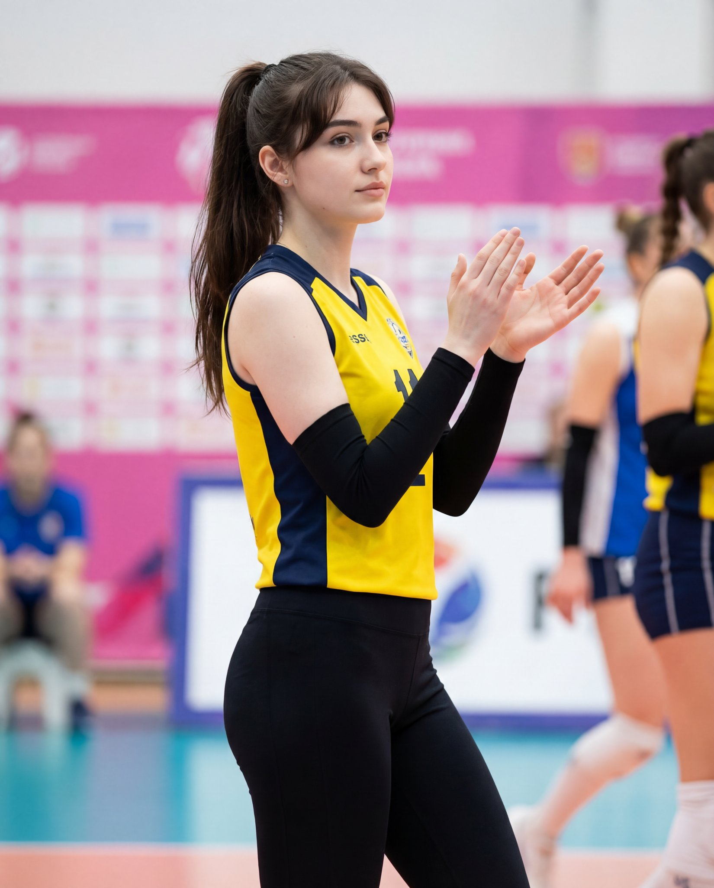
  <!--  -->
</div>

**Source:** [𝕏](https://x.com/ZaraIrahh/status/2003476315828097321)

```json
{
  "image_prompt": {
    "reference": {
      "face_identity": "uploaded reference image",
      "identity_lock": true,
      "face_preservation": "100% identical facial structure, proportions, eyes, nose, lips, brows, skin texture, moles, and expression"
    },
    "subject": {
      "gender": "female",
      "age_range": "young adult",
      "expression": "calm, focused, neutral competitive expression",
      "pose": {
        "action": "hands raised mid-clap",
        "body_orientation": "three-quarter side profile",
        "posture": "upright athletic stance"
      }
    },
    "outfit": {
      "top": "yellow and navy sleeveless volleyball jersey",
      "armwear": "black compression arm sleeve on right arm",
      "bottom": {
        "type": "full-length black athletic pants",
        "coverage": "legs fully covered at all times",
        "fit": "sporty, fitted, opaque fabric"
      },
      "footwear": "not visible or cropped out"
    },
    "appearance": {
      "hair": {
        "style": "high ponytail with soft bangs",
        "color": "dark brown"
      },
      "makeup": "natural sports makeup, light blush, subtle eyeliner",
      "nails": "short, painted black"
    },
    "scene": {
      "location": "indoor sports arena",
      "background": "blurred volleyball court with pink and white wall panels",
      "other_subjects": "teammates visible in soft background blur"
    },
    "lighting": {
      "type": "bright indoor sports lighting",
      "tone": "neutral and even",
      "shadows": "soft"
    },
    "camera": {
      "shot_type": "medium shot",
      "angle": "eye-level",
      "focus": "sharp focus on subject face and upper body",
      "depth_of_field": "shallow background blur"
    },
    "constraints": {
      "no_nudity": true,
      "no_exposed_legs": true,
      "legs_must_be_covered": "black pants required",
      "no_outfit_changes": "jersey and arm sleeve remain identical",
      "no_face_modification": true
    },
    "quality": {
      "realism": "photorealistic",
      "resolution": "8K ultra sharp",
      "detail_level": "high"
    }
  }
}
```
---

### 🖼️ Prompt 79

<div align="center">
  
  <!--  -->
</div>

**Source:** [𝕏](https://x.com/lexx_aura/status/2003475774930645201)

```json
{
  "subject": {
    "description": "Young woman with long, straight brunette hair parted in the middle.",
    "pose": "Reclining comfortably on a beige sectional sofa, leaning back on her left hand, with legs extended and crossed at the ankles.",
    "expression": "Soft, relaxed smile, gazing directly at the camera.",
    "attire": {
      "dress": "Red velvet mini dress with white faux fur trim along the neckline and hem, resembling a Santa outfit.",
      "socks": "White knee-high socks.",
      "jewelry": "Delicate gold pendant necklace, small gold hoop earrings, and a thin bracelet on the right wrist."
    },
    "physical_features": "Fair skin tone, natural makeup look."
  },
  "environment": {
    "setting": "Modern living room interior.",
    "furniture": "Large, light beige L-shaped sectional sofa.",
    "background_elements": "Cream-colored walls, a floor lamp with a warm glowing shade behind the sofa, and a large abstract beige canvas art piece on the wall.",
    "ambiance": "Cozy, warm, and intimate."
  },
  "lighting": {
    "type": "Warm indoor lighting mixed with camera flash.",
    "characteristics": "Soft glow from the lamp creating a warm atmosphere, with direct flash illumination on the subject, creating a slightly vintage digital camera aesthetic."
  },
  "composition": {
    "angle": "Eye-level, slightly off-center.",
    "framing": "Medium shot capturing the subject from head to toe."
  }
}
```
---

## 📌 Why This Exists

- Visual reference for prompt crafting
- Compare outputs across styles & models
- A personal archive of inspiring AI generations

---

## ⚠️ Ownership & Credits

- All prompts and images in this repository are NOT owned by me.
- They have been collected from various sources on the internet.
- All rights, ownership, and credits belong to their respective original creators.
- This repository is shared strictly for educational and inspiration purposes only.
- If you are a rights holder and wish to have content removed or credited, please open an issue.

---

<div align="center">

✨ If this repository inspired you, consider leaving a star ✨<br>Craft better prompts. Generate better images.

</div>
